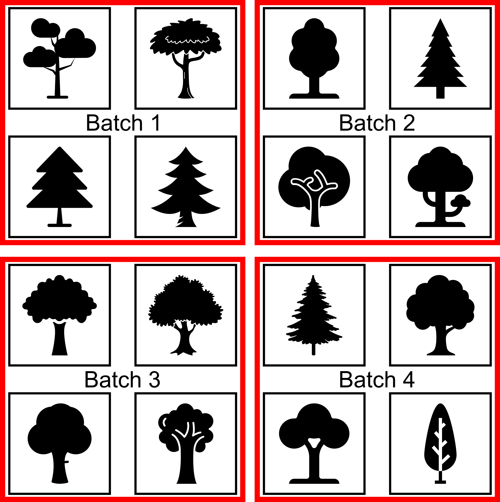
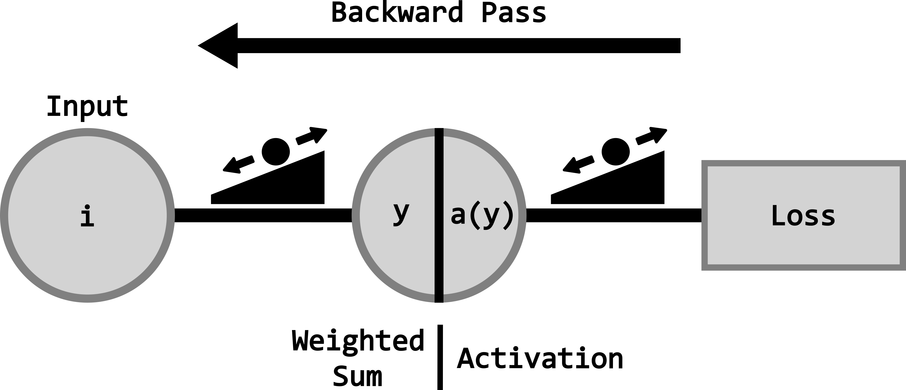

## Relevant Resources

- [**Slides for Introduction**](01_intro_slides.qmd)
- [**The Deep Learning Book**](https://www.deeplearningbook.org/)
- [**Dive into Deep Learning**](https://d2l.ai/)
- [**MIT Introduction to Deep Learning Lecture Series**](https://youtube.com/playlist?list=PLjctrnwG0NeT9dd2mvP3W40TdX58rZc1P&si=2XOgUqho5YtppYij)

## Overview
This section provides a foundational introduction to deep learning with a focus on applications for enhanced forest inventories (EFIs). It introduces core concepts behind neural networks, explains how models learn through the prediction-feedback loop, and outlines common deep learning tasks such as classification, regression and segmentation. This section also contrasts image-based and point-based deep learning approaches, establishes key terminology used throughout the workflow, and highlights practical challenges encountered when applying deep learning to real-world forestry data.

By the end of this section our hope is that you will be able to:

1)	Understand the human-centric role of artificial intelligence for enhanced forest inventory modelling

2)  Explain how deep learning relates to artificial intelligence and machine learning

3)	Describe the structure and components of a deep neural network

4)	Understand how models learn through loss functions, gradients and iterative training

5)	Compare image-based and point-based deep learning approaches

6)	Familiarize yourself with core deep learning terminology correctly (e.g., parameters, hyperparameters, batches, epochs)

7)	Recognize common challenges when applying deep learning to forestry and remote sensing data

## Human-Centric Artificial Intelligence for Enhanced Forest Inventories
EFIs have traditionally relied on field measurements, allometric equations, statistical models, and process-informed assumptions to estimate forest attributes such as biomass, volume, canopy height, species composition, and structural complexity. These approaches remain foundational to forestry. However, the increasing availability of rich remote sensing data, particularly Airborne Laser Scanning (ALS), multispectral imagery, and other spatial products, has significantly expanded what can be measured and modeled.

Artificial Intelligence (AI), and more specifically deep learning, should not be seen as a replacement for traditional forestry knowledge. Instead, AI provides **human-centric computational modelling capabilities** that complement and extend existing approaches. **Domain expertise remains essential throughout the entire end-to-end workflow**, from data preparation and selection to model evaluation and interpretation. In this sense, deep learning acts as a tool that amplifies human decision-making rather than automating it away.

While this workshop focuses primarily on classification and regression tasks, it is useful to situate these methods within a broader AI context. At a high level, AI techniques used for EFIs can be grouped into four modelling capabilities: **descriptive, predictive, prescriptive, and generative.** Understanding these capabilities helps clarify the role of deep learning in forest inventories and how it can support forest management and decision-making.

: Table 1: The 4 Pillars of AI Capability in Forestry

| Capability   | What the AI Does                                                                 | The Indispensable Human Role                                                                 |
|-------------|----------------------------------------------------------------------------------|-----------------------------------------------------------------------------------------------|
| **Descriptive** |Extracts meaningful patterns and representations from complex data (e.g., raw ALS point clouds. | *Contextualizing Structure:* defining what “meaningful” structure looks like across Canada’s diverse ecozones. |
| **Predictive**  | Learns non-linear relationships between remote sensing data and attributes like biomass or species. | *Data Governance:* selecting the response variables and ground-truth plots that reflect real-world variability. |
| **Prescriptive** | Simulates scenarios to recommend optimal management paths (harvesting, conservation, or risk mitigation). | *Strategic Oversight:* ensuring that AI recommendations align with policy, biodiversity goals, and socio-economic needs. |
| **Generative**  | Synthesizes realistic forest data to fill gaps in remote regions or explore “what-if” climate scenarios. | *Ecological Validation:* verifying that synthetic scenarios are biologically plausible and scientifically sound. |

### Descriptive modelling: learning structure from data
Descriptive modelling focuses on **extracting meaningful patterns and representations from complex data**. For example, ALS point clouds contain detailed 3D information about canopy and understory structure, as well as the terrain. Traditionally, this information was summarized using handcrafted features such as height percentiles or canopy cover metrics.

Deep learning enables models to **learn hierarchical feature representations directly from raw or minimally processed data**, capturing subtle patters that are difficult to define manually. In EFIs, this allows for:

-	Automatic extraction of structural representations from ALS data that captures both the horizontal and vertical forest complexity
-	More consistent feature extraction across regions and forest types

**Human expertise remains critical** in selecting appropriate data sources, interpreting learned features and validating that extracted patterns are meaningful for real-world forestry.

### Predictive modelling: estimating forest attributes at scale
Predictive modelling is the most familiar application of AI in forestry. It involves learning relationships between inputs (e.g., ALS-derived features) and outputs (e.g. forest attributes). Deep learning excels in predictive tasks when:

-	Relationships are nonlinear and high-dimensional
-	Data comes from multiple sources or modalities

Common predictive EFI applications include classification tasks such as species groups, forest types, or disturbance classes as well as regression tasks such as estimating biomass, volume, or canopy height. Compared to traditional regression or allometric models, deep learning approaches can scale more effectively across regions, adapt to diverse forest conditions, and reduce the need for manual feature engineering.

**Human input remains indispensable** for selecting meaningful response variables, designing appropriate training and validation datasets, and interpreting predictions within a forestry context.

### Prescriptive modelling: from prediction to decisions
Prescriptive modelling likes predictions to **actions or decisions**. While this workshop does not implement perspective models directly, understanding their relevance is important. In forestry, prescriptive AI can support:

-	Inventory-driven management planning
-	Prioritization for harvesting, conservation, or monitoring
-	Optimization of sampling strategies and data acquisition

Accurate predictive models are a **necessary foundation** for prescriptive applications and better EFI predictions lead to better forestry decisions. **Domain expertise ensures that prescriptive recommendations are practical and aligned with forest management objectives.**

### Generative modelling: exploring “what-if” scenarios
Generative modelling focuses on **creating new data or scenarios that are consistent with observed patterns.** In the context of EFIs, this may include:

-	Simulating forest structures under different management or disturbance scenarios
-	Augmenting training data in regions with limited field measurements
-	Exploring uncertainty and variability in forest inventory estimates

While generative models are outside the scope of this workshop, understanding their role helps place predictive deep learning within the broader AI trajectory for EFIs. **Human expertise is key for designing realistic scenarios and validating their ecological relevance.**

::: callout-note
*Human expertise is essential at every step* from preparing data and defining tasks to interpreting results and making management decisions. Human-centric AI ensures that deep learning tools enhance existing forestry knowledge rather than replace it.
:::

## What is Deep Learning?
Deep learning is a branch of machine learning, which in turn is a subset of AI. **AI** refers to methods that enable machines to mimic human behavior. **Machine learning** uses statistical techniques to allow machines to improve their performance through experience. **Deep learning** is a machine learning approach that focuses on the use of neural networks with a large number of hidden layers. The terms neural network and deep learning are used interchangeably, and we will use both throughout this workshop.

{#fig-ai-vendiagram fig-align="center" width=50%}

### Components of a deep neural network
There are several key components and terms commonly used to describe a neural network. The **depth** of a neural network refers to the number of **layers** in its architecture (the example in @fig-neuralnetwork has five layers), whereas the **width** refers to the number of neurons within each layer. Increasing depth allows the network to learn more **hierarchical and abstract representations** of the input data, as successive layers can model increasingly complex feature interactions. Increasing width, on the other hand, increases the **representational capacity** of each layer, enabling the model to capture more variability at a given level of abstraction. In practice, deeper and wider networks can improve predictive performance but also increase the risk of overfitting, computational cost, and training instability, making their choice a trade-off that depends on data size, complexity, and modelling task.

{#fig-neuralnetwork fig-align="center"}

The most fundamental unit of a deep neural network is the **neuron**, which serves as the building block of any neural network. A neuron receives a set of inputs ($x_i$), weights ($w_i$) and sums them, while adding a bias term ($b$). These **weights** and **biases** are adjustable parameters that the network learns during **training**.

$$
\Large y = w_1x_1 + w_2x_2 + b
$$

Another important part of a neuron is called the **activation**. The output of the weighted sum ($y$) is passed through an activation function, which determines the strength of the output and whether the neuron becomes activated or not. Activation functions are essential because they introduce nonlinearity into the model. Without them, every layer would behave like a linear transformation, and no matter how many layers were stacked, the network could only learn simple linear relationships. By adding nonlinear activations, deep neural networks can capture complex patterns and interactions in the data, making it possible to learn rich structure found in imagery and point clouds.

{#fig-neuron fig-align="center" width=60%}

::: callout-note
There are many types of activation functions, and you are encouraged to research which one would be best for your specific use case.
:::

### The prediction - feedback loop
The **prediction-feedback loop** is what makes **learning** possible as a deep neural network doesn't just memorize the data, it adapts to the patterns within and generalizes from them. This allows a model to progressively fine-tune how it *sees* the input **data** to improve its performance with respect to the **goal** and the **task**.

{#fig-feedback-loop fig-align="center" width=60%}

This prediction–feedback loop is driven by the goal of the **loss function**, which guides the model in adjusting its weights and biases toward an optimal solution. The loss function assesses the difference between the true and predicted **labels**, typically, with the objective of minimizing the error between the two. There are multiple types of loss functions, each providing different forms of feedback to the model. Choosing an appropriate loss function depends on the task (e.g., classification, regression), and is a crucial step in the deep neural network's design.

A key part of this update process involves **gradients**, which measure how sensitive the loss is to small changes in each weight or bias. Gradients point the model in the direction that most reduces error, allowing the network to adjust its parameters efficiently. During training, these gradients are computed and used to iteratively update the weights so that, over time, the model’s predictions become more accurate. Although gradients operate behind the scenes, they are central to how deep neural networks learn from the data.

Over multiple iterations, or **epochs**, the model continually adjusts its weights and biases based on the feedback received from the loss function. Eventually, the model reaches a point where no further improvements are made given the available data, and the loss begins to stabilize, indicating that the model has converged to an optimal or near-optimal solution.

{#fig-epochs fig-align="center"}

This iterative adjustment process is called model training and involves a **training** and a separate **validation** dataset. The training dataset is used to teach the model by updating its parameters, while the validation dataset assesses how well the model generalizes to unseen data. Monitoring performance on the validation set helps to detect **overfitting** (when a model learns the training data too closely and fails to perform well on new inputs), thereby ensuring that the final model remains both accurate and robust. We can monitor this using **loss curves** as seen in @fig-epochs, by verifying that the loss continues to drop for both the training and validation datasets.

After the prediction-feedback loop (training and validation), a **testing** dataset is used to provide an unbiased evaluation of the model’s final performance. Unlike the validation set, which is used to guide the model tuning during training, the test set is completely withheld until all adjustments are complete. This ensures that the performance metrics accurately reflect how the model will behave on truly unseen data, offering a realistic measure of its generalization ability and reliability for real-world applications.

::: callout-note
It is crucial that these three separate and distinct datasets (training, validation, and testing) are properly prepared for training deep neural networks. Mixing or reusing data between these datasets can lead to misleading performance metrics and poor generalization. Proper separation ensures that the model is evaluated fairly at each stage of development and that its reported accuracy truly reflects performance on new, unseen data.
:::

### Common deep learning tasks
#### Classification
**Classification** assigns each input (an image, pixel, object, or point cloud sample) to a discrete class. This is often the starting point in deep learning for ecological or environmental analysis.

Common forestry classification applications include:

- **Tree-species recognition:** Using spectral signatures, textural patterns, or structural characteristics to classify (label) species at the tree or stand level.
- **Land-cover mapping:** Categorizing pixels into classes such as forest, water, bare ground, or herbaceous vegetation.
- **Disturbance detection:** Identifying wildfire scars, harvest events, pest outbreaks, or storm damage.
- **Health or stress classification:** Detecting and identifying different stressed areas or detecting tree mortality at the tree or stand level.

{#fig-classification fig-align="center" width=80%}

#### Regression
**Regression** models predict continuous numerical values, making them ideal for estimating biophysical variables derived from remote sensing datasets. Rather than assigning categories, they learn patterns that correspond to a continuous numerical output.

Typical forestry-focused regression tasks include:

- **Above-ground biomass estimation:** Using spectral reflectance, canopy texture or structural characteristics from lidar to estimate the AGB of a tree or stand.
- **Canopy cover for leaf area index estimation:** Modelling continuous vegetation density across forested landscapes.
- **Crown diameter or volume:** Predicting various individual-tree metrics.

{#fig-regression fig-align="center" width=80%}

#### Segmentation
**Segmentation** assigns a label to every pixel/point (**semantic segmentation**) or separates individual objects within an image or point cloud (**instance segmentation**). This task is essential when the goal is to create detailed spatial maps rather than broad classifications.

In forestry applications, segmentation helps support:

- **Tree-crown delineation:** Separating individual tree crowns in imagery or point clouds for per-tree analyses.
- **Stand or management-unit boundaries:** Automatically outlining key forest changes or stand edges.
- **Vegetation structure mapping:** Distinguishing between canopy, understory, stem, and ground points from lidar data.

{#fig-segmentation fig-align="center" width=80%}

## Image-Based vs. Point-Based Deep Learning
### Image-based deep learning
**Image-based** deep learning is a computer vision method that teaches computers to understand and interpret images. Instead of manually telling the computer what to look for, these algorithms automatically learn patterns from large sets of images. These algorithms can learn features like edges, shapes, and colours, and can eventually identify complex objects such as trees. Because these models learn directly from the data, they can help computers effectively *see* and make sense of the imagery.

{#fig-imagedl fig-align="center" width=80%}

A common image-based deep learning technique is the **convolutional neural network (CNN)**. CNNs use filters (also called kernels) that slide across an image to detect important visual features. These filters help the network to focus on local patterns while preserving the spatial relationships in the image. As the data moves through the different layers of the network, the CNN learns increasingly complex patterns. 

{#fig-convolutions fig-align="center" width=60%}

### Point-based deep learning
**Point-based** deep learning is a method used to analyze 3D point cloud data. Unlike image data, which is structured in a grid of pixels, point clouds are irregular and unstructured, making them harder for traditional neural networks to process. Point-based deep neural networks are designed to handle this challenge by directly learning from the spatial relationships between points without requiring conversion into images or grids. By learning the geometric patterns directly from the raw point clouds, these models are able to provide an accurate and detailed understanding of complex 3D structures of the forest. Similar to image-based approaches as the data moves through successive layers, and increasingly complex patterns are extracted.

{#fig-pointdl fig-align="center" width=80%}

## Key Terminology and Concepts to Know
Before exploring data preparation, training workflows, and model evaluation, it is useful to establish a common vocabulary describing how deep neural networks operate. The terms below describe the core components, processes, and ideas that appear throughout all deep learning methods, regardless of the specific architecture or data type. Understanding these concepts will help clarify how models learn, how they are structured, and how different parts of the training pipeline fit together.

### Parameters vs. hyperparameters
**Parameters** are the internal values of a neural network that are learned during training. These include the weights and biases in each layer. They are updated automatically through optimization algorithms and define how the model transforms inputs into predictions.

**Hyperparameters** control *how* a model learns rather than what it learns. Examples include learning rate, batch size, number of epochs, and model depth. Unlike parameters, hyperparameters are set by the user and are not learned during training. These often need to be tuned in order to achieve optimal results.

### Input features vs. labels vs. learned features vs. logits
**Input Features** are the input variables or measurements the model receives. In imagery, these might be pixel values from the spectral bands; in point clouds, they may include XYZ coordinates, intensity, or return number. Features describe the data but not the model's predictions.

**Labels** represent the target values the model is trying to predict. These can be discrete classes (e.g. species), continuous values (e.g. biomass), or spatial assignments (e.g. segmentation masks). Labels are essential for supervised learning.

**Learned Features** are internal representations automatically discovered by the neural network as the data moves through its layers. Unlike input features, which come directly from the dataset, learned features are generated by the model itself. Early layers often capture simple patterns such as edges or local geometry, while deeper layers encode more abstract concepts such as textures, shapes, or structural patterns. These learned features enable deep neural networks to extract complex information without requiring manual feature engineering.

**Logits** are the raw, unnormalized outputs of a neural network’s final layer before an activation function is applied. In classification tasks, they represent the model’s scores for each class and are typically transformed into probabilities using functions such as softmax or sigmoid. Logits are commonly used directly by the loss function for numerical stability.

### Data augmentation
**Data augmentation** refers to the process of artificially increasing the diversity of a training dataset by applying specific and controlled transformations to existing samples. Augmentation introduces realistic variability (e.g., geometric transformations, intensity perturbations, or spatial subsampling), while preserving the underlying labels. This helps improve model generalization by reducing overfitting and increasing robustness to noise, sensor differences, and site variability. Data augmentation is particularly valuable in forestry and remote sensing applications, where labelled data are limited, class imbalances are common, and acquisition conditions vary across regions and sensors.

### Batches & batch size
Instead of processing the entire dataset at once, the model learns from small subsets of the data called **batches**. The **batch size** is the number of samples processed per training step. Batch size affects memory usage, training stability, and learning dynamics.

{#fig-batches fig-align="center" width=60%}

### Model architecture vs. model weights
The **model architecture** defines the structure of the network, including the number and type of layers and how they are connected. Examples include CNNs for image and point based networks for 3D data. The architecture determines the model’s capacity to learn patterns, and differs based on the goal and task.

**Model weights** are the numerical values stored within each layer that get updated during training while the architecture remains fixed, the weights change continuously, forming the learned representations of the data.

### Forward pass vs. backward pass
The **forward pass** is the process where input data moves through the network, from the first layer to the final output, to generate predictions. All computations during this step use the current parameter values.

The **backward pass** computes gradients that describe how the loss changes with respect to each parameter. These gradients are then used by the optimizer to update the model's parameters, allowing it to improve over time.

{#fig-backwardpass fig-align="center" width=80%}

### Training loop
The **training loop** refers to the repeated cycle of performing forward passes, computing loss, running backward passes, and updating parameters. This loop continues for a set number of epochs or until the model stops improving.

### Gradient descent
**Gradient descent** is the core optimization idea that adjusts a model’s parameters to minimize the loss function. By moving the weights in the direction that decreases the error, the model incrementally improves its predictions.

### Transfer learning & fine-tuning
**Transfer learning** is a technique where a deep neural network that has already been trained on a large, general-purpose dataset is reused as the starting point for a new task. Instead of training from scratch, the model begins with learned features that capture useful patterns, such as edges, textures, shapes, or geometric structures, that often transfer well across related tasks and data types.

**Fine-tuning** is the process of adjusting (or refining) some or all of the pretrained model’s weights on your specific dataset. This allows the model to adapt its learned features to the characteristics of your data, such as new species, sensor types, or forest structures. Fine-tuning is especially valuable when labelled data are limited, because it reduces the amount of training needed and often leads to better generalization than starting with a randomly initialized model.

## Challenges and Considerations for Deep Learning in Forestry Applications
Forestry data introduces unique complexities that shape how deep neural networks behave in real-world applications. Understanding these challenges at a high level helps set realistic expectations for model performance and highlights why certain design choices are necessary. The following considerations provide important context for why deep learning in forestry often requires additional care compared to more controlled or synthetic environments.

: Table 2: Key challenges and considerations for applying deep learning to forestry remote sensing.

| Challenge / Consideration | Description | Impact on Deep Neural Networks | Potential Solutions |
|---------------------------|--------------------------------|--------------------------------|--------------------------------|
| **High Variability Across Sensors and Sites** | Remote sensing data originate from different platforms, sensors, and acquisition conditions, with variations in resolution, illumination, phenology, and sensor characteristics. | Models may fail or struggle to generalize across sites, sensors, or forest types. | Fine-tuning, domain adaptation, cross-site and cross-sensor calibration. |
| **Spatial Autocorrelation** | Nearby pixels, trees, or points are inherently more similar than distant ones due to spatial structure in forest environments. | Spatially clustered training and test samples can inflate performance estimates and reduce true generalization. | Spatially explicit sampling strategies, spatial cross-validation. |
| **Imbalanced Ecological Classes** | Forestry datasets often contain disproportionate representation of dominant species or canopy structures, with minority classes being underrepresented. | Models tend to prioritize majority classes and perform poorly on rare or minority classes. | Class weighting, modified loss functions, balanced or stratified sampling. |
| **Models Developed on Idealized or Synthetic Benchmarks** | Many deep learning architectures are developed and evaluated on synthetic or highly controlled datasets lacking real-world noise, occlusion, and structural complexity. | Strong benchmark performance may not transfer to operational forestry data. | Fine-tuning on representative field datasets, model adaptation, incorporation of domain knowledge. |
| **Limited Quantity of Labeled Data** | High-quality labeled forestry data are scarce due to costly, time-consuming manual annotation requiring expert knowledge. | Limited labeled data constrain model training and robustness. | Data augmentation, semi-supervised learning, transfer learning, pseudo-sample generation. |

## Frequently Asked Questions

<strong>How does deep learning differ from machine learning or artificial intelligence?</strong>

Artificial intelligence is the broad field of creating systems that perform tasks associated with human intelligence. Machine learning is a subset of artificial intelligence that uses data-driven algorithms to learn patterns and make predictions. Deep learning is a further subset of machine learning that uses multi-layered neural networks to automatically learn complex representations from data. Unlike many traditional machine learning methods, deep learning can extract features directly from raw inputs, reducing the need for manual feature generation.

<strong>What makes deep learning deep?</strong>

Deep neural networks are considered *deep* because they contain multiple layers of neurons through which data are successively transformed. Each layer learns increasingly abstract features, from simple edges or shapes to complex patterns and structures. The depth, or number of layers, enables these models to capture highly non-linear relationships that simpler models cannot represent.

<strong>What are some advantages and disadvantages of deep learning?</strong>

Deep learning excels at learning complex patterns, handling high-dimensional data, and achieving state-of-the-art performance in tasks like image classification, segmentation, and 3D analysis. However, it typically requires large amounts of labelled data, substantial computational resources, and careful tuning. Deep neural networks can also be harder to interpret, making it challenging to understand why a model makes certain predictions.

<strong>When should a deep neural networks be used?</strong>

Deep learning is most effective when you have large, diverse datasets and tasks with complex patterns that simpler models struggle to capture. As the complexity of the data or the task increases, deep learning becomes a more beneficial option. Raw lidar data, for example, is a complex dataset and is well suited for deep learning tasks.

{#fig-deeplearning-complexity fig-align="center" width=40%}

<strong>What computing resources are required to run a deep neural network?</strong>

Training deep neural networks generally benefits from using a GPU, which accelerates the large matrix operations involved. Smaller models or inference tasks can run on a standard CPU, but training deep neural networks on CPUs is typically slow. For larger datasets or 3D models, access to GPUs, high memory capacity, and efficient data pipelines becomes increasingly important.

<strong>Why do deep neural networks need so much data?</strong>

Deep neural networks contain millions of parameters that must be learned during training. Large datasets help ensure these parameters capture general patterns rather than memorizing noise. With limited data, models are more likely to overfit. More data, especially diverse data, improves generalization.

<strong>How do I know which model architecture to choose?</strong>

The choice of architecture depends on the type of data, the goal, and the task. CNNs are well suited for image-based tasks, while point-based neural networks handle 3D point clouds. Architectures like U-Net are often used for segmentation, whereas regression problems might consider feedforward networks. A practical approach is to start with commonly used architectures and adapt them based on performance.

<strong>How long does it take to train a deep neural network?</strong>

Training time varies depending on model size, computing resources, and batch configuration. Small models may train in minutes to hours, while large models or 3D networks trained on high-resolution data can take days. Efficient hardware, optimized data loading, and appropriate batch sizes can significantly reduce training time.

<strong>How do I know if I have enough labelled data?</strong>

A practical way to assess this is by observing model performance and generalization. Signs you may not have enough labelled data include overfitting, unstable validation performance, or high sensitivity to small changes in the training set. If performance does not improve despite tuning, acquiring more labelled samples or using techniques like data augmentation, transfer learning, or pseudo-sample generation can help compensate for limited data.

