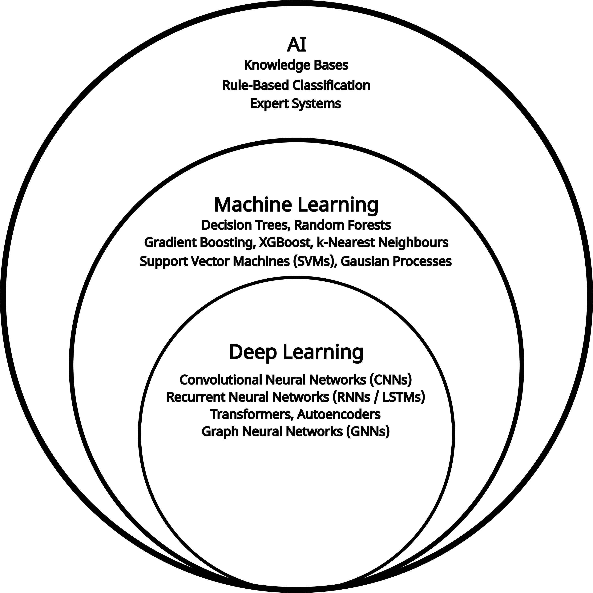
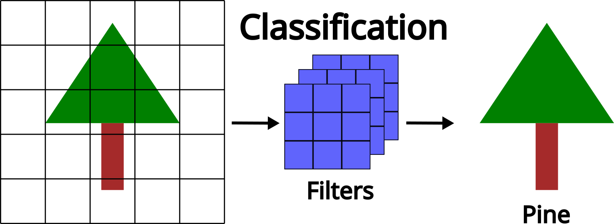
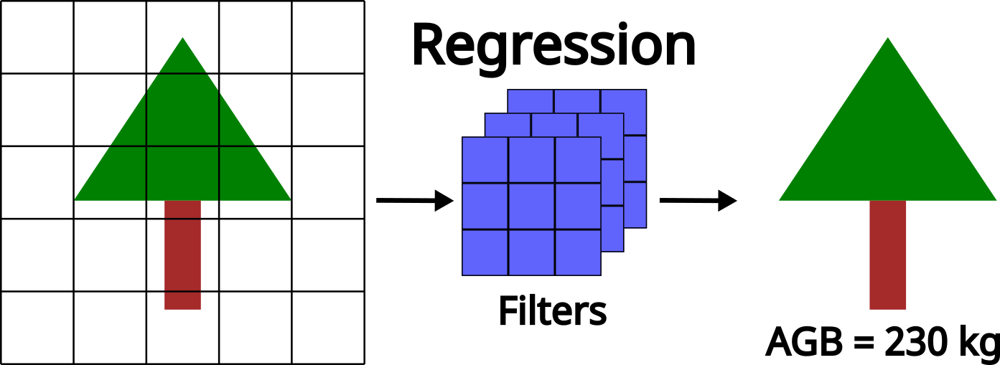
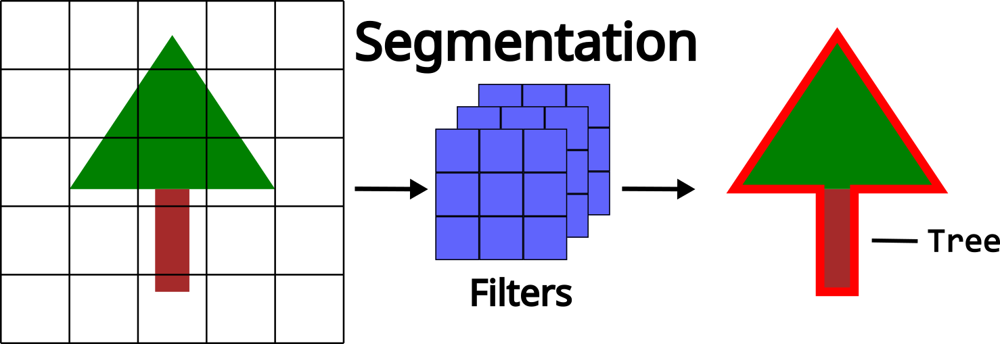

## Relevant Resources
<a href="https://www.deeplearningbook.org/" target="_blank">The Deep Learning Book</a>

## What is Deep Learning?
Deep learning is a branch of machine learning, and both are forms of artificial intelligence (AI). **AI** refers to methods that enable machines to mimic human behavior. **Machine learning** is a subset of AI that uses statistical techniques to allow machines to improve their performance through experience, while **deep learning** is a subset of machine learning that enables the computation of multi-layered neural networks. A neural network is a term that is used interchangeably with deep learning and we will use them both throughout this workshop.

{#fig-ai-vendiagram fig-align="center" width=50%}

### Components of a Deep Neural Network
There are several key components and terms commonly used to describe a neural network. The **depth** of a neural network refers to the number of **layers** in its architecture (the example in @fig-neuralnetwork has five layers), whereas the **width** refers to the number of neurons within each layer.

{#fig-neuralnetwork fig-align="center"}

The most fundamental unit of a deep neural network is the **neuron**, which serves as the building block of any neural network. A neuron receives a set of inputs ($x_i$), weights ($w_i$) and sums them, while adding a bias term ($b$). These **weights** and **biases** are adjustable parameters that the network learns during **training**.

$$
\Large y = w_1x_1 + w_2x_2 + b
$$

Another important part of a neuron is called the **activation**. The output of the weighted sum ($y$) is passed through an activation function, which determines the strength of the output and whether the neuron becomes activated or not. Activation functions are essential because they introduce nonlinearity into the model. Without them, every layer would behave like a linear transformation, and no matter how many layers were stacked, the network could only learn simple linear relationships. By adding nonlinear activations, deep learning models can capture complex patterns and interactions in the data, making it possible to learn rich structure found in imagery and point clouds.

{#fig-neuron fig-align="center" width=60%}

::: callout-note
There are many activation functions, and you are encouraged to research which one would be best for your specific use case.
:::

### The Prediction - Feedback Loop
The **prediction-feedback loop** is what makes **learning** possible as a deep learning model doesn't just memorize the data, it adapts and generalizes to it. This allows a model to fine-tune how it *sees* the input **data** to improve its performance based on the **goal** and the **task**.

{#fig-feedback-loop fig-align="center" width=60%}

This prediction–feedback loop is driven by the goal of the **loss function**, which guides the model in adjusting its weights and biases to find the optimal solution. The loss function assesses the difference between the true and predicted **labels**, typically, with the goal to minimize the error between the two. There are different types of loss functions, each providing different feedback to the model. Choosing a loss function depends on the task (e.g., classification, regression), and ensuring that it is appropriate for the problem is a crucial step.

A key part of this update process involves **gradients**, which measure how much a small change in each weight or bias would affect the loss. Gradients point the model in the direction that most reduces error, allowing the network to adjust its parameters efficiently. During training, these gradients are computed and used to update the weights so that, over time, the model’s predictions become more accurate. Although gradients operate behind the scenes, they are central to how deep learning models learn from the data.

Over a number of iterations, or **epochs**, the model adjusts its weights and biases based on the feedback received from the loss function. Eventually, the model can no longer improve given the input data, and at this point, the loss begins to stabilize, indicating that the model has reached its optimal performance. 

{#fig-epochs fig-align="center"}

This iterative adjustment process is called model training and involves a **training** and a separate **validation** dataset. The training dataset is used to teach the model by updating its parameters, while the validation dataset assesses how well the model generalizes to unseen data. Monitoring performance on the validation set helps to detect **overfitting** (when a model learns the training data too closely and fails to perform well on new inputs) ensuring the final model remains both accurate and robust. We can monitor this using **loss curves** as seen in @fig-epochs ensuring that the loss continues to drop for both the training and validation datasets.

After the prediction-feedback loop (training and validation), a **testing** dataset is used to provide an unbiased evaluation of the model’s final performance. Unlike the validation set, which guides the model tuning during training, the test set is completely withheld until all adjustments are complete. This ensures that the performance metrics reflect how the model will behave on truly unseen data, offering a realistic measure of its generalization ability and reliability for real-world applications.

::: callout-note
It is crucial that these three separate and distinct datasets (training, validation, and testing) are generated for training deep learning models. Mixing or reusing data between these datasets can lead to misleading performance metrics and poor generalization. Proper separation ensures that the model is evaluated fairly at each stage of development and that its reported accuracy truly reflects performance on new, unseen data.
:::

### Common Deep Learning Tasks
#### Classification
**Classification** assigns each input (an image, pixel, object, or point cloud sample) to a discrete class. This is often the starting point in deep learning for ecological or environmental analysis.

Common forestry classification applications include:

- **Tree-species recognition:** Using spectral signatures, textural patterns, or structural characteristics to label species at the tree or stand level.
- **Land-cover mapping:** Categorizing pixels into classes such as forest, water, bare ground, or herbaceous vegetation.
- **Disturbance detection:** Identifying wildfire scars, harvest events, pest outbreaks, or storm damage.
- **Health or stress classification:** Detecting and identifying different stressed areas or detecting mortality at the tree or stand level.

{#fig-classification fig-align="center" width=80%}

#### Regression
**Regression** models predict continuous numerical values, making them ideal for estimating biophysical variables derived from remote sensing datasets. Rather than assigning categories, they learn patterns that correspond to a real-valued output.

Typical forestry-focused regression tasks include:

- **Above-ground biomass estimation:** Using spectral reflectance, canopy texture or structural characteristics from lidar to estimate AGB of a tree or stand.
- **Canopy cover for leaf area index estimation:** Modeling continuous vegetation density across forested landscapes.
- **Crown diameter or volume:** Predicting various individual-tree metrics.

{#fig-regression fig-align="center" width=80%}

#### Segmentation
**Segmentation** assigns a label to every pixel/point (**semantic segmentation**) or separates individual objects within an image or point cloud (**instance segmentation**). This task is essential when the goal is to create detailed spatial maps rather than broad classifications.

In forestry applications, segmentation helps support:

- **Tree-crown delineation:** Separating individual tree crowns in imagery or point clouds for per-tree analysis.
- **Stand or management-unit boundaries:** Automatically outlining key forest changes or stand edges.
- **Vegetation structure mapping:** Distinguishing between canopy, understory, stem, and ground points from lidar data.

{#fig-segmentation fig-align="center" width=80%}

## Image-Based vs. Point-Based Deep Learning
### Image-Based Deep Learning
**Image-based** deep learning is a computer vision method that teaches computers to understand and interpret images. Instead of manually telling the computer what to look for, these algorithms automatically learn patterns from large sets of images. These algorithms can learn features like edges, shapes, and colours, and eventually can identify complex objects such as trees. Because these models learn directly from the data, they can help computers *see* and make sense of the imagery.

{#fig-imagedl fig-align="center" width=80%}

A common image-based deep learning technique is the **convolutional neural network (CNN)**. CNNs use filters (also called kernels) that slide across an image to detect important visual features. These filters help the network to focus on local patterns while keeping track of the spatial relationships in the image. As the data moves through the different layers of the network, the CNN learns increasingly complex patterns. 

{#fig-convolutions fig-align="center" width=60%}

### Point Based Deep Learning
**Point-based** deep learning is a method used to analyze 3D data point clouds. Unlike image data, which is structured in a grid of pixels, point clouds are irregular and unorganized, making them harder for traditional neural networks to process. Point-based deep learning models are designed to handle this challenge by directly learning from the spatial relationships between points without needing to convert them into images or grids. By learning the geometric patterns directly from the raw point clouds, these models are able to provide an accurate and detailed understanding of complex 3D structures of the forest. Similar to image-based approaches as the data moves through the different layers different and more complex patterns can be extracted.

{#fig-pointdl fig-align="center" width=80%}

## Key Terminology and Concepts to Know
Before exploring data preparation, training workflows, and model evaluation, it is useful to establish a common vocabulary for how deep learning models operate. The terms below describe the core components, processes, and ideas that appear throughout all deep learning methods, regardless of the specific architecture or data type. Understanding these concepts will help clarify how models learn, how they are structured, and how different parts of the training pipeline fit together.

### Parameters vs. Hyperparameters
**Parameters** are the internal values of a neural network that are learned during training. These include the weights and biases in each layer. They are updated automatically through optimization and define how the model transforms inputs into predictions.

**Hyperparameters** control *how* a model learns rather than what it learns. Examples include learning rate, batch size, number of epochs, and model depth. Unlike parameters, hyperparameters are set by the user and are not learned during training. These often need to be tuned in order to receive optimal results.

### Input Features vs. Labels vs. Learned Features
**Input Features** are the input variables or measurements the model receives. In imagery, these might be pixel values from the spectral bands; in point clouds, they may include XYZ coordinates, intensity, or return number. Features describe the data but are not predictions themselves.

**Labels** represent the target values the model is trying to predict. These can be discrete classes (e.g. species), continuous values (e.g. biomass), or spatial assignments (e.g. segmentation masks). Labels are essential for supervised learning.

**Learned Features** are internal representations automatically discovered by the neural network as the data moves through its layers. Unlike input features, which come directly from the dataset, learned features are created by the model itself. Early layers often capture simple patterns such as edges or local geometry, while deeper layers encode more abstract concepts such as textures, shapes, or structural patterns. These learned features enable deep learning models to extract complex information without requiring manual feature engineering.

### Batches & Batch Size
Instead of processing the entire dataset at once, the model learns from small subsets of the data called **batches**. The **batch size** is the number of samples processed per training step. Batch size affects memory usage, training stability, and learning dynamics.

### Model Architecture vs. Model Weights
The **model architecture** defines the structure of the network, including the number and type of layers and how they are connected. Examples include CNNs for image and point based networks for 3D data. The architecture determines the model’s capacity to learn patterns, and differ based on the goal and task.

**Model weights** are the numerical values stored within each layer that get updated during training while the architecture stays fixed, the weights change continuously, forming the learned representations of the data.

### Forward pass vs. Backward Pass
The **forward pass** is the process where input data moves through the network, from the first layer to the final output, to generate predictions. All computations during this step use the current parameter values.

The **backward pass** computes gradients that describe how the loss changes with respect to each parameter. These gradients are then used by the optimizer to update the models parameters, allowing it to improve over time.

### Training Loop
The **training loop** refers to the repeated cycle of performing forward passes, computing loss, running backward passes, and updating parameters. This loop continues for a set number of epochs or until the model stops improving.

### Gradient Descent
**Gradient decent** is the core optimization ideal that adjusts a model’s parameters to minimize the loss function. By moving the weights in the direction that decreases the error, the model incrementally improves its predictions.

### Transfer Learning & Fine-Tuning
**Transfer learning** is a technique where a deep learning model that has already been trained on a large, general-purpose dataset is reused as the starting point for a new task. Instead of training from scratch, the model begins with learned features that capture useful patterns, such as edges, textures, shapes, or geometric structures, that often transfer well across related tasks and data types.

**Fine-tuning** is the process of adjusting (or refining) some or all of the pretrained model’s weights on your specific dataset. This allows the model to adapt its learned features to the characteristics of your data, such as new species, sensor types, or forest structures. Fine-tuning is especially valuable when labelled data are limited, because it reduces the amount of training needed and often leads to better generalization that starting with a randomly initialized model.

## Challenges and Considerations for Deep Learning in Forestry Applications
Forestry data introduce unique complexities that shape how deep learning models behave in real-world applications. Understanding these challenges at a high level helps set realistic expectations for model performance and highlights why certain design choices are necessary. The following considerations provide important context for why deep learning in forestry often requires additional care compared to more controlled or synthetic environments.

### High Variability Across Sensors and Sites
Remote sensing data in forest often come from different platforms, sensors, and acquisition conditions. Variations in resolution, illumination, phenology, or sensor characteristics can change how forests appear in the imagery or point cloud. Deep learning models may struggle to generalize when trained on one condition but applied to another, making cross-site or cross-sensor performance a challenge. This issue has led to ongoing research in **fine-tuning and domain adaptation**, where models trained in one environment are carefully adjusted to perform well in new regions, sensors, or forest types.

### Spatial Autocorrelation
Nearby pixels, trees, or points in a forest environment tend to be more similar than distant ones. This natural spatial structure can bias model training and validation if not accounted for. For instance, training and test samples drawn from the same spatial neighborhood may artificially inflate performance, making the model appear more accurate than it truly is on new areas.

### Imbalanced Ecological Classes
Forestry datasets frequently contain disproportionate numbers of certain classes (e.g. abundant/dominant species or canopy structures). Samples that are underrepresented often cause models to prioritize majority classes and perform poorly on minority ones. This imbalance requires careful design of training strategies, loss functions and evaluation metrics.

### Models Developed on Idealized or Synthetic Benchmarks
Many deep learning models, particularly point-based architectures, are initially designed and validated on synthetic or highly controlled benchmark datasets unrelated to forestry. These datasets lack noise, irregular sampling, occlusion, and structural complexity found real world samples. As a result, models that perform impressively on these datasets often struggle when applied directly to operational forestry data. Adapting these models to real-world conditions is crucial and is an ongoing research challenge that frequently requires domain knowledge/adaptation, and fine-tuning on representative field datasets.

### Limited Quantity of Labeled Datasets
High-quality labelled datasets are often scare in forestry because manual annotation, such as identifying species, delineating crowns, or validating biomass measurements, is time-consuming, costly, and requires expert knowledge. This limited availability of labelled data can restrict model performance and make it difficult to train deep neural networks effectively. As a results, approaches such as data augmentation, semi-supervised learning, transfer learning, and pseudo-sample generation are especially important in forestry applications to help models learn from small or imperfect datasets.

## Frequently Asked Questions
### How does deep learning differ from machine learning or artificial intelligence?
Artificial intelligence is the broad field of creating systems that perform tasks associated with human intelligence. Machine learning is a subset of artificial intelligence that uses data-driven algorithms to learn patterns and make predictions. Deep learning is a further subset of machine learning that uses multi-layered neural networks to automatically learn complex representations from data. Unlike many traditional machine learning methods, deep learning can extract features directly from raw inputs, reducing the need for manual feature generation.

### What makes deep learning deep?
Deep learning models are considered *deep* because they contain multiple layers of neurons through which data are successively transformed. Each layer learns increasingly abstract features, from simple edges or shapes to complex patterns and structures. The depth, or number of layers, enables these models to capture highly non-linear relationships that simpler models cannot represent.

### What are some advantages and disadvantages of deep learning?
Deep learning excels at learning complex patterns, handling high-dimensional data, and achieving state-of-the-art performance in tasks like image classification, segmentation, and 3D analysis. However, it typically requires large amounts of labelled data, substantial computational resources, and careful tuning. Deep learning models can also be harder to interpret, making it challenging to understand why a model makes certain predictions.

### When should a deep learning model be used?
Deep learning is most effective when you have large, diverse datasets and tasks with complex patterns that simpler models struggle to capture. As the complexity of the data or the task increases deep learning becomes a more beneficial option. Raw lidar data for example is a complex dataset and is well suited for deep learning tasks.

{#fig-deeplearning-complexity fig-align="center" width=40%}

### What computing resources are required to run a deep learning model?
Training deep learning models generally benefits from using a graphics processing unit (GPU), which accelerates the large matrix operations involved. Smaller models or inference tasks can run on a standard CPU, but training deep neural networks on CPUs is typically slow. For larger datasets or 3D models, access to GPUs, high memory capacity, and efficient data pipelines becomes increasingly important

### Why do deep learning models need so much data?
Deep learning models contain millions of parameters that must be learned during training. Large datasets help ensure these parameters capture general patterns rather than memorizing noise. With limited data, deep learning models are more likely to overfit, producing high accuracy on the training set but poor performance on new or unseen data. More data, especially diver data, improves generalization.

### How do I know which model architecture to choose?
The choice of architecture depends on the type of data, the goal and the task, CNNs are well suited for image-based tasks, while point-based neural networks handle 3D point clouds. Architectures like U-Net are often used for segmentation, whereas regression problems might consider feedforward networks. In practice, the best approach is to start with widely used, well-documented architectures and adapt them as needed based on performance.

### How long does it take to train a deep learning model?
Training time varies widely depending on model size, computing resources, and batch configuration. Small models may train in a minutes to hours, while large models or 3D networks trained on high-resolution data can take days. Efficient hardware, optimized data loading, and appropriate batch sizes can significantly reduce training time.

### How do I know if I have enough labelled data?
A practical way to assess this is by observing model performance and generalization. Signs you may not have enough labelled data include overfitting, unstable validation performance, or high sensitivity to small changes in the training set. If performance does not improve despite tuning, acquiring more labelled samples or using techniques like data augmentation, transfer learning, or pseudo-sample generating can help compensate for limited data.