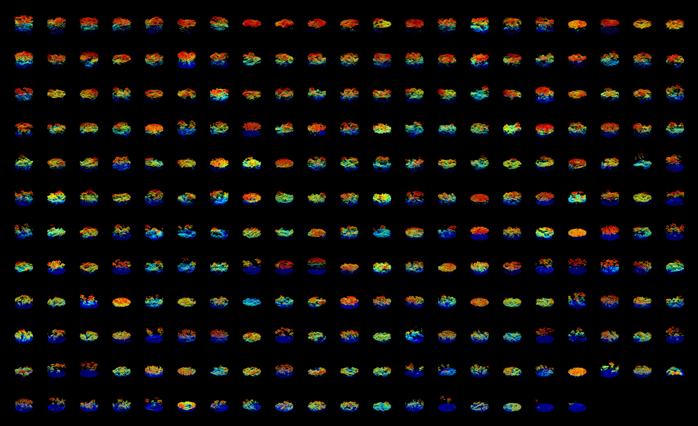
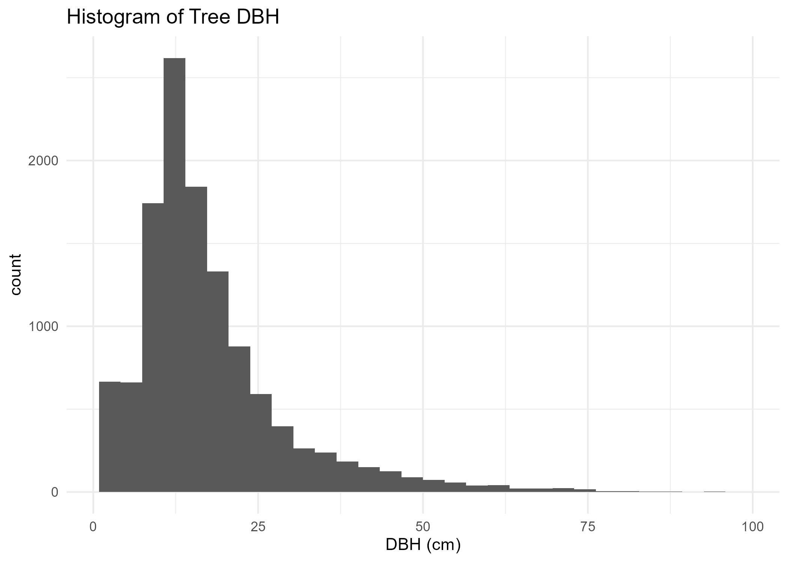
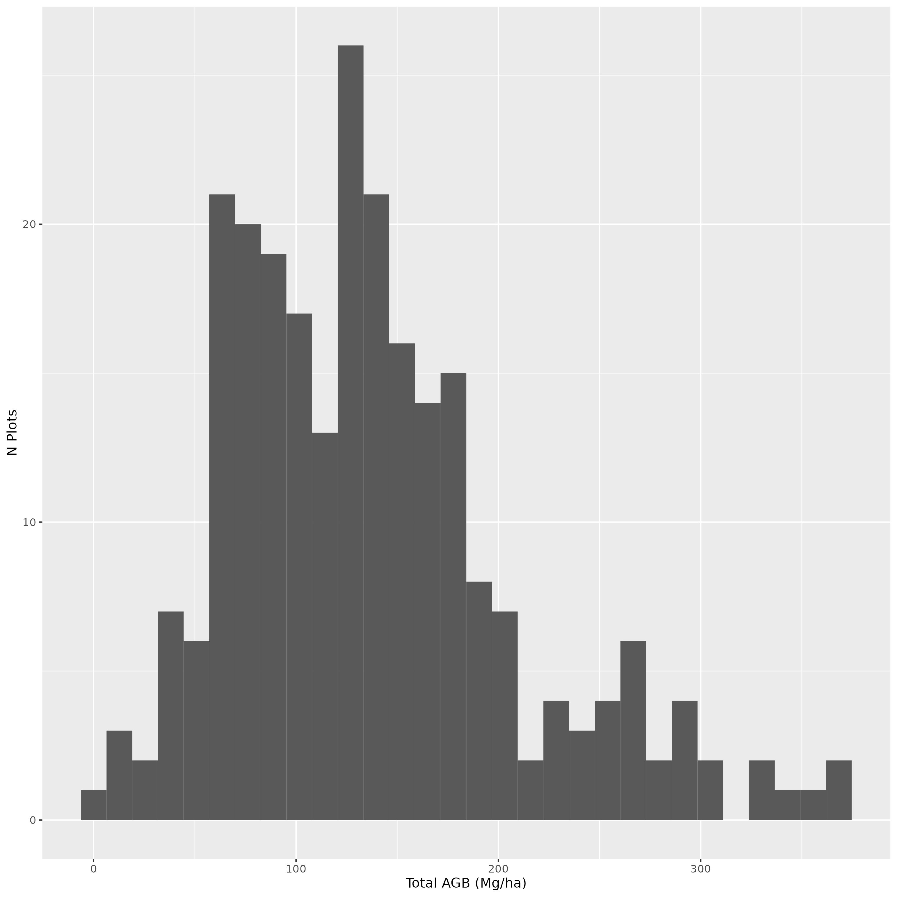
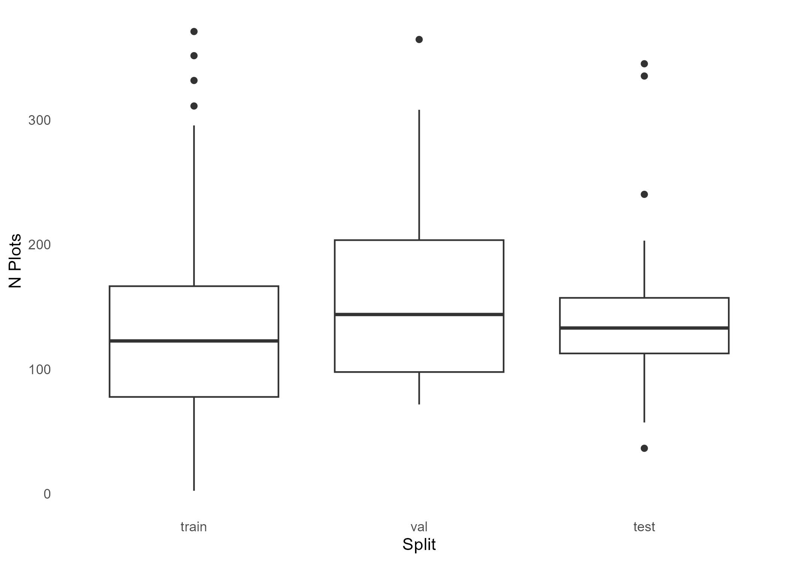
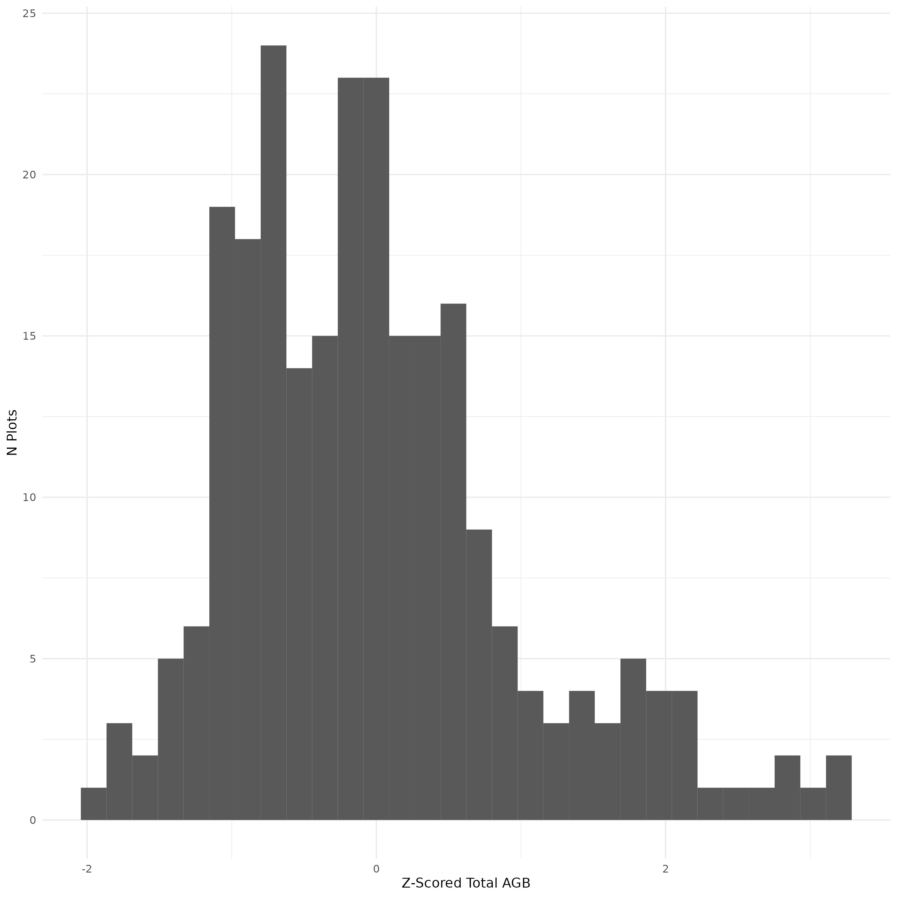

{fig-alt="Petawawa Forest Map" caption="" width="80%"}

This section will provide preprocessing code to prepare LiDAR and sample plot data for subsequent point cloud deep learning model development.

# Relevant Resources

**The complete preprocessed dataset can be downloaded [here](https://ln5.sync.com/dl/88a6f5dd0#u24mrtkh-d5dqhart-zrg42shx-jfhhk8u5) as an alternative to running this notebook.**

If you wish to run the preprocessing, the original height normalized ALS and sample plot data for the PRF can be downloaded from the NFIS website:

* LiDAR: [https://opendata.nfis.org/downloads/petawawa/Raster/LiDAR_2018/PRF_benchmarking_harmonized_2018_ALS.zip](https://opendata.nfis.org/downloads/petawawa/Raster/LiDAR_2018/PRF_benchmarking_harmonized_2018_ALS.zip)

* Field Plots: [https://opendata.nfis.org/downloads/petawawa/Vector/Forest%20Sample%20Plots/SPL2018_EFI_ground_plots.zip](https://opendata.nfis.org/downloads/petawawa/Vector/Forest%20Sample%20Plots/SPL2018_EFI_ground_plots.zip)

## The lidR Package

This tutorial makes use of the `lidR` package to prepare LiDAR data for deep learning. LiDAR preprocessing can often be complex and is a critical step in an enhanced forest inventory workflow. However, it is not the focus of this workshop. For more detailed information about LiDAR preprocessing, see the [lidR package tutorial](https://r-lidar.github.io/lidRbook/).

# Dataset Background

The Petawawa Resereach Forest (PRF) is the oldest research forest in Canada, established in 1918. It is a remote sensing supersite and is part of the [GEO-TREES](https://geo-trees.org/) network.

In this workshop we make use of enhanced forest inventory sample plots collected in the PRF in 2018. We are also using single photon airborne laser scanning (ALS) data also collected in 2018.

**Key information about dataset**

* Sample plots are fixed-area and have a 14.1 m radius (625 m^2^).

* Dataset size: n = 249 plots

* Live trees with DBH > 9 cm measured (DBH, height, species, etc.)

* ALS data has a mean point density of 35 points/m^2^.

# Summary of Preprocessing Steps

1) LiDAR preprocessing

2) Examine and clean sample plot data

3) Determine dominant species type (coniferous/deciduous/mixed)

4) Derive plot-level total aboveground biomass (AGB) using allometry

5) Divide the data into training, validation, and test sets (i.e., splits)

6) Perform Z-score normalization for AGB data

7) Export preprocessed data

# Filepaths

Ensure that the data is downloaded from [here](https://ln5.sync.com/dl/88a6f5dd0#u24mrtkh-d5dqhart-zrg42shx-jfhhk8u5) and that the filepaths below are correct prior to running any code.

Currently, the variable `PROCESS_LIDAR` is set to `FALSE`, which skips the LiDAR preprocessing code to save time. The preprocessed point cloud data is already provided in the dataset downloaded from the link above. However, if you wish to preprocess the ALS data, you can download the full Petawawa ALS dataset [here](https://opendata.nfis.org/downloads/petawawa/Raster/LiDAR_2018/PRF_benchmarking_harmonized_2018_ALS.zip). 

```{r}
#| code-fold: true

PROCESS_LIDAR = FALSE

PLOT_RADIUS = 14.1

PLOT_COORDS_FPATH = 'data/SPL2018_EFI_ground_plots/SPL2018_EFI_ground_plots/PRF_SPL2018_EFI_plots_pts_wgs84.shp'

PLOT_DATA_FPATH = 'data/SPL2018_EFI_ground_plots/SPL2018_EFI_ground_plots/PRF_CNL_SPL_CalibrationData_LiveDeadStems.xlsx'

TREE_SP_CODES_FPATH = 'data/mnrf_sp_codes.csv'

PLOT_PC_DIR = "data/plot_point_clouds"

PLOT_LAS_DIR = "data/plot_las_files"

LABELS_FPATH = 'data/labels.csv'

ZQ95_FPATH = 'data/zq95.csv'

LIDAR_INDEX_FPATH = 'data/prf_lidar_index.gpkg'

LIDAR_DIR = NA # The full ALS dataset is optional as preprocessed point clouds are provided (see above)

```

# Packages

Ensure the following package dependencies are installed. Note that [reticulate](https://rstudio.github.io/reticulate/) is an R package that allows for interfacing between R and Python languages. To use reticulate in this case, you need to have a python virtual environment set up beforehand. Python environment setup instructions are provided [here](setup.qmd). Ensure that the data and python environment are all stored in the same root directory as the tutorial files.

```{r}
#| code-fold: true

library(lidR)
library(here)
library(sf)
library(tidyverse)
library(mapview)
library(ggplot2)
library(plotly)
library(reticulate)
library(readxl)
library(purrr)

# Import python numpy module using reticulate
np <- reticulate::import("numpy")

```

# Study Area

We can start by examining the study area, including vector data representing ALS coverage of the PRF (i.e., the lidar index) and ground sample plot locations. 

The plot data in this case were sampled in 2018 as a remeasurement of Temporary Sample Plots (TSP) originally established in
2013-2014 in support of an earlier LiDAR acquisition project.

The ALS data was collected in 2018 to support an EFI of the research forest.

```{r}
#| code-fold: true

lidar_index <- st_read(LIDAR_INDEX_FPATH, quiet=TRUE)

#Read the plot coordinates and ensure CRS is correct
plot_centers <- st_read(here(PLOT_COORDS_FPATH), quiet=TRUE) %>%
    st_transform(st_crs(lidar_index)) %>%
    st_zm() %>%
    dplyr::rename(plot_id = Plot)

mapview(lidar_index, layer.name = 'LiDAR Tiles', map.types = c('Esri.WorldImagery'), 
        alpha.regions = 0.2, col.regions = 'white', color = 'grey') + 
    mapview(plot_centers,col.regions = 'red', color = 'black', layer.name = 'Ground Plots')

```

# 1) LiDAR preprocessing

## Steps and Functions

**The code below includes the LiDAR preprocessing steps to prepare the ALS point cloud data for use in deep neural network model development.**

Most of these preprocessing steps are standard in any ALS - forest inventory workflow and described in greater detail in the [lidR package documentation](https://r-lidar.github.io/lidRbook/). The steps are implemented as functions below, which are applied to each individual plot-level point cloud extracted from the full LiDAR aquisiton. These steps include:

1) Extract and clean ALS point clouds contained within the boundary of the ground reference plots. We do this using the function `extract_pc` in the code below. 

2) Filter duplicates, then classify and remove noisy points. This is performed using various functions from the lidR package combined in the `clean_pc` function.

3) Beyond this point, we abandon the LAS object from the lidR package and convert the point cloud to a simpler 3D array using the `pc_to_matrix` function. We do this because storing data in a simpler array format allows for faster reading time for deep learning model training. 

4) We then normalize the point cloud data such that it has the X and Y coordinates are (0,0) at the center of the point cloud. This step improves deep neural network training outcomes as was outlined in early research by [Qi et al. (2017)](https://proceedings.neurips.cc/paper/2017/hash/d8bf84be3800d12f74d8b05e9b89836f-Abstract.html). This is performed using the `normalize_pc_xy` function. Note that the Z coordinates are left as height above ground in meters. 

5) We calculate the 95th height percentile for each plot point cloud for later comparison to ensure that there is good alignment between plot level canopy height measurements and LiDAR height. We do this with the `calc_pc_zq95` function.

6) Export point clouds to numpy files (.npy) for later use in model development using the `write_pc_to_npy`. Note that other file formats (e.g., pickle, LAS, HDF5, PLY, etc.) are also used in point cloud deep learning applications. The choice of file format is case dependent. Here we favour the .npy format since it is fast and easy to work with in Python.

```{r}
#| code-fold: true

extract_pc <- function(coords, ctg){

      x = coords[1]
      y = coords[2]

      las <- lidR::clip_circle(
        las = ctg,
        x = x,
        y = y,
        radius = PLOT_RADIUS)
      
      return(las)

    }

clean_pc <- function(las) {
  
  las <- lidR::filter_duplicates(las)
  
  las <- lidR::classify_noise(las, sor(9,2))
  
  las <- lidR::filter_poi(las, Classification != LASNOISE)
  
  return(las)
}

pc_to_matrix <- function(las){

  pc <- unname(st_coordinates(las))

  return(pc)

}

normalize_pc_xy <- function(pc){

  pc[, 1] <- pc[, 1] - mean(pc[, 1])
  pc[, 2] <- pc[, 2] - mean(pc[, 2])

  return(pc)
}

calc_pc_zq95 <- function(pc){

    zq95 <- quantile(pc[, 3], probs = 0.95)

    return(zq95)

}

write_pc_to_npy <- function(pc, plot_id, pc_out_dir){    
    
    pc_np <- np$array(pc, dtype = "float32")

    np$save(file.path(here(pc_out_dir), paste0(plot_id, ".npy")), pc_np)

    return('')
    
    }

```

## Preprocessing Pipeline

Here we apply the functions defined above to each individual sample plot point cloud.

1) Load a [LAS Catalog](https://r-lidar.github.io/lidRbook/engine.html) representing the LiDAR data spanning the PRF.

2) Extract the corresponding point cloud for each plot with `extract_pc`

3) Clean the point clouds with `clean_pc`

4) Export the cleaned point clouds to LAS files (for use in random forest modelling)

5) Convert point clouds to arrays and normalize using `pc_to_matrix` and `normalize_pc_xy`

6) Calculate the 9th height percentile using `calc_pc_zq95`

7) Export the numpy point cloud files and the 95th height percentile data.

```{r}
#| code-fold: true

if(PROCESS_LIDAR){

  #Read the normalized las catalog
  ctg <- readLAScatalog(LIDAR_DIR)

  #Set some catalog processing parameters
  opt_select(ctg) <- "xyz"
  opt_progress(ctg) <- FALSE

  # Ensure coordinate systems match
  plot_centers <- plot_centers %>% st_transform(lidR::crs(ctg))

  # Get a list of plot coordinates
  coords <- split(st_coordinates(plot_centers), 
                    seq_len(nrow(plot_centers)))

  # Extract point clouds and store in list
  las_ls <- purrr::map(coords, extract_pc,  ctg = ctg, .progress = TRUE)

  # Clean point clouds
  las_ls <- purrr::map(las_ls, clean_pc, .progress = TRUE)

  # Export cleaned las files
  for(i in 1:nrow(plot_centers)){
    plot_id <- plot_centers$plot_id[i]
    las_fpath <- here(file.path(PLOT_LAS_DIR, paste0(plot_id, ".las")))
    lidR::writeLAS(las_ls[[i]], las_fpath)
  }

  # Convert point clouds to matrices
  pc_ls <- purrr::map(las_ls, pc_to_matrix, .progress = TRUE)

  # Normalize point clouds X & Y coordinates (leave Z)
  pc_ls <- purrr::map(pc_ls, normalize_pc_xy, .progress = TRUE)

  # Calculate zq95 for each point cloud to check alignment with plot data later
  als_derived_zq95_ls <- purrr::map(pc_ls, calc_pc_zq95, .progress = TRUE)

  # Ensure the point cloud directory exists
  dir.create(PLOT_PC_DIR, recursive = TRUE, showWarnings = FALSE)

  # Export point clouds to numpy (.npy) files for use in python
  mapply(write_pc_to_npy, 
        pc = pc_ls,
        plot_id = plot_centers$plot_id,
        pc_out_dir=PLOT_PC_DIR)

  # Export ZQ95 values
  als_derived_zq95_df <- data.frame(plot_id = plot_centers$plot_id,
                                    als_zq95 = as.numeric(als_derived_zq95_ls))

  write.csv(als_derived_zq95_df, ZQ95_FPATH, row.names=FALSE)

}


```

### Preprocessed Point Cloud Example

The plot below shows the point cloud for a plot in the PRF dataset. Note that the X and Y coordinates are now normalized and are relative to the plot center.

```{r}
#| code-fold: true

plot_pc <- function(pc){

  pc_df <- as.data.frame(pc)
  names(pc_df) <- c('x', 'y', 'z')

  p <- plot_ly(pc_df, x = ~x, y = ~y, z = ~z, type = "scatter3d", mode = "markers",
             marker = list(size = 3, color = ~z, colorscale = "Jet")) %>%
            layout(title = "",
                  scene = list(
                    xaxis = list(title = "", showgrid = FALSE, showticklabels = TRUE, ticks = "outside"),
                    yaxis = list(title = "", showgrid = FALSE, showticklabels = TRUE, ticks = "outside"),
                    zaxis = list(title = "Z", showgrid = FALSE, showticklabels = TRUE, ticks = "outside")
                  ))

  return(p)

}

# Load an example pc
demo_pc <- np$load(list.files(PLOT_PC_DIR, full.names = TRUE)[50])

# Visualize a point cloud
plot_pc(demo_pc)

```


### Preprocessed point clouds

Image below shows the 249 sample plot point clouds in the PRF from 2018. Plots are listed in decreasing order based on canopy height. Click image to view in full screen.

<a href="images/seely_etal_2025_prf_point_clouds.jpg" target="_blank">
  
</a>

# 2) Examine and clean sample plot data

We now move on to loading and examining the tree level measurements across the PRF sample plots (n = 249).

Below we perform the following:

  1) Load tree species codes to get the full names for subsequent joining with allometric equation parameters.

  2) Load individual tree measurements from the `PRF_CNL_SPL_CalibrationData_LiveDeadStems.xlsx` spreadsheet.

  3) Remove any dead stems from the tree list and join the data with the species names


```{r}
#| code-fold: true

# Load tree species codes
tree_sp_codes_df <- read.csv(TREE_SP_CODES_FPATH) %>%
                      mutate(species = trimws(species))

# Load plot level tree measurements
trees_df <- read_excel(PLOT_DATA_FPATH, sheet = 'Tree') %>%
              dplyr::rename(plot_id = PlotName,
                            sp_code = tree_spec,
                            dbh = DBH) %>%
              select(plot_id, sp_code, dbh, 
                     ht_meas, tvol, Status) %>%
              # Drop dead trees from dataset
              filter(Status == "L") %>%
              # Add species names from codes df
              left_join(tree_sp_codes_df, by = 'sp_code') %>%
              #Capitalize species name
              mutate(species = str_to_title(species))

print(str(trees_df))

```

## Check for NA data and examine species proportions

In the code below we check to see if any trees are missing species information.

We also summarize the proportion of each species in the dataset based on count.

```{r}
#| code-fold: false

print(table(is.na(trees_df$species)))

sp_sorted = sort(round(table(trees_df['species']) / nrow(trees_df) * 100, 2), 
     decreasing = TRUE)

print(sp_sorted)
```

## Check alignment between LiDAR and Plot Data

An effective way to check the alignment between the preprocessed LiDAR and plot data is by comparing plot-level canopy height measurements with LiDAR-derived 95th height percentile. If there is a strong correlation this indicates good alignment.

Below we perform the following:

1) Load the previously derived LiDAR derived 95th height percentile values (ZQ95)

2) Derive plot-level ZQ95 based on field tree height measurements.

3) Visualize the field-derived ZQ95 vs. the LiDAR derived ZQ95.

```{r}
#| code-fold: true

als_derived_zq95_df <- read.csv(ZQ95_FPATH)

field_zq95_df <- trees_df %>%
                filter(!is.na(ht_meas)) %>%
                group_by(plot_id) %>%
                summarize(field_zq95 = quantile(ht_meas, probs = 0.95))

zq95_df <- field_zq95_df %>%
              left_join(als_derived_zq95_df, by = 'plot_id')

zq95_df %>%
  ggplot(aes(x = field_zq95, y = als_zq95)) + 
  geom_point() + 
  geom_abline(intercept = 0, slope = 1, linetype = "dashed", color = "red") +
  theme_minimal() + 
  coord_fixed(ratio = 1) + 
  xlab('Field-Derived ZQ95 (m)') + 
  ylab('LiDAR-Derived ZQ95 (m)')

```

# 3) Determine dominant species type

Here we can classify each plot as dominated by coniferous, deciduous or mixed. These three classes will later be used to train a deep neural network classifier in the `TRAIN` section of the tutorial.

For the purpose of this tutorial, we will use total volume (`tvol`) to define species dominance.

In the code below we do the following:

1) Set a volume percentage threshold to define species dominance (`DOMINANCE_PERC_THRESH`). 

2) Define a function (`get_tvol_d_perc`) to derive the plot total volume (`plot_tvol`) and the total deciduous volume (`decid_tvol`). We then use both of these to derive the percentage deciduous volume comprising each plot.

3) We apply the `get_tvol_d_perc` to each plot and use the `DOMINANCE_PERC_THRESH` to assign a plot to either coniferous, deciduous, or mixed using the following logic:

    **% Decid. > 70% → Deciduous**

    **% Decid. < 30% → Coniferous**

    **30% <= % Decid. <= 70% → Mixed**

```{r}
#| code-fold: true

DOMINANCE_PERC_THRESH <- 70

get_tvol_d_perc <- function(trees){

  plot_tvol <- trees %>% 
                pull(tvol) %>%
                sum()

  decid_tvol <- trees %>% 
                  filter(sp_type == 'd') %>%
                  pull(tvol) %>%
                  sum()

  perc_tvol_d <- decid_tvol / plot_tvol * 100

  return(perc_tvol_d)

  }

perc_d_vec <- vector(mode = 'numeric')

for(plot_id_i in unique(trees_df$plot_id)){

  plot_i_trees <- trees_df[trees_df['plot_id'] == plot_id_i, ]

  perc_d_vec <- append(perc_d_vec, get_tvol_d_perc(plot_i_trees))

}

# Assing plot to be either coniferous or deciduous dominant
perc_decid_df <- data.frame(plot_id = unique(trees_df$plot_id),
                            perc_decid = perc_d_vec) %>%
                  mutate(dom_sp_type = if_else(perc_decid > DOMINANCE_PERC_THRESH, 'decid', 
                                       if_else(perc_decid > (100 - DOMINANCE_PERC_THRESH) , 'mixed', 'conif')))


perc_decid_df %>%
  mutate(dom_sp_type = if_else(dom_sp_type == 'conif', 'Coniferous',
                       if_else(dom_sp_type == 'decid', 'Deciduous', "Mixed"))) %>%
  ggplot(aes(x = perc_decid, fill = dom_sp_type)) + 
  geom_histogram(position='identity') + 
  theme_minimal() +
  xlab("Percent Deciduous (%)") + 
  ylab("N Plots") + 
  scale_fill_discrete(name = "Dominant Type")

head(perc_decid_df)

```

# 4) Derive plot-level total aboveground biomass

## Prepare species-specific allometric equations

Load Canadian national tree aboveground biomass equations allometric parameters (Lambert et al., 2005)

[Lambert, M.-C.; Ung, C.-H.; Raulier, F. 2005. Canadian national tree aboveground biomass equations. Can. J. For. Res. 35:1996-2018.](https://cdnsciencepub.com/doi/10.1139/x05-112)

Note that for the purpose of this tutorial, we use the DBH-only allometric equations since not all trees in the field data have height measurements. 

**In the code below we:**

1) Load the allometric equation parameters from Lambert et al. (2005)

2) Fix issues with species names to match those in the allometric data

3) Check that all species names match


```{r}
#| code-fold: false

allo_eqs_fpath = here('data/ung_lambert_allometric_dbh_eqs.csv')

allo_df <- read.csv(allo_eqs_fpath) %>%
              rename(species = Species_en) %>%
              mutate(species = str_to_title(species))

allo_sp_nms <- sort(unique(allo_df$species))

# Rename species to match allometric names

# Red (Soft) Maple as Red Maple
trees_df$species[trees_df$species == "Red (Soft) Maple"] <- "Red Maple"

# Ironwood (Ostrya virginiana) as Hop-Hornbeam
trees_df$species[trees_df$species == "Ironwood"] <- "Hop-Hornbeam"

# Tamarack as Tamarack Larch
trees_df$species[trees_df$species == "Tamarack"] <- "Tamarack Larch"

# White pine as Eastern white pine
trees_df$species[trees_df$species == "White Pine"] <- "Eastern White Pine"

# American Elm as White elm
trees_df$species[trees_df$species == "American Elm"] <- "White Elm"

#Northern White Cedar as Eastern white cedar
trees_df$species[trees_df$species == "Northern White Cedar"] <- "Eastern White Cedar"

#Check that all species names in data coreespond to those in allometric eqs
print("Species names match with allometric names:")
table(unique(trees_df$species) %in% unique(allo_df$species))

```

## Check distribution of DBH values 

```{r}
#| code-fold: true

fig <- trees_df %>%
  ggplot(aes(x = dbh)) +
  geom_histogram() +
  ggtitle("Histogram of Tree DBH") +
  theme_minimal() + 
  xlab("DBH (cm)")

ggsave(filename = here('images/trees_dbh_histogram.jpg'),
       plot = fig)

```



**In the code below, we pivot the allometric data frame to a wide format for easier implementation**

```{r}
#| code-fold: true

# Pivot allometric equations to wide format
allo_df_wide <- allo_df %>% select(species, Component_en, a, b) %>%
                      pivot_wider(names_from = Component_en, values_from = c(a, b))
head(allo_df_wide)
```


**Define functions to calculate AGB for each tree**

```{r}
#| code-fold: true

get_biomass <- function(a, b, c, dbh){ #DBH in cm, height in meters

  Biomass_kg <- a * (dbh^b)

  return(Biomass_kg)
}

get_tree_comp_biomass <- function(tree_df, use_height=FALSE){

  tree_df['foliage_biomass_kg'] <- get_biomass(
                                            a=tree_df['a_Foliage'], 
                                            b=tree_df['b_Foliage'], 
                                            c=tree_df['c_Foliage'],
                                            dbh=tree_df['dbh'])

  tree_df['bark_biomass_kg'] <- get_biomass(
                                         a=tree_df['a_Bark'], 
                                         b=tree_df['b_Bark'], 
                                         c=tree_df['c_Bark'],
                                         dbh=tree_df['dbh'])

  tree_df['branches_biomass_kg'] <- get_biomass(
                                             a=tree_df['a_Branches'], 
                                             b=tree_df['b_Branches'], 
                                             c=tree_df['c_Branches'],
                                             dbh=tree_df['dbh'])

  tree_df['wood_biomass_kg'] <- get_biomass(
                                         a=tree_df['a_Wood'], 
                                         b=tree_df['b_Wood'], 
                                         c=tree_df['c_Wood'],
                                         dbh=tree_df['dbh'])
  
  return(tree_df)
  
}

```

## Derive tree-level and subsequently plot-level AGB

**Here we take the following steps to derive plot-level AGB:**

1) Join the trees with allometric parameters based on species name

2) Apply the `get_tree_comp_biomass` to calculate tree component biomass (Foliage, Bark, Branch, Wood)

3) Sum tree biomass components to get `total_biomass_kg` in Kilograms (kg) for each tree

4) Sum tree AGB for each plot to get plot-level AGB (`total_agb_kg`)

5) Convert to tonnes per hecatre (Mg/ha) using the plot area in hectares (`0.06246 ha`)

```{r}
#| code-fold: false

trees_agb_df <- trees_df %>%
      left_join(allo_df_wide, by = "species") %>%
      get_tree_comp_biomass(.) %>%
      mutate(total_biomass_kg = foliage_biomass_kg + bark_biomass_kg + branches_biomass_kg + wood_biomass_kg)

# Check for NAs
print("Total AGB NAs"); table(is.na(trees_agb_df$total_biomass_kg))

# Each plot has a radius of 14.10m, so an area of 624.6m^2
# 1m^2 == 0.0001 ha
# So each plot is 0.06246 ha

plot_area_in_ha = 0.06246

#Summarize biomass by component for each plot
biomass_df <- trees_agb_df %>% 
                group_by(plot_id) %>% 
                summarise(total_agb_kg = sum(total_biomass_kg))

# Divide by 1000 for tonnes conversion, then by plot area in ha to get tonnes/ha
# 1t == 1000 kg, per hectare
biomass_df <- biomass_df %>% mutate(total_agb_mg_ha = total_agb_kg/1000/plot_area_in_ha)

head(biomass_df)

fig <- biomass_df %>%
  ggplot(aes(x = total_agb_mg_ha)) + 
  geom_histogram() + 
  theme_minimal(base_size = 18) +
  xlab("Total AGB (Mg/ha)") + 
  ylab("N Plots")

ggsave(filename = here('images/agb_histogram.jpg'),
       plot = fig)

```



# 5) Split Datasets

In deep learning applications, there is a requirement for three different subsets of your dataset: training, validation, and test. These are referred to as dataset `splits`.

* `Training` split is used to fit the deep neural network to patterns in the data in order to predict the target

* `Validation` split is used during model fitting iteratively to evaluate whether the model is generalizing well. Typically model training is stopped when performance on the validation split is optimal.

* `Test` split is used for final model assessment. The test data is kept completely isolated during the model fitting process and is used at the end to evaluate how well the deep neural network generalizes to unseen data.

**Below we combine the biomass and dominant species data**

```{r}
#| code-fold: false


# Join species and biomass data frames
df <- perc_decid_df %>%
          left_join(biomass_df, by = 'plot_id')

print("Check for NAs:")
print(table(is.na(df$total_agb_mg_ha)))
print(table(is.na(df$dom_sp_type)))
```

## Divide data into training, validation, and testing

Note that in many cases, it is useful to divide sample into splits using a stratified sampling procedure based on the response variable. For for purpose of in this tutorial, we will simply assign samples to each split randomly. However, note that in imbalanced datasets this may result in poor model performance, especially if the test split does not align well with the train split. As such, other strategies can be used to get better alignment between splits, such as stratified sampling or cross-validation.

**We randomly assign 70% of the plots to the train split, 15% to validation, and the remaining 15% to test.**

```{r}
#| code-fold: false

train_prop <- 0.7
val_prop <- 0.15
test_prop <- 0.15

stopifnot(train_prop + val_prop + test_prop == 1)

# Establish the number of samples per split
n_test <- round(nrow(df) * 0.15, 0)

n_train <-  round(nrow(df) * 0.70, 0)

set.seed(14)
test_df <- df %>%
    slice_sample(n=n_test) %>%
    mutate(split = "test")
  
set.seed(14)
train_df <- df %>%
    anti_join(test_df, by = "plot_id") %>%
    slice_sample(n=n_train) %>%
    mutate(split = "train")
  
val_df <- df %>%
    anti_join(train_df, by = "plot_id") %>%
    anti_join(test_df, by = "plot_id") %>%
    mutate(split = "val")

# Combine data frames
labels_df <- dplyr::bind_rows(train_df, val_df, test_df) %>%
                      select(c(plot_id, dom_sp_type, perc_decid, total_agb_mg_ha, split)) %>%
                      mutate(split = factor(split,
                                               levels = c('train', 'val', 'test'),
                                               ordered = TRUE))

head(labels_df)

```

**Visualize the dataset splits**

```{r}
#| code-fold: true


# Check splits
cat(
  sprintf("N Train Samples: %d (%.1f%%)\n", nrow(train_df), 100 * nrow(train_df) / nrow(df)),
  sprintf("N Val Samples:   %d (%.1f%%)\n", nrow(val_df), 100 * nrow(val_df) / nrow(df)),
  sprintf("N Test Samples:  %d (%.1f%%)\n", nrow(test_df), 100 * nrow(test_df) / nrow(df))
)

# View species type frequency by split
ggplot(labels_df, aes(x = split, fill = dom_sp_type)) +
  geom_bar(position = "dodge") +
  geom_text(stat = "count", aes(label = ..count..), 
            position = position_dodge(width = 0.9), vjust = -0.5, color = "black", size = 5) +
  labs(x = "Split",
       y = "Number of Observations",
       fill = "Dominant Species Type") +
  theme_minimal() +
  scale_fill_brewer(
    palette = "Set2",
    labels = c("conif" = "Coniferous", "decid" = "Deciduous", "mixed" = "Mixed")
  )

# View biomass variation by split
fig <- labels_df %>%
    ggplot(aes(x = split, y = total_agb_mg_ha)) +
    geom_boxplot() + 
    theme_minimal() + 
    ylab("Total AGB (Mg/ha)") + 
    theme(
        panel.grid = element_blank(),  
    ) + 
    xlab("Split")

# Export figure
ggsave(filename = here('images/dom_sp_data_split_histogram.jpg'), 
      plot = fig)

```




# 6) Z-score AGB for improved model convergence and training stability

In many deep learning regression problems, response variables are z-score normalized to improve training stability. Here we z-score the AGB values as shown in code and plot below.


```{r}
#| code-fold: true

get_z <- function(x, mn, sd){
  Z <- (x - mn)/sd
  return(Z)}

convert_to_z_score <- function(vector){

  mn <- mean(vector)
  sd <- sd(vector)

  z_scores <- unlist(lapply(vector, FUN = get_z, mn=mn, sd=sd))

  return(z_scores)

}


labels_df$total_agb_z <- convert_to_z_score(labels_df$total_agb_mg_ha)

fig <- labels_df %>%
  ggplot(aes(x = total_agb_z)) + 
  geom_histogram() + 
  theme_minimal() +
  xlab("Z-Scored Total AGB") + 
  ylab("N Plots")

ggsave(filename = here('images/total_agb_z_histogram.jpg'),
       plot = fig)


```



# 7) Export preprocessed data

We have finished preparing the LiDAR, dominant species, and biomass data for deep learning training. This yields the following in our `data` directory:

1) Sample plot point cloud stored as numpy array files (.npy) in `data/plot_point_clouds`

2) Dominant tree species and aboveground biomass of each plot stored in `data/labels.csv`

```{r}
#| code-fold: true

# Ensure that labels correspond to existing point cloud files
pc_flist <- list.files(PLOT_PC_DIR, full.names = TRUE)
pc_id_ls <- gsub(".npy", "", basename(pc_flist))

# Ensure labels contain the same plots as the ALS point clouds
labels_df <- labels_df %>% filter(plot_id %in% pc_id_ls)

# Export labels
write.csv(labels_df, LABELS_FPATH, row.names=FALSE)

```


**Below we visualize a point cloud with dominant species and biomass labels**

```{r}
#| code-fold: true

target_plot_id <- "PRF080"

demo_pc2 <- np$load(file.path(PLOT_PC_DIR, paste0(target_plot_id, ".npy")))

labels_sub <- labels_df %>% 
                filter(plot_id == target_plot_id)

print(paste("Plot level AGB:", round(labels_sub$total_agb_mg_ha, 1), "Mg/ha"))

print(paste("Dominant Species Type:", labels_sub$dom_sp_type))

plot_pc(demo_pc2)

```
