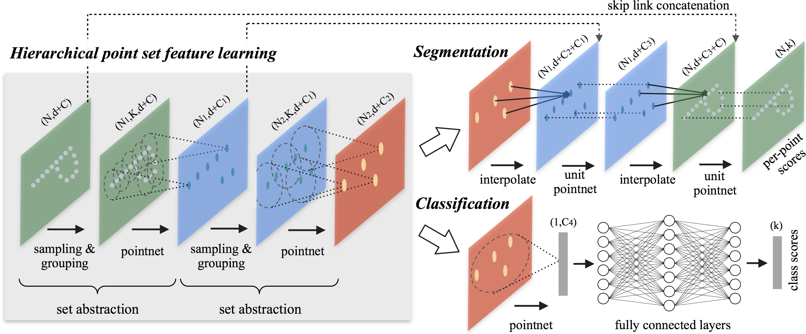

## Relevant Resources
### paper

[Qi et al. 2017. PointNet++: Deep Hierarchical Feature Learning on Point Sets in a Metric Space]

### github
- [Original code](https://github.com/charlesq34/pointnet2)
- [Pytorch reimplementation](https://github.com/yanx27/Pointnet_Pointnet2_pytorch)

## Training Deep Learning Models in PyTorch
### Environment install

### Dataloader

### Model
#### Model Architecture
- Classification

#### Code

### Optimizers

### Loss Functions

### Training
#### hps
### Training/Testing
