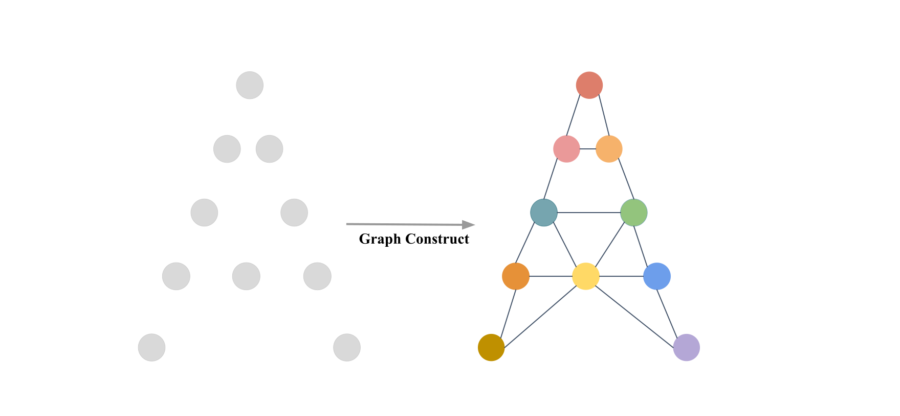
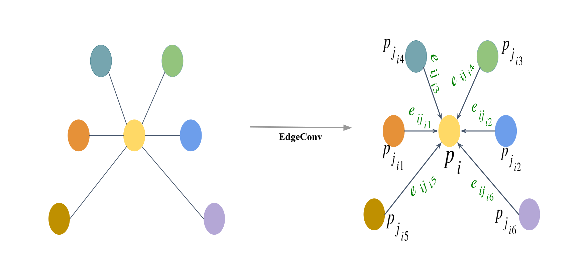
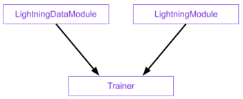

# Introduction
Deep Neural Networks (DNN), specifically those designed for 3D point clouds, are powerful tools for automation. This tutorial outlines how to use the `PyTorch Lightning (PL)` framework to train a specific and highly effective model—the `Dynamic Graph CNN (DGCNN)`—on your plot data.

Our goal is to automate complex analysis, such as:

1) Classification: Automatically determining the forest type (e.g., coniferous/deciduous/mixed) for a plot.
   
2) Regression: Estimating biomass or predicting tree attributes like total height or basal area.

Source code is available on [Github](https://github.com/Brent-Murray/DeepLearningEFI/tree/main/src)

# Relevant Resources
---

## Tutorial references of Pytorch Lightning
[Tutorial](https://lightning.ai/pages/blog/pl-tutorial-and-overview/)

## Relevant Resources for DGCNN
### paper

[Wang Y. et al., 2019. Dynamic Graph CNN for Learning on Point Clouds](https://arxiv.org/abs/1801.07829)

### code
[Original Pytorch reimplementation for DGCNN](https://github.com/WangYueFt/dgcnn/blob/master/pytorch/model.py)

## Other Deep Lerning Frameworks


# How DGCNN Works

While our framework supports multiple models (like PointNet), we will focus on `DGCNN` (`--model dgcnn`) because of its superior ability to capture complex local geometry in point clouds—perfect for identifying fine details in forest structure.

Unlike standard 2D image models, `DGCNN` does not treat points in isolation. Instead, for every point in the cloud:

1) Find `Neighbors`: It looks at the $k$ closest neighboring points.

2) Build a Local Graph: It constructs a miniature graph defining the `relationship` between the central point and its neighbors.

3) Dynamic Update: After each layer of processing, it re-evaluates the "neighborhood" in the feature space (hence Dynamic). This allows the model to progressively learn more complex, abstract relationships in the data, ultimately leading to highly accurate classification or attribute prediction for the entire plot.

::: {#fig-dgcnn-graph layout-ncol=2}





DGCNN Graph Convolution
:::

# Deep Learning Pipeline

)](./images/03_train/dl_pipeline.png)

The core components of Pytorch Lightning:

1) `LightningDataModule` wraps the data phase. It takes in a custom `PyTorch Dataset` and `DataLoader` which enables Trainer to handle data during training. If needed, `LightningDataModule` exposes the setup and prepare_data hooks in case you need additional customization. 
   
2) `LightningModule` itself is a custom `torch.nn.Module` that is extended with dozens of additional hooks like `on_fit_start` and `on_fit_end`. These hooks allow us better control of Trainer’s flows and enables custom behaviors by overriding these hooks. 
   
3) `Trainer` configures the training scope and manages the training loop with `LightningModule` and `LightningDataModule`. The simplest Trainer configuration is accomplished by setting flags like devices, accelerator, and strategy and by passing in our choice of loggers, profilers, callbacks, and plugins.
   


---

# The Data Foundation: The EFI Point Cloud Dataset
The first critical step in any deep learning project is data ingestion. In our project, this is handled by two dedicated Python classes: `EfiDataset` and `EfiDataModule`

## The `EfiDataset`
This class is the translator. It knows how to read your raw point cloud files (e.g., .npy format saved for each plot) and your labels file (e.g., `labels.csv` for species estimation and `biomass_labels.csv` for biomass estimation in our workshop).

Key functions:

1) Input: It takes your plot files and the label column you are interested in (e.g., `dom_sp_type` for classification or `total_agb_z` for biomass regression).
   
2) Pre-processing: It samples a fixed number of points (`num_point`, default 8192) from each plot and, optionally, calculates `normals` (which describe the local orientation of the points, improving model performance).
   
3) Caching: When run with `--process_data`, it intelligently processes and saves the prepared data as a cache file (`_process_and_cache()`). This avoids resampling the raw data every time you train, drastically speeding up development. Else if cache exists: `_load_cache()`, else: `on-the-fly`.


### The `EfiDataModule`
In the Pytorch Lightning framework, the `EfiDataModule` wraps the `EfiDataset` to handle the data workflow. It automatically creates the necessary `DataLoader` objects for the `training`, `validation`, and `test` sets.

This class ensures the data is correctly loaded and split (e.g., using the `split` column in `labels.csv`), and batches are efficiently provided to the GPU workers.

::: callout-important
Lightning call order: `prepare_data(), setup(stage="fit"), train_dataloader() / val_dataloader()`
::: 

```{python}
#| code-overflow: wrap
import pytorch_lightning as pl
from torch.utils.data import DataLoader
from .efi_dataset import EfiDataset

class EfiDataModule(pl.LightningDataModule):
    """
    A PyTorch Lightning DataModule for the EFI point cloud dataset.
    Handles data preparation, setup, and creation of DataLoaders.
    """
    def __init__(self, cfg, args):
        super().__init__()
        self.cfg = cfg # Full dataset config (e.g., root, csv_path)
        self.args = args # Command line arguments (e.g., batch_size, num_point)
        self.num_workers = 4 # Fixed worker count for robustness

    def prepare_data(self):
        """
        If 'process_data' is true, this triggers the pre-processing step: prepare_data(self).
        """
        if getattr(self.args, "process_data", False):
            for split in ["train", "val", "test"]:
                print(f"--- Preprocessing {split} ---")
                EfiDataset(
                    root=self.cfg['root'],
                    csv_path=self.cfg['csv'],
                    label_col=self.cfg['label_col'],
                    task_type=self.cfg['task'],
                    split=split,
                    num_points=self.args.num_point,
                    classes_list=self.cfg.get('classes', None),
                    process_data=True,
                    use_normals=self.cfg['use_normal'],
                    use_fps=self.cfg['use_fps'],
                )
```

---

# The Model: Dynamic Graph CNN (DGCNN)
## Define the DGCNN Model

This section covers the implementation of the `get_model` function and the `DGCNN` class itself, including its structure of feature extraction layers and final classification/regression heads.

```{python }
#| code-fold: true
#| code-overflow: wrap
import torch
import torch.nn as nn
import torch.nn.functional as F
from models.heads import ClassificationHead, RegressionHead

def knn(x, k):
    inner = -2*torch.matmul(x.transpose(2, 1), x)
    xx = torch.sum(x**2, dim=1, keepdim=True)
    pairwise_distance = -xx - inner - xx.transpose(2, 1)
 
    idx = pairwise_distance.topk(k=k, dim=-1)[1]   # (batch_size, num_points, k)
    return idx

def get_graph_feature(x, k=20, idx=None):
    batch_size = x.size(0)
    num_points = x.size(2)
    x = x.view(batch_size, -1, num_points)
    if idx is None:
        idx = knn(x, k=k)   # (batch_size, num_points, k)
    device = torch.device('cuda')

    idx_base = torch.arange(0, batch_size, device=device).view(-1, 1, 1)*num_points

    idx = idx + idx_base

    idx = idx.view(-1)
 
    _, num_dims, _ = x.size()

    x = x.transpose(2, 1).contiguous()   # (batch_size, num_points, num_dims)  -> (batch_size*num_points, num_dims) #   batch_size * num_points * k + range(0, batch_size*num_points)
    feature = x.view(batch_size*num_points, -1)[idx, :]
    feature = feature.view(batch_size, num_points, k, num_dims) 
    x = x.view(batch_size, num_points, 1, num_dims).repeat(1, 1, k, 1)
    
    feature = torch.cat((feature-x, x), dim=3).permute(0, 3, 1, 2).contiguous()
  
    return feature

class get_model(nn.Module):
    def __init__(self, cfg):
        super(get_model, self).__init__()
        self.k = cfg.get('k', 20)
        emb_dims = cfg.get('emb_dims', 1024)
        num_classes = cfg['num_classes']
        
        self.bn1 = nn.BatchNorm2d(64)
        self.bn2 = nn.BatchNorm2d(64)
        self.bn3 = nn.BatchNorm2d(128)
        self.bn4 = nn.BatchNorm2d(256)
        self.bn5 = nn.BatchNorm1d(emb_dims)

        self.conv1 = nn.Sequential(nn.Conv2d(6, 64, kernel_size=1, bias=False),
                                   self.bn1,
                                   nn.LeakyReLU(negative_slope=0.2))
        self.conv2 = nn.Sequential(nn.Conv2d(64*2, 64, kernel_size=1, bias=False),
                                   self.bn2,
                                   nn.LeakyReLU(negative_slope=0.2))
        self.conv3 = nn.Sequential(nn.Conv2d(64*2, 128, kernel_size=1, bias=False),
                                   self.bn3,
                                   nn.LeakyReLU(negative_slope=0.2))
        self.conv4 = nn.Sequential(nn.Conv2d(128*2, 256, kernel_size=1, bias=False),
                                   self.bn4,
                                   nn.LeakyReLU(negative_slope=0.2))
        self.conv5 = nn.Sequential(nn.Conv1d(512, emb_dims, kernel_size=1, bias=False),
                                   self.bn5,
                                   nn.LeakyReLU(negative_slope=0.2))
        
        head_input_dim = emb_dims * 2 # 2048
        
        if num_classes == 1:
            self.mlp = RegressionHead(head_input_dim, num_classes)
        else:
            self.mlp = ClassificationHead(
                head_input_dim, 
                num_classes,
                drop1=cfg.get('drop1', 0.5),
                drop2=cfg.get('drop2', 0.6)
            )

    def forward(self, x):
        batch_size = x.size(0)
        x = get_graph_feature(x, k=self.k)
        x = self.conv1(x)
        x1 = x.max(dim=-1, keepdim=False)[0]

        x = get_graph_feature(x1, k=self.k)
        x = self.conv2(x)
        x2 = x.max(dim=-1, keepdim=False)[0]

        x = get_graph_feature(x2, k=self.k)
        x = self.conv3(x)
        x3 = x.max(dim=-1, keepdim=False)[0]

        x = get_graph_feature(x3, k=self.k)
        x = self.conv4(x)
        x4 = x.max(dim=-1, keepdim=False)[0]

        x = torch.cat((x1, x2, x3, x4), dim=1)

        x = self.conv5(x)
        x1 = F.adaptive_max_pool1d(x, 1).view(batch_size, -1)
        x2 = F.adaptive_avg_pool1d(x, 1).view(batch_size, -1)
        x = torch.cat((x1, x2), 1)

        x = self.mlp(x) # [B, num_outputs]
        trans_feat = None # DGCNN does not produce a transform matrix
        
        return x, trans_feat
    

```

## Loss functions

The `loss function`, or cost function, quantifies the `difference between the model's prediction and the true target value`. It is the primary signal that guides the Deep Learning model during training. The goal of the optimizer (e.g., Adam) is to adjust the model's weights to continuously minimize this loss value.

Our module uses task-specific loss components:

```{python}
def get_loss_function(task):
    """
    Returns the core loss function (either nn.Module or functional).
    """
    if task == 'classification':
        # Using CrossEntropyLoss is simplest if input is raw logits.
        return F.nll_loss
    elif task == 'regression':
        return F.smooth_l1_loss
    else:
        raise ValueError(f"Unknown task type: {task}")
```

- For Classification Tasks: `F.nll_loss` ([Pytorch Implementation](https://docs.pytorch.org/docs/stable/generated/torch.nn.NLLLoss.html#torch.nn.NLLLoss)
). 

This function is typically used when the model outputs log-probabilities (often obtained by applying a log-softmax activation to the raw logits). It penalizes the model when it assigns a low probability to the correct class:

$$
L_{\text{NLL}}(y, \hat{y}) = - \hat{y}_c
$$

where $y$ is the true class index, $\hat{y}$ is the vector of log-probabilities output by the model (e.g., via F.log_softmax), and $\hat{y}_c$ is the log-probability corresponding to the true class $c$.

- For Regression Tasks: `F.smooth_l1_loss` ([Pytorch Implementation](https://docs.pytorch.org/docs/stable/generated/torch.nn.SmoothL1Loss.html#torch.nn.SmoothL1Loss)).

This function is a robust alternative to Mean Squared Error (L2) and Mean Absolute Error (L1). It behaves like L2 loss for small errors (which gives a smoother gradient for optimization) and like L1 loss for large errors (which makes it less sensitive to outliers).

$$
\ell(x, y) = L = \{l_1, ..., l_N\}^T
$$
$$

l_n = \begin{cases}
        0.5 (x_n - y_n)^2 / beta, & \text{if } |x_n - y_n| < beta \\
        |x_n - y_n| - 0.5 * beta, & \text{otherwise }
        \end{cases}
$$

## The PyTorch Lightning Wrapper: EfiModelModule

This class is the single source of truth for your experiment:

1) Initialization: It loads the `DGCNN` model and sets up the loss function.
```{python}
class EfiModelModule(pl.LightningModule):
    def __init__(self, cfg, args):
        super().__init__()
        # Store hyperparameters for W&B/checkpointing
        self.save_hyperparameters(cfg, args) 
        self.cfg = cfg
        self.args = args
        self.task = cfg['task']

        # 1. Load Model Backbone
        # NOTE: This import assumes a specific package structure (e.g., models.model_name)
        model_module = importlib.import_module(f"models.{cfg['model_name']}")
        self.model = model_module.get_model(cfg)

        # 2. Setup Metric Calculators (one for validation, one for testing)
        self.val_metrics = MetricsCalculator(self.task, cfg['num_classes'])
        self.test_metrics = MetricsCalculator(self.task, cfg['num_classes'])
```
2) Core Step Logic: 
   - `forward(self, points)`: Simple pass-through to the `DGCNN` backbone, returning both prediction and feature transformation.
   - `_shared_step(self, batch)`: The main processing pipeline.

```{python}
def forward(self, points):
    """Standard model forward pass."""
    return self.model(points)

def _shared_step(self, batch):
    """Shared logic for training, validation, and test step."""
    points, target, _ = batch # _ is plot_id, doesn't need in the these stpes
    
    # Transpose [B, N, C] -> [B, C, N] and enforce float32
    points = points.transpose(2, 1).float() 
    
    # 1. Forward Pass
    pred, trans_feat = self(points)
    
    # 2. Calculate Loss
    loss = calculate_total_loss(
        pred, 
        target, 
        trans_feat, 
        task=self.task
    )
    
    return loss, pred, target
```

3) `training_step`, `validation_step`, `test_step`: Defines how to calculate the loss for a single batch of data. This loss includes the primary objective (Classification or Regression loss).

`training_step`:

```{python}
# --- Training ---
def training_step(self, batch, batch_idx):
    loss, _, _ = self._shared_step(batch)
    
    # Log basic training loss and learning rate for W&B
    self.log('train/loss', loss, on_step=False, on_epoch=True, prog_bar=True)
    self.log('train/lr', self.optimizers().param_groups[0]['lr'], on_step=True, on_epoch=False)
    return loss
```

`validation_step`:

```{python}
#| code-fold: true
# --- Validation ---
def validation_step(self, batch, batch_idx):
    loss, pred, target = self._shared_step(batch)
    
    # 1. Log validation loss (PL automatically averages this over the epoch)
    self.log('val/loss', loss, on_step=False, on_epoch=True, prog_bar=True)
    
    # 2. Update the full MetricsCalculator for end-of-epoch aggregation
    self.val_metrics.update(pred, target, 0.0)
    
    return loss
```

`test_step`:

```{python}
#| code-fold: true
# --- Test Step ---
def test_step(self, batch, batch_idx):
    """
    Dedicated step for final, unbiased evaluation on the test set.
    Runs when trainer.test() is called.
    """
    loss, pred, target = self._shared_step(batch)
    
    # 1. Log test loss
    self.log('test/loss', loss, on_step=False, on_epoch=True)
    
    # 2. Update the full MetricsCalculator for end-of-epoch aggregation
    self.test_metrics.update(pred, target, 0.0)
    
    return loss

def on_test_epoch_end(self):
    """
    Calculates and logs all final test metrics, mirroring the validation logic.
    """
    # Compute metrics from the aggregated predictions/targets
    all_pred = np.concatenate(self.test_metrics.predictions, axis=0)
    all_target = np.concatenate(self.test_metrics.targets, axis=0)
    
    test_logs = {}

    if self.task == 'classification':
        pred_labels = np.argmax(all_pred, axis=1)
        instance_acc = np.mean(pred_labels == all_target)

        # Per-Class Accuracy
        cm = confusion_matrix(all_target, pred_labels)
        with np.errstate(divide='ignore', invalid='ignore'):
                class_acc_array = cm.diagonal() / cm.sum(axis=1)
        class_acc = np.mean(class_acc_array[~np.isnan(class_acc_array)])
        
        # Log all classification metrics
        test_logs['test/instance_acc'] = instance_acc
        test_logs['test/class_acc'] = class_acc
        
    elif self.task == 'regression':
        pred_values = all_pred.flatten()
        target_values = all_target.flatten()
        
        # Compute R2 and RMSE
        r2 = r2_score(target_values, pred_values)
        rmse = np.sqrt(mean_squared_error(target_values, pred_values))
        
        # Log all regression metrics
        test_logs['test/r2_score'] = r2
        test_logs['test/rmse'] = rmse

    # PL logging handles synchronization across GPUs
    self.log_dict(test_logs, on_step=False, on_epoch=True, prog_bar=False)
    
    # Reset metric calculator for the next run
    self.test_metrics.reset()
```

`prediction_step` is used for generating raw output/predictions on unseen data, it does not calculating loss and metrices:

```{python}
#| code-fold: true
# --- Prediction / Inference ---
def predict_step(self, batch, batch_idx, dataloader_idx=0):
    """
    Used for generating raw output/predictions on unseen data.
    Does not calculate loss or metrics.
    Runs when trainer.predict() is called.
    """
    points, target, pid = batch 
    
    # Transpose [B, N, C] -> [B, C, N] and enforce float32
    points = points.transpose(2, 1).float() 
    
    # 1. Forward Pass
    # Assuming self(points) returns (pred, trans_feat), we only return the prediction (pred)
    pred, _ = self(points)
    if self.task == 'classification':
        pred = torch.argmax(pred, dim=1)
    
    # Return only the raw prediction tensor for the user
    return {
        "plot_id": pid,
        "pred": pred.detach().cpu(),
        "gt": target.detach().cpu()
    }
```

4) Optimizer and Scheduler: `configure_optimizers`: the setup of the `Adam` optimizer (with specific learning rate and weight decay from args) and the `StepLR` scheduler, emphasizing the necessity of returning them in the nested dictionary format required by `PyTorch Lightning`.

```{python}
#| code-fold: true
# --- Optimizer Configuration ---
def configure_optimizers(self):
    """Defines the optimizer and scheduler as required by PL."""
    optimizer = torch.optim.Adam(
        self.parameters(),
        lr=self.args.learning_rate,
        betas=(0.9, 0.999),
        eps=1e-08,
        weight_decay=self.args.decay_rate
    )
    
    scheduler = torch.optim.lr_scheduler.StepLR(optimizer, step_size=20, gamma=0.7)
    
    # PL requires the scheduler to be returned in a dictionary format
    return {
        'optimizer': optimizer,
        'lr_scheduler': {
            'scheduler': scheduler, 
            'interval': 'epoch', # Run scheduler step after each epoch
        }
    }
```

---

## Training Deep Learning Models in PyTorch Lighting

#### Configurations

Detail where the `cfg` (e.g., `config.py` configuration file) and args (e.g., command line arguments) are loaded and parsed.

```{python}
#| code-fold: true
#| code-overflow: wrap
DATASET_CONFIG = {
    'petawawa_cls': {
        'task': 'classification',
        'root': './data/petawawa/plot_point_clouds',
        'csv': './data/petawawa/labels.csv',
        'classes': [
            'conif', 
            'decid', 
            'mixed'
        ],
        'label_col': 'dom_sp_type',
        'num_classes': 3
    },
    
    'petawawa_reg': {
        'task': 'regression',
        'root': './data/petawawa/plot_point_clouds',
        'csv': './data/petawawa/biomass_labels.csv',
        'classes': None,
        'label_col': 'total_agb_z',
        'num_classes': 1
    }
}
```

Importance: Explain that these objects define the task, model choice, hyperparameters, and logging options.

### The PyTorch Lightning Trainer
The `Trainer` class is responsible for the entire training lifecycle, handling distributed training, checkpointing, and calling the *step hooks of the `EfiModelModule`.

```{python}
#| code-fold: true
# 3. Instantiate DataModule and Lightning Module
data_module = EfiDataModule(full_cfg, args)
model_module = EfiModelModule(full_cfg, args)

# 4. Define Callbacks
primary_metric = 'val/instance_acc' if task == 'classification' else 'val/r2_score'

checkpoint_callback = ModelCheckpoint(
    dirpath=checkpoint_dir, 
    filename='{epoch:02d}-{val_loss:.4f}-{' + primary_metric.split('/')[-1] + ':.4f}',
    monitor=primary_metric,
    mode='max', # Maximize accuracy/R2
    save_top_k=1,
    verbose=True
)
lr_monitor = LearningRateMonitor(logging_interval='epoch')

# 5. Instantiate the Trainer
# PL handles device setup automatically based on arguments
trainer = pl.Trainer(
    max_epochs=args.epoch,
    accelerator='gpu' if torch.cuda.is_available() and not args.use_cpu else 'cpu',
    devices=[int(g) for g in args.gpu.split(',')] if ',' in args.gpu else (1 if not args.use_cpu else 0),
    logger=wandb_logger,
    callbacks=[checkpoint_callback, lr_monitor],
    deterministic=True, # For reproducibility
    enable_progress_bar=True
)

# 6. Start Training
if mode == "training":
    print('Starting PyTorch Lightning Training...')
    trainer.fit(model_module, data_module)

# Test the best checkpoint after training
else:
    print('\n--- Testing Model ---')
    trainer.test(datamodule=data_module, ckpt_path='best')

```

## Monitoring with Weights & Biases (W&B)

The `WandbLogger` is integrated directly into the `train_pl.py` script. `W&B` is a powerful tool that automatically logs everything:

`Metrics`: All the calculated `val/instance_acc`, `val/r2_score`, `train/loss`, etc., are plotted in real-time.

```{python}
# 2. Setup W&B Logger
wandb_logger = WandbLogger(
    project=args.wandb_project,
    name=Path('./log/').joinpath(task).joinpath(args.model).joinpath(args.log_dir or str(datetime.datetime.now().strftime('%Y-%m-%d_%H-%M'))),
    config={**full_cfg, **vars(args)}, # Log all configs and arguments
)

# Use W&B's run directory for checkpoints
checkpoint_dir = Path('./log') / args.wandb_project / wandb_logger.experiment.name / 'checkpoints'
checkpoint_dir.mkdir(parents=True, exist_ok=True)
```

### W&B Dashboard

<iframe src="https://api.wandb.ai/links/ubc-yuwei-cao/akty7srj" style="border:none;height:1024px;width:100%"></iframe>


## Hyperparameter tuning Weights and Biases


Weights and Biases (wandb) is an online deep learning tool that can track experiments, perform hyperparameter tuning and visualize results. It is an effective method for refining and comparing models with different configurations.

Compare results of different HPs using WANDB Sweep: DGCNN example

<iframe src="https://api.wandb.ai/links/ubc-yuwei-cao/qs96lr1s" style="border:none;height:1024px;width:100%"></iframe>

## Predicting use the pre-trained model

```{python}
#| code-fold: true
#| code-overflow: wrap
# predict.py
# ... same as training for configs loading, datamodule, modelmodule, trainer initialize
# 4. Run prediction
print("Running prediction...")
outputs = trainer.predict(model, dataloaders=data_module)

# 5. Parse outputs → CSV
records = []

if task == "classification":
    for o in outputs:
        for pid, gt, pred in zip(
            o["plot_id"],
            o["gt"],
            o["pred"]
        ):
            records.append({
                "plot_id": pid,
                "dom_sp_type": int(gt.item()),
                "pred_dom_sp_type": int(pred.item())
            })

else:  # regression
    for o in outputs:
        for pid, gt, pred in zip(
            o["plot_id"],
            o["gt"],
            o["pred"]
        ):
            records.append({
                "plot_id": pid,
                "total_agb_z": float(gt.item()),
                "total_agb_z_pred": float(pred.item())
            })

df = pd.DataFrame(records)
df.to_csv(os.path.join(os.path.dirname(args.ckpt_path), args.out_csv), index=False)

print(f"Predictions saved to: {os.path.join(os.path.dirname(args.ckpt_path), args.out_csv)}")
```

## How to run
### Environment install

see `python_environment_setup.md`

### Training
#### Classification
To train the `DGCNN` model on the petawawa dataset for a species classification task:

```{bash}
python train_pl.py \
    --model dgcnn \
    --dataset_config_key petawawa_cls \
    --batch_size 16 \
    --epoch 150 \
    --learning_rate 0.0001 \
    --log_dir petawawa_species_cls_dgcnn \
    --process_data # First time / no cache
```

#### Regression
To train the `DGCNN` model on the petawawa dataset for a biomass estimation task:

```{bash}
python train_pl.py \
    --model dgcnn \
    --dataset_config_key petawawa_reg \
    --batch_size 16 \
    --epoch 150 \
    --learning_rate 0.0001 \
    --log_dir petawawa_bio_reg_dgcnn \
    --process_data # First time / no cache
```

### Testing
#### Classification
How to run:
```{bash}
wget -P /path/to/directory https://github.com/Brent-Murray/DeepLearningEFI/blob/main/src/pretrained_ckpt/peta_cls_dgcnn_bs16_lre4/checkpoints/best_model.ckpt 

python predict.py --model dgcnn --dataset_config_key petawawa_cls --ckpt_path /path/to/directory/best_model.ckpt

# example
python predict.py --model dgcnn --dataset_config_key petawawa_cls --ckpt_path log/EFI_DL/peta_cls_dgcnn_bs8_lre3/checkpoints/best_model.ckpt
```

#### Regression

How to run:
```{bash}
wget -P /path/to/directory https://github.com/Brent-Murray/DeepLearningEFI/blob/main/src/pretrained_ckpt/peta_reg_dgcnn_bs8_lre3/checkpoints/best_model.ckpt

python predict.py --model dgcnn --dataset_config_key petawawa_reg --ckpt_path /path/to/directory/best_model.ckpt

# example
python predict.py --model dgcnn --dataset_config_key petawawa_reg --ckpt_path log/EFI_DL/peta_reg_dgcnn_bs8_lre3/checkpoints/best_model.ckpt
```

### Code structure

```
└── src
    ├── README.md
    ├── config.py
    ├── dataset
        ├── data_utils.py
        ├── efi_datamodule.py
        └── efi_dataset.py
    ├── models
        ├── dgcnn.py
        ├── efi_modelmodule.py
        ├── heads.py
        ├── loss_utils.py
        ├── metrics.py
        ├── pointnet.py
        ├── pointnet2_msg.py
        ├── pointnet2_ssg.py
        ├── pointnet2_utils.py
        ├── pointnet_utils.py
        └── pointnext.py
    └── train_pl.py
```