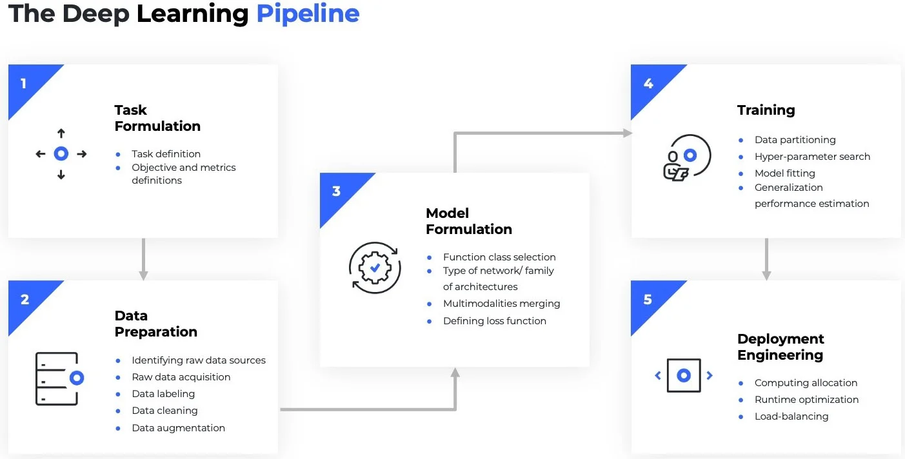
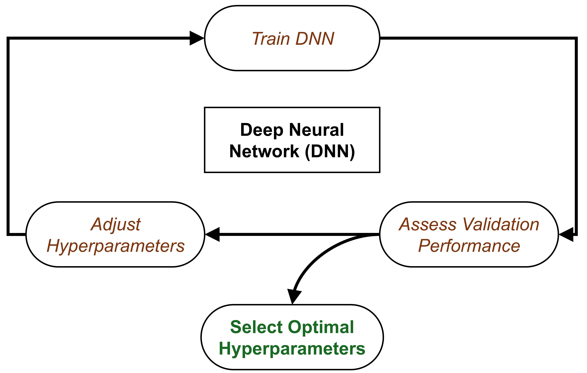
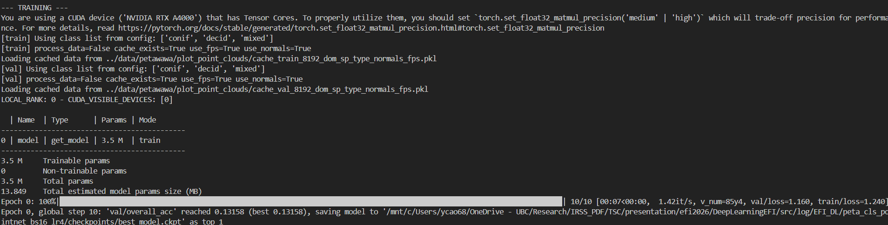

## Relevant Resources

Below we provide references to additional materials relevant to this section.

### Tutorial references of PyTorch Lightning
[Official Tutorial](https://lightning.ai/pages/blog/pl-tutorial-and-overview/)

### Paper
[Wang Y. et al., 2019. Dynamic Graph CNN for Learning on Point Clouds](https://arxiv.org/abs/1801.07829)

### Code
[Original PyTorch reimplementation for DGCNN](https://github.com/WangYueFt/dgcnn/blob/master/pytorch/model.py)

---

## Other Deep Learning Frameworks

::: {#fig-dl_frames-graph}

{width=60%}

Deep learning frameworks
:::

---

# Introduction

Deep Neural Networks (DNNs), specifically those designed for 3D point clouds, are powerful tools for automation. This tutorial outlines how to use the `PyTorch Lightning (PL)` framework to train a specific and highly effective model—the **Dynamic Graph CNN (DGCNN)**—on your plot data.

Our goal is to automate complex analyses, such as:

1) **Classification**: Automatically determining the **forest type** (e.g., coniferous/deciduous/mixed) for a plot.
   
2) **Regression**: Estimating **biomass** or predicting tree attributes like total height or basal area.

Source code is available on [GitHub](https://github.com/Brent-Murray/DeepLearningEFI/tree/main/src)

```
└── src
    ├── README.md
    ├── config.py
    ├── dataset
        ├── data_utils.py
        ├── efi_datamodule.py
        └── efi_dataset.py
    ├── models
        ├── dgcnn.py
        ├── efi_modelmodule.py
        ├── heads.py
        ├── loss_utils.py
        ├── metrics.py
        ├── pointnet.py
        ├── pointnet2_msg.py
        ├── pointnet2_ssg.py
        ├── pointnet2_utils.py
        ├── pointnet_utils.py
        └── pointnext.py
    └── train_pl.py
```

---

# Deep Learning Pipeline

::: {#fig-dl_pipeline-graph}



Pipeline ([source](https://subscription.packtpub.com/book/data/9781800561618/2/ch02lvl1sec05/understanding-the-key-components-of-pytorch-lightning))

:::

## The Core Components of PyTorch Lightning:

1) `LightningDataModule` standardizes the training, val, test splits, data preparation and transforms. It takes in a custom `PyTorch Dataset` and `DataLoader`, which enables the Trainer to handle data during training. If needed, `LightningDataModule` exposes the `setup` and `prepare_data` functions in case you need additional customization. 
   
2) `LightningModule` itself is a custom `torch.nn.Module` that is extended with dozens of additional functions like `on_fit_start` and `on_fit_end`. These functions allow us better control of Trainer’s flows and enable custom behaviors by overriding these hooks. 
   
3) `Trainer` configures the training scope and manages the training loop with `LightningModule` and `LightningDataModule`. The simplest Trainer configuration is accomplished by setting flags like devices, accelerator, and strategy and by passing in our choice of loggers, profilers, callbacks, and plugins.
   


::: {#fig-pl-comp-graph}


PyTorch Lightning Components

:::
---

# The Data Foundation: The EFI Point Cloud Dataset

The first step in any deep learning project is getting your data from files on disk into **tensors** on the GPU. In this project, that job is handled by two Python scripts:

- `EfiDataset.py` — reads and prepares individual plots

- `EfiDataModule.py` — organizes those plots into **training**, **validation**, and **test loaders**

## The `EfiDataset` ([efi_dataset.py](https://github.com/Brent-Murray/DeepLearningEFI/tree/main/src/dataset/efi_dataset.py))

The `EfiDataset` class defines how to read your raw point cloud files (e.g., `.npy` format saved for each plot) and your labels file (e.g., `labels.csv` in our workshop) for the model.

### What it does

1. Reads raw files

- Loads point clouds from .npy files

- Reads labels from labels.csv (e.g., `dom_sp_type` for classification or `total_agb_z` for biomass regression)

2. Samples points

- Selects a fixed number of points (`num_point`, default: 8192)

- This keeps memory usage manageable and ensures every batch has the same shape

3. Computes optional features

- `Surface normals` (local orientation of points)

4. Caches processed data

- If `--process_data` is enabled, it saves a processed version to disk (`_process_and_cache()`). Future runs load this cached data instead of reprocessing (`_load_cache()`). This avoids resampling the raw data every time you train, drastically speeding up development. Else: `on-the-fly`.
 
> Why 8192? Point clouds are massive. We downsample to a fixed number so we can process them in batches. If we used the full points of a LiDAR plot, we'd run out of GPU memory instantly. 8192 is a typical 'sweet spot' for DNNs to retain structural information without crashing the hardware. We didn't test all possible settings in our demo—try it out!

## The `EfiDataModule` ([efi_datamodule.py](https://github.com/Brent-Murray/DeepLearningEFI/tree/main/src/dataset/efi_datamodule.py))

In the PyTorch Lightning framework, the `EfiDataModule` wraps the `EfiDataset` to handle the data workflow. It controls how **plots** move through the training system.

### What it manages

1. Which plots go into:

The `setup()` function creates three datasets: 

- `train_dataset` 
  
- `val_dataset` 
  
- `test_dataset`

Each one uses the same loading logic, but different rows from the label file (e.g., using the `split` column in `labels.csv`).

1. How big each batch is

2. How many background workers load data in parallel (make sure batches are efficiently provided to the GPU workers).

```{python}
#| code-overflow: wrap
# efi_datamodule.py
import pytorch_lightning as pl
from torch.utils.data import DataLoader
from .efi_dataset import EfiDataset

class EfiDataModule(pl.LightningDataModule):
    """
    A PyTorch Lightning DataModule for the EFI point cloud dataset.
    Handles data preparation, setup, and creation of DataLoaders.
    """
    def __init__(self, cfg, args):
        super().__init__()
        self.cfg = cfg # Full dataset config (e.g., root, csv_path)
        self.args = args # Command line arguments (e.g., batch_size, num_point)
        self.num_workers = 4 # Fixed worker count for robustness

    def setup(self, stage=None):
        common_params = dict(
            root=self.cfg['root'], 
            csv_path=self.cfg['csv'], 
            label_col=self.cfg['label_col'], 
            task_type=self.cfg['task'],
            num_points=self.args.num_point,
            classes_list=self.cfg['classes'],
            process_data=False, # rely on cache or on-the-fly loading
            use_normals=self.cfg['use_normal'],
            use_fps=self.cfg['use_fps']
        )

        if stage in (None, "fit"):
            self.train_dataset = EfiDataset(split="train", **common_params)
            self.val_dataset = EfiDataset(split="val", **common_params)
        if stage in (None, "test", "predict"):
            self.test_dataset = EfiDataset(split="test", **common_params)
        
    def train_dataloader(self):
        return DataLoader(
            self.train_dataset, 
            batch_size=self.args.batch_size, 
            shuffle=True, 
            num_workers=self.num_workers,
            drop_last=True,
            pin_memory=True
        )
```

::: callout-note
Lightning call order in `DataModule`: `prepare_data()` if process data → `setup()` → `DataLoader` → GPU → Model 

To summarize: `EfiDataset` prepares one plot at a time (Reader & Preparer). `EfiDataModule` manages how plots are grouped and fed into training (Traffic Controller).
::: 

# The Model: EfiModelModule ([efi_modelmodule.py](https://github.com/Brent-Murray/DeepLearningEFI/tree/main/src/models/efi_modelmodule.py))

The `EfiModelModule` is a custom wrapper built using `PyTorch Lightning` (specifically inheriting from `pl.LightningModule`). Its primary job is to act as the "Brain" of your deep learning system—organizing the model **architecture**, the **training logic**, the **optimization**, and the **evaluation metrics** into a single, clean structure.

The `EfiModelModule` connects four things into one clean interface:

- The neural network (DGCNN)
- The loss function
- The optimizer
- The evaluation metrics

## How Dynamic Graph CNN (DGCNN) Works

While our framework supports multiple models (like PointNet, PointNet2, PointNeXt), we will focus on `DGCNN` (`--model dgcnn`) because of its superior ability to capture complex local geometry in point clouds—perfect for identifying fine details in forest structure.

Unlike standard `PointNet`, which looks at each point individually, DGCNN looks at the difference between a point and its neighbors ($x_i - x_j$). DGCNN is based on a spatial-based graph convolution network, which formulates graph convolutions as aggregating feature information from neighbors.  

> This is like an ecologist looking not just at one tree's height, but how much taller it is than its immediate neighbors—capturing the canopy texture.

For every point in the cloud:

1) Find **Neighbors**: It looks at the $k$ closest neighboring points (such as $x_{j_{i1}}$,...,$x_{j_{ik}}$ are closet to $x_i$).

2) Build **a Local Graph**: It constructs a graph defining the **relationship** between the central point and its neighbors using edges $(i, j_{i1}) -> e_{ij_{i1}}$.

3) **Dynamic Update**: After each layer of processing (`EdgeConv`), it re-evaluates the "neighborhood" in the feature space (hence Dynamic). 

::: {#fig-dgcnn-graph layout-ncol=2}


DGCNN Graph Convolution
:::

This allows the model to progressively learn more complex, abstract relationships in the data, ultimately leading to highly accurate classification or attribute prediction for the entire plot.

## Implement the DGCNN Model ([dgcnn.py](https://github.com/Brent-Murray/DeepLearningEFI/tree/main/src/models/dgcnn.py))

This section covers the implementation of the `DGCNN` model, including:

- KNN-based local graph construction
- Architecture construction (input features, layers, classification head, and regression head)
- Classification/regression heads

```{python }
#| code-fold: true
#| code-overflow: wrap
import torch
import torch.nn as nn
import torch.nn.functional as F
from models.heads import ClassificationHead, RegressionHead

def knn(x, k):
    inner = -2*torch.matmul(x.transpose(2, 1), x)
    xx = torch.sum(x**2, dim=1, keepdim=True)
    pairwise_distance = -xx - inner - xx.transpose(2, 1)
 
    idx = pairwise_distance.topk(k=k, dim=-1)[1]   # (batch_size, num_points, k)
    return idx

def get_graph_feature(x, k=20, idx=None):
    batch_size = x.size(0)
    num_points = x.size(2)
    x = x.view(batch_size, -1, num_points)
    if idx is None:
        idx = knn(x, k=k)   # (batch_size, num_points, k)
    device = torch.device('cuda')

    idx_base = torch.arange(0, batch_size, device=device).view(-1, 1, 1)*num_points

    idx = idx + idx_base

    idx = idx.view(-1)
 
    _, num_dims, _ = x.size()

    x = x.transpose(2, 1).contiguous()   # (batch_size, num_points, num_dims)  -> (batch_size*num_points, num_dims) #   batch_size * num_points * k + range(0, batch_size*num_points)
    feature = x.view(batch_size*num_points, -1)[idx, :]
    feature = feature.view(batch_size, num_points, k, num_dims) 
    x = x.view(batch_size, num_points, 1, num_dims).repeat(1, 1, k, 1)
    
    feature = torch.cat((feature-x, x), dim=3).permute(0, 3, 1, 2).contiguous()
  
    return feature
```

- Architecture construction (input features, layers, classification head, and regression head)
```{python }
#| code-fold: true
#| code-overflow: wrap
import torch
import torch.nn as nn
import torch.nn.functional as F
from models.heads import ClassificationHead, RegressionHead

class get_model(nn.Module):
    def __init__(self, cfg):
        super(get_model, self).__init__()
        self.k = cfg.get('k', 20)
        emb_dims = cfg.get('emb_dims', 1024)
        num_classes = cfg['num_classes']
        
        self.bn1 = nn.BatchNorm2d(64)
        self.bn2 = nn.BatchNorm2d(64)
        self.bn3 = nn.BatchNorm2d(128)
        self.bn4 = nn.BatchNorm2d(256)
        self.bn5 = nn.BatchNorm1d(emb_dims)

        self.conv1 = nn.Sequential(nn.Conv2d(6, 64, kernel_size=1, bias=False),
                                   self.bn1,
                                   nn.LeakyReLU(negative_slope=0.2))
        self.conv2 = nn.Sequential(nn.Conv2d(64*2, 64, kernel_size=1, bias=False),
                                   self.bn2,
                                   nn.LeakyReLU(negative_slope=0.2))
        self.conv3 = nn.Sequential(nn.Conv2d(64*2, 128, kernel_size=1, bias=False),
                                   self.bn3,
                                   nn.LeakyReLU(negative_slope=0.2))
        self.conv4 = nn.Sequential(nn.Conv2d(128*2, 256, kernel_size=1, bias=False),
                                   self.bn4,
                                   nn.LeakyReLU(negative_slope=0.2))
        self.conv5 = nn.Sequential(nn.Conv1d(512, emb_dims, kernel_size=1, bias=False),
                                   self.bn5,
                                   nn.LeakyReLU(negative_slope=0.2))
        
        head_input_dim = emb_dims * 2 # 2048
        
        if num_classes == 1:
            self.mlp = RegressionHead(head_input_dim, num_classes)
        else:
            self.mlp = ClassificationHead(
                head_input_dim, 
                num_classes,
                drop1=cfg.get('drop1', 0.5),
                drop2=cfg.get('drop2', 0.6)
            )

    def forward(self, x):
        batch_size = x.size(0)
        x = get_graph_feature(x, k=self.k)
        x = self.conv1(x)
        x1 = x.max(dim=-1, keepdim=False)[0]

        x = get_graph_feature(x1, k=self.k)
        x = self.conv2(x)
        x2 = x.max(dim=-1, keepdim=False)[0]

        x = get_graph_feature(x2, k=self.k)
        x = self.conv3(x)
        x3 = x.max(dim=-1, keepdim=False)[0]

        x = get_graph_feature(x3, k=self.k)
        x = self.conv4(x)
        x4 = x.max(dim=-1, keepdim=False)[0]

        x = torch.cat((x1, x2, x3, x4), dim=1)

        x = self.conv5(x)
        x1 = F.adaptive_max_pool1d(x, 1).view(batch_size, -1)
        x2 = F.adaptive_avg_pool1d(x, 1).view(batch_size, -1)
        x = torch.cat((x1, x2), 1)

        x = self.mlp(x) # [B, num_outputs]
        trans_feat = None # DGCNN does not produce a transform matrix
        
        return x, trans_feat
```

- classification/regression heads

```{python}
class ClassificationHead(nn.Module):
    def __init__(self, in_dim, num_outputs, drop1=0.5, drop2=0.5):
        super().__init__()
        self.net = nn.Sequential(
            nn.Linear(in_dim, 512),
            nn.BatchNorm1d(512),
            nn.ReLU(),
            nn.Dropout(drop1),
            nn.Linear(512, 256),
            nn.BatchNorm1d(256),
            nn.ReLU(),
            nn.Dropout(drop2),
            nn.Linear(256, num_outputs),
        )

    def forward(self, x):
        return F.log_softmax(self.net(x), dim=-1)   # logits [B, num_classes]


class RegressionHead(nn.Module):
    def __init__(self, input_dim, num_outputs):
        super().__init__()
        self.num_outputs = num_outputs

        self.net = nn.Sequential(
            nn.Linear(input_dim, 512),
            nn.ReLU(),
            nn.Linear(512, 64),
            nn.ReLU(),
            nn.Linear(64, self.num_outputs)
        )

    def forward(self, feat):
        
        return self.net(feat)

```

## Loss Functions ([loss_utils.py](https://github.com/Brent-Murray/DeepLearningEFI/tree/main/src/models/loss_utils.py))

The **loss function**, or cost function, quantifies the *difference between the model's prediction and the true target value*. It is the primary signal that guides the DNN during training. 

Our module uses task-specific loss components (Classification or Regression loss):

```{python}
def get_loss_function(task):
    """
    Returns the core loss function (either nn.Module or functional).
    """
    if task == 'classification':
        # Using CrossEntropyLoss is simplest if input is raw logits.
        return F.nll_loss
    elif task == 'regression':
        return F.smooth_l1_loss
    else:
        raise ValueError(f"Unknown task type: {task}")
```

- For classification tasks: `F.nll_loss` ([PyTorch Implementation](https://docs.pytorch.org/docs/stable/generated/torch.nn.NLLLoss.html#torch.nn.NLLLoss)
). 

This function is typically used when the model outputs log-probabilities (often obtained by applying a log-softmax activation to the raw logits). It penalizes the model when it assigns a low probability to the correct class:

$$
L_{\text{NLL}}(y, \hat{y}) = - \hat{y}_c
$$

where $y$ is the true class index, $\hat{y}$ is the vector of log-probabilities output by the model (e.g., via F.log_softmax), and $\hat{y}_c$ is the log-probability corresponding to the true class $c$.

- For regression tasks: `F.smooth_l1_loss` ([PyTorch Implementation](https://docs.pytorch.org/docs/stable/generated/torch.nn.SmoothL1Loss.html#torch.nn.SmoothL1Loss)).

This function is a robust alternative to Mean Squared Error (L2) and Mean Absolute Error (L1). It behaves like L2 loss for small errors (which gives a smoother gradient for optimization) and like L1 loss for large errors (which makes it less sensitive to outliers).

$$
\ell(x, y) = L = \{l_1, ..., l_N\}^T
$$
$$
l_n = \begin{cases}
    0.5 (x_n - y_n)^2 / beta, & \text{if } |x_n - y_n| < beta \\
    |x_n - y_n| - 0.5 * beta, & \text{otherwise }
    \end{cases}
$$

## Evaluation Metrics ([metrics.py](https://github.com/Brent-Murray/DeepLearningEFI/tree/main/src/models/metrics.py))

```{python}
# overall accuracy
pred_labels = np.argmax(all_pred, axis=1)
overall_acc = np.mean(pred_labels == all_target)

# mean per-class accuracy
cm = confusion_matrix(all_target, pred_labels)
class_acc_array = cm.diagonal() / cm.sum(axis=1) # # TP for each class / Total true samples per class
class_acc = np.mean(class_acc_array[~np.isnan(class_acc_array)])

# r2 score
pred_values = all_pred.flatten()
target_values = all_target.flatten()
r2 = r2_score(target_values, pred_values)
```

## Core components of the wrapper

The `EfiModelModule` typically organizes code into four main functional blocks:

1) Initialization (`__init__`)
   
This is where the model is born.

- **Model Setup**: It usually initializes a **backbone** (like `DGCNN`), a task-specific **head** (like a classification layer).
- **Hyperparameters**: Loads configs, and it uses self.save_hyperparameters() to automatically save arguments like learning rate or model version into checkpoints for easy reproducibility.
- **Initialize evaluation metrics**

```{python}
class EfiModelModule(pl.LightningModule):
    def __init__(self, cfg, args):
        super().__init__()
        # Store hyperparameters for W&B/checkpointing
        self.save_hyperparameters(cfg, args) 
        self.cfg = cfg
        self.args = args
        self.task = cfg['task']

        # 1. Load Model Backbone
        model_module = importlib.import_module(f"models.{cfg['model_name']}")
        self.model = model_module.get_model(cfg)

        # 2. Setup Metric Calculators (one for validation, one for testing)
        self.val_metrics = MetricsCalculator(self.task, cfg['num_classes'])
        self.test_metrics = MetricsCalculator(self.task, cfg['num_classes'])
```
2) The forward pass (`forward`): 
   
Defines how data flows through the model during **inference**. You call it when you want to get an `output` from an input: $\hat{y} = model(x)$

```{python}
def forward(self, points):
    """Standard model forward pass."""
    return self.model(points)
```

3) The logic hooks
   
In `PyTorch Lightning`, the `loops` are broken down into specific hooks: `training_step`, `validation_step`, `test_step`, `predict_step`: what happens during one "step" of training or evaluation or testing . 

- `_shared_step`: Shared logic for training, validation, and test step
  
```{python}
def _shared_step(self, batch):
    """Shared logic for training, validation, and test step."""
    points, target, _ = batch # _ is plot_id, doesn't need in the these stpes
    
    # Transpose [B, N, C] -> [B, C, N] and enforce float32
    points = points.transpose(2, 1).float() 
    
    # 1. Forward Pass
    pred, trans_feat = self(points)
    
    # 2. Calculate Loss
    loss = calculate_total_loss(
        pred, 
        target, 
        trans_feat, 
        task=self.task
    )
    
    return loss, pred, target
```

- `training_step`: Calculate the training loss.

```{python}
# --- Training ---
def training_step(self, batch, batch_idx):
    loss, _, _ = self._shared_step(batch)
    
    # logs metrics for each training_step,
    # and the average across the epoch, to the progress bar and logger
    # Log basic training loss and learning rate for W&B
    self.log('train/loss', loss, on_step=False, on_epoch=True, prog_bar=True)
    self.log('train/lr', self.optimizers().param_groups[0]['lr'], on_step=True, on_epoch=False)
    return loss
```

::: {.callout-tip}

 What happens: This is the heart of the training loop. `Lightning` handles the boilerplate (**forward pass, loss calculation, backward propagation, and optimizer updates**) automatically based on what you return here. 

Under the hood, Lightning does the following (pseudocode):

```python
# enable gradient calculation
torch.set_grad_enabled(True)

for batch_idx, batch in enumerate(train_dataloader):
    loss = training_step(batch, batch_idx)

    # clear gradients
    optimizer.zero_grad()

    # backward
    loss.backward()

    # update parameters
    optimizer.step()
```
:::
 


- `validation_step`: Monitor model performance on unseen data during training.

```{python}
#| code-fold: true
# --- Validation ---
def validation_step(self, batch, batch_idx):
    loss, pred, target = self._shared_step(batch)
    
    # 1. Log validation loss (PL automatically averages this over the epoch)
    self.log('val/loss', loss, on_step=False, on_epoch=True, prog_bar=True)
    
    # 2. Update the full MetricsCalculator for end-of-epoch aggregation
    self.val_metrics.update(pred, target, 0.0)
    
    return loss
```

> Usually triggered at the end of every training epoch. It helps track if the model is overfitting. Unlike the training step, it does not update model weights.

- `test_step`: Provide a final, unbiased evaluation after training is complete.

```{python}
#| code-fold: true
# --- Test Step ---
def test_step(self, batch, batch_idx):
    """
    Dedicated step for final, unbiased evaluation on the test set.
    Runs when trainer.test() is called.
    """
    loss, pred, target = self._shared_step(batch)
    
    # 1. Log test loss
    self.log('test/loss', loss, on_step=False, on_epoch=True)
    
    # 2. Update the full MetricsCalculator for end-of-epoch aggregation
    self.test_metrics.update(pred, target, 0.0)
    
    return loss
```

> This is only called when you explicitly run `trainer.test()`. It uses the "best" version of the model saved during training to see how it performs on a strictly held-out dataset. 

- `predict_step` is used for generating raw output/predictions on unseen data; it does not calculate loss and metrics:

```{python}
#| code-fold: true
# --- Prediction / Inference ---
def predict_step(self, batch, batch_idx, dataloader_idx=0):
    """
    Used for generating raw output/predictions on unseen data.
    Does not calculate loss or metrics.
    Runs when trainer.predict() is called.
    """
    points, target, pid = batch 
    
    # Transpose [B, N, C] -> [B, C, N] and enforce float32
    points = points.transpose(2, 1).float() 
    
    # 1. Forward Pass
    # Assuming self(points) returns (pred, trans_feat), we only return the prediction (pred)
    pred, _ = self(points)
    if self.task == 'classification':
        pred = torch.argmax(pred, dim=1)
    
    # Return only the raw prediction tensor for the user
    return {
        "plot_id": pid,
        "pred": pred.detach().cpu(),
        "gt": target.detach().cpu()
    }
```

4) Optimizer and scheduler: `configure_optimizers`: 

This tells the trainer which algorithm to use (e.g., `Adam`, `SGD`) to adjust the model's weights to continuously minimize this loss value and how the learning rate should change over time (Schedulers, e.g., `StepLR`). 

```{python}
#| code-fold: true
# --- Optimizer Configuration ---
def configure_optimizers(self):
    """Defines the optimizer and scheduler as required by PL."""
    optimizer = torch.optim.Adam(
        self.parameters(),
        lr=self.args.learning_rate,
        betas=(0.9, 0.999),
        eps=1e-08,
        weight_decay=self.args.decay_rate
    )
    
    scheduler = torch.optim.lr_scheduler.StepLR(optimizer, step_size=20, gamma=0.7)
    
    # PL requires the scheduler to be returned in a dictionary format
    return {
        'optimizer': optimizer,
        'lr_scheduler': {
            'scheduler': scheduler, 
            'interval': 'epoch', # Run scheduler step after each epoch
        }
    }
```


> Instead of writing long training loops, you describe what happens to one batch, and Lightning handles the rest.

---

# Training Deep Learning Models in PyTorch Lightning

## Configurations ([config.py](https://github.com/Brent-Murray/DeepLearningEFI/tree/main/src/config.py))

Detail where the `cfg` (e.g., `config.py` configuration file) and args (e.g., command line arguments) are loaded and parsed.

```{python}
#| code-fold: true
#| code-overflow: wrap
DATASET_CONFIG = {
    'petawawa_cls': {
        'task': 'classification',
        'root': './data/petawawa/plot_point_clouds',
        'csv': './data/petawawa/labels.csv',
        'classes': [
            'conif', 
            'decid', 
            'mixed'
        ],
        'label_col': 'dom_sp_type',
        'num_classes': 3
    },
    
    'petawawa_reg': {
        'task': 'regression',
        'root': './data/petawawa/plot_point_clouds',
        'csv': './data/petawawa/biomass_labels.csv',
        'classes': None,
        'label_col': 'total_agb_z',
        'num_classes': 1
    }
}
```


## The PyTorch Lightning Trainer ([train_pl.py](https://github.com/Brent-Murray/DeepLearningEFI/tree/main/src/train_pl.py))

The `Trainer` class is responsible for the entire training lifecycle, handling distributed training, and checkpointing.

```{python}
#| code-fold: true
# set seeds for pseudo-random generators
seed_everything(42, workers=True)
# ---------------------------
# Data + Model
# ---------------------------
data_module = EfiDataModule(full_cfg, args)

# Only construct model manually in train
model_module = None if args.mode == "test" else EfiModelModule(full_cfg, args)

# ---------------------------
# Callbacks
# ---------------------------
primary_metric = 'val/overall_acc' if task == 'classification' else 'val/loss'
ckpt_mode = 'max' if task == 'classification' else 'min'

checkpoint_callback = ModelCheckpoint(
    dirpath=ckpt_dir,
    filename='best_model',
    monitor=primary_metric,
    mode=ckpt_mode, # Maximize accuracy/R2 or minimize loss
    save_top_k=1,
    verbose=True
)

early_stop_callback = EarlyStopping(
    monitor=primary_metric,
    patience=10,
    mode=ckpt_mode
)

lr_monitor = LearningRateMonitor(logging_interval='epoch')

# OPTIONAL: set up distributed training with multiple GPUs if needed
if args.ddp:
    n_gpus = torch.cuda.device_count()
    gpu_strategy = DDPStrategy(process_group_backend= "gloo", 
                                find_unused_parameters=False,
                                gradient_as_bucket_view=True)
else:
    n_gpus = 1
    gpu_strategy = 'auto'

# ---------------------------
# Trainer
# ---------------------------
trainer = pl.Trainer(
    num_nodes=1,
    strategy=gpu_strategy,
    devices=n_gpus,
    max_epochs=args.epoch,
    accelerator='gpu' if torch.cuda.is_available() and not args.use_cpu else 'cpu',
    logger=wandb_logger,
    callbacks=[checkpoint_callback, lr_monitor, early_stop_callback],
    enable_progress_bar=True,
    log_every_n_steps=2,
)

# ---------------------------
# Run
# ---------------------------
if args.mode == "train":
    print("\n--- TRAINING ---")
    trainer.fit(model_module, datamodule=data_module)

else:
    print("\n--- TEST ONLY ---")
    trainer.test(
        ckpt_path=str(ckpt_dir / "best_model.ckpt"),
        datamodule=data_module
    )

```

::: {.callout-note}
Under the hood, it handles all loop details for you, some examples include:

- Automatically enabling/disabling grads

- Running the training, validation and test dataloaders

- Calling the Callbacks at the appropriate times

- Putting batches and computations on the correct devices
:::

## Summary: EFI Deep Learning Pipeline Logic

| Component   | Responsibility                                         | Key Hook                         |
|-------------|---------------------------------------------------------|----------------------------------|
| DataModule | Loads `.npy` files and applies splits           | `setup()`                       |
| ModelModule| Defines DGCNN architecture and loss functions           | `forward()`, `*_step()`          |
| Trainer    | Manages loops, hardware, and W&B logging                | `fit()`                         |
| Callbacks  | Saves the best model weights automatically              | `on_validation_epoch_end()`      |

: The EFI Deep Learning Pipeline Logic {#tbl-logic-map}

### Logic flow

> The `ModelModule` doesn't work in isolation. It is the "Brain" that interacts with the "Body" (`DataModule`) and the "Coach" (`Trainer`).

When you pass the `EfiModelModule` and `EfiDataModule` to a `Lightning Trainer` (`trainer.fit(model_module, data_module)`), the following flow occurs:

- Setup Phase: 
  - `DataModule` prepares and loads the data (**Train/Val splits**)
  - `ModelModule` initializes the architecture (e.g., **DGCNN**).
- The Training Loop (Repeat for $N$ Epochs)
  - **Batch Start**: `Trainer` pulls a batch from the `DataLoader`.
  - **Forward & Loss**: `Trainer` calls `training_step()` in the `ModelModule`.
  - **Optimization**: Lightning automatically runs `loss.backward()` and `optimizer.step()`.
  - **Metrics**: Metrics are logged via `self.log()`.
- The Validation Loop (after each Epoch):
  - **Evaluation**: Trainer switches to `eval()` mode.
  - **Metrics**: Trainer calls `validation_step()` to check `accuracy/loss` on the **validation set**.
  - **Checkpointing**: If validation performance improves, the `Trainer` saves the **model weights**.

---

# Monitoring with Weights & Biases (W&B)

::: {#fig-learning-curve}

{width=60%}

Learning curve ([source](https://www.googleapis.com/download/storage/v1/b/kaggle-user-content/o/inbox%2F4533747%2F61b58caa4e9b00ead191242796e86e27%2Ffitting.JPG?generation=1594728310000042&alt=media))
:::

[Weights and Biases (wandb)](https://wandb.ai/site/) is an online deep learning tool that can track experiments, perform hyperparameter tuning, and visualize results. It is an effective method for refining and comparing models with different configurations.

The `WandbLogger` is integrated directly into the `train_pl.py` script. `W&B` is a powerful tool that automatically logs everything:

`Metrics`: All the calculated `val/instance_acc`, `val/r2_score`, `train/loss`, etc., are plotted in real-time.

```{python}
# 2. Setup W&B Logger
wandb_logger = WandbLogger(
    project=args.wandb_project,
    name=Path('./log/').joinpath(task).joinpath(args.model).joinpath(args.log_dir or str(datetime.datetime.now().strftime('%Y-%m-%d_%H-%M'))),
    config={**full_cfg, **vars(args)}, # Log all configs and arguments
)

# Use W&B's run directory for checkpoints
checkpoint_dir = Path('./log') / args.wandb_project / wandb_logger.experiment.name / 'checkpoints'
checkpoint_dir.mkdir(parents=True, exist_ok=True)
```

## W&B Dashboard

Load Interactive W&B Dashboard

<iframe src="https://api.wandb.ai/links/ubc-yuwei-cao/akty7srj" style="border:none;height:600px;width:100%" loading="lazy"></iframe>

## What to Look for in the Dashboard

- The **Loss Curve** (Train vs. Val): If `train/loss` continues to drop but `val/loss` starts rising, the model is **overfitting** (learning the plots by heart rather than the general forest structure).
- **Metrics**, e.g., R² Score (biomass regression), overall accuracy and mean per-class accuracy (tree species classification)

> Example: Model predicts dominant species very well, rare species always wrong: Overall accuracy = 90%, Mean class accuracy = 45%
  
# Hyperparameter Tuning with Weights and Biases

::: {#fig-hp-tune-graph}

{width=50%}

Hyperparameter tuning process
:::

Compare results of different HPs using W&B Sweep: DGCNN example

Load Interactive W&B Sweep

<iframe src="https://api.wandb.ai/links/ubc-yuwei-cao/9s0cpx7w" style="border:none;height:600px;width:100%" loading="lazy"></iframe>

# Predicting ([predict.py](https://github.com/Brent-Murray/DeepLearningEFI/tree/main/src/models/predict.py))

Once your model has finished hyperparameter tuning and you have selected the best checkpoint, you can run predictions. The output is saved as a CSV containing the ground truth and the model's estimate.

```{python}
#| code-fold: true
#| code-overflow: wrap
# predict.py
# ... same as training for configs loading, datamodule, modelmodule, trainer initialize
# 4. Run prediction
print("Running prediction...")
outputs = trainer.predict(model, dataloaders=data_module)

# 5. Parse outputs → CSV
records = []

if task == "classification":
    for o in outputs:
        for pid, gt, pred in zip(
            o["plot_id"],
            o["gt"],
            o["pred"]
        ):
            records.append({
                "plot_id": pid,
                "dom_sp_type": int(gt.item()),
                "pred_dom_sp_type": int(pred.item())
            })

else:  # regression
    for o in outputs:
        for pid, gt, pred in zip(
            o["plot_id"],
            o["gt"],
            o["pred"]
        ):
            records.append({
                "plot_id": pid,
                "total_agb_z": float(gt.item()),
                "total_agb_z_pred": float(pred.item())
            })

df = pd.DataFrame(records)
df.to_csv(os.path.join(os.path.dirname(args.ckpt_path), args.out_csv), index=False)

print(f"Predictions saved to: {os.path.join(os.path.dirname(args.ckpt_path), args.out_csv)}")
```

## Tree Species Classification

For classification, we compare the categorical index of the dominant forest type between the ground truth and the model predictions. @tbl-cls-results shows the results of a DGCNN model classifying forest plots into type 0, 1, or 2 (Coniferous, Deciduous, Mixed).

| plot_id | dom_sp_type (Actual) | pred_dom_sp_type (Predicted) |
|---------|-----------------------|-------------------------------|
| PRF009 | 1                     | 1                             |
| PRF076 | 0                     | 0                             |
| PRF011 | 0                     | 0                             |
| PRF122 | 2                     | 2                             |
| PRF179 | 1                     | 1                             |

: Example of Tree Species Classification Results {#tbl-cls-results}

## Biomass Regression
For regression, we compare the standardized Above Ground Biomass (AGB) values. This enables the calculation of quantitative performance metrics such as RMSE and the coefficient of determination ($R^2$). @tbl-reg-results provides example predictions.

| plot_id | total_agb_z (Actual) | total_agb_z_pred (Predicted) |
|---------|------------------------|-------------------------------|
| PRF009 | -0.03388112783432007    | -0.06726609170436859      |
| PRF076 | -0.342624306678772    | -0.3901059031486511      |
| PRF011 | -0.22952325642108917     | -0.29783695936203003    |
| PRF122 | 0.3514338731765747   | 0.34753304719924927     |
| PRF179 | 0.09915713965892792   | 1.4272195100784302    |

: Example of Biomass Regression Results {#tbl-reg-results}

# How to Run
## Environment Setup

See the [`Get Started`](setup.qmd) page.

## Training
### Classification
To train the `DGCNN` model on the Petawawa dataset for a species classification task:

```{bash}
python train_pl.py \
    --model dgcnn \
    --dataset_config_key petawawa_cls \
    --batch_size 16 \
    --epoch 150 \
    --learning_rate 0.0001 \
    --log_dir petawawa_species_cls_dgcnn \
    --process_data # First time / no cache
```

::: {#fig-training-graph}

{width=100%}

Example of training

::: 

### Regression
To train the `DGCNN` model on the Petawawa dataset for a biomass estimation task:

```{bash}
python train_pl.py \
    --model dgcnn \
    --dataset_config_key petawawa_reg \
    --batch_size 16 \
    --epoch 150 \
    --learning_rate 0.0001 \
    --log_dir petawawa_bio_reg_dgcnn \
    --process_data # First time / no cache
```

## Testing
### Classification
How to run:
```{bash}
wget -P /path/to/directory https://github.com/Brent-Murray/DeepLearningEFI/blob/main/src/pretrained_ckpt/peta_cls_dgcnn_bs16_lre4/checkpoints/best_model.ckpt 

python predict.py --model dgcnn --dataset_config_key petawawa_cls --ckpt_path /path/to/directory/best_model.ckpt

# example
python predict.py --model dgcnn --dataset_config_key petawawa_cls --ckpt_path log/EFI_DL/peta_cls_dgcnn_bs8_lre3/checkpoints/best_model.ckpt
```

### Regression

How to run:
```{bash}
wget -P /path/to/directory https://github.com/Brent-Murray/DeepLearningEFI/blob/main/src/pretrained_ckpt/peta_reg_dgcnn_bs8_lre3/checkpoints/best_model.ckpt

python predict.py --model dgcnn --dataset_config_key petawawa_reg --ckpt_path /path/to/directory/best_model.ckpt

# example
python predict.py --model dgcnn --dataset_config_key petawawa_reg --ckpt_path log/EFI_DL/peta_reg_dgcnn_bs8_lre3/checkpoints/best_model.ckpt
```


