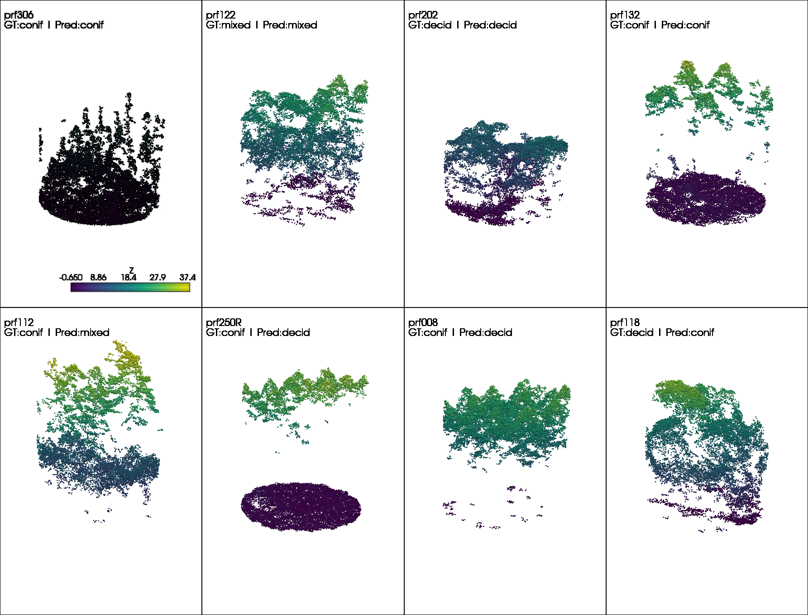

This section details how to interpret the results from the final test run and how to use the trained model effectively.

---

## Evaluating Deep Learning Predictions

Evaluation goes beyond just logging the final loss. It requires inspecting the raw outputs and ensuring they make sense in the context of the problem.

Prediction vs. Target: The core of evaluation is comparing the model's output (raw logits or predicted values) against the ground truth. This is handled within the on_test_epoch_end hook, where raw predictions are aggregated.

Post-processing: For classification, raw logits must be converted to class indices (e.g., using np.argmax(all_pred, axis=1)) before calculating metrics like accuracy or confusion matrices.

### Key Evaluation Metrics

The choice of metric depends entirely on the task type, as implemented in your on_test_epoch_end hook:

#### Classification Metrics

Instance Accuracy: The proportion of correctly classified individual samples (points or objects).

Class Accuracy (Mean Class Accuracy): The average accuracy across all possible classes. This is vital for imbalanced datasets, as it prevents the model from being judged solely by its performance on the most frequent class.

$$\text{Class Acc} = \frac{1}{N_{c}} \sum_{c=1}^{N_{c}} \frac{\text{True Positives}_c}{\text{Total Samples}_c}$$

Confusion Matrix: A table that visualizes the performance of the classification model, where each row represents the instances in an actual class, and each column represents the instances in a predicted class.

#### Regression Metrics

Root Mean Squared Error (RMSE): Measures the average magnitude of the errors. Since the errors are squared before being averaged, RMSE gives a relatively high weight to large errors.


$$\text{RMSE} = \sqrt{\frac{1}{N} \sum_{i=1}^{N} (y_i - \hat{y}_i)^2}$$

R-squared ($R^2$): Represents the proportion of the variance for a dependent variable that's explained by the independent variable(s) in a regression model. $R^2$ ranges from $0$ to $1$, with $1$ being a perfect fit.

---

### Prediction results 

<iframe src="https://api.wandb.ai/links/ubc-yuwei-cao/q2oxsdbc" style="border:none;height:1024px;width:100%"></iframe>

---

## Examples of Evaluation Metrics and Plotting Figures

Visualizing the results is often more informative than numerical logs alone.


Qualitative Visualization: For point cloud applications, visualize the point cloud data colored by the model's predicted label versus the true label to identify spatial regions where the model struggles.


```{python}
#| code-fold: true
# helper functions
import pyvista as pv
import numpy as np

def visualize_z_grid(correct_df, wrong_df, pc_dir, save_path=None):
    import pyvista as pv
    import numpy as np

    CLASS_MAP = {0: "conif", 1: "decid", 2: "mixed"}

    plotter = pv.Plotter(shape=(2,4), window_size=(1800,1360))
    plotter.link_views()
    plotter.enable_eye_dome_lighting()

    rows = [("CORRECT", correct_df), ("WRONG", wrong_df)]

    for row_idx, (_, row_df) in enumerate(rows):
        for col_idx, (_, r) in enumerate(row_df.iterrows()):
            plotter.subplot(row_idx, col_idx)

            pid = r.plot_id
            if pid is None:
                continue  # empty subplot

            gt = CLASS_MAP[int(r.dom_sp_type)]
            pred = CLASS_MAP[int(r.pred_dom_sp_type)]

            pts = np.load(pc_dir / f"{pid}.npy")[:, :3]
            cloud = pv.PolyData(pts)
            cloud["Z"] = pts[:, 2]

            plotter.add_points(
                cloud,
                scalars="Z",
                cmap="viridis",
                point_size=3,
                render_points_as_spheres=True
            )

            plotter.add_text(
                f"{pid}\nGT:{gt} | Pred:{pred}",
                position=(0.02,0.9),
                viewport=True,
                font_size=11,
                color="black",
                shadow=False
            )

    if save_path:
        plotter.show(screenshot=save_path)
    else:
        plotter.show()


def sample_grid(df, n_per_row=3, seed=42):
    df = df.copy()
    df["correct"] = df.dom_sp_type == df.pred_dom_sp_type

    correct = df[df.correct].sample(
        min(n_per_row, len(df[df.correct])),
        random_state=seed
    )
    wrong = df[~df.correct].sample(
        min(n_per_row, len(df[~df.correct])),
        random_state=seed
    )

    return correct, wrong

```

```{python}
import pandas as pd
import numpy as np
import pyvista as pv
from pathlib import Path
import random

CLASS_MAP = {
    0: "conif",
    1: "decid",
    2: "mixed"
}

# Load predictions
df = pd.read_csv("src\pretrained_ckpt\peta_cls_dgcnn_bs8_lre3\checkpoints\predictions.csv")

# Folder with point clouds
pc_dir = Path("src\data\petawawa\plot_point_clouds")  # contains prf003.npy, etc

df["correct"] = df.dom_sp_type == df.pred_dom_sp_type

print("Correct:", df.correct.sum())
print("Incorrect:", (~df.correct).sum())

correct_df, wrong_df = sample_grid(df, n_per_row=4)

visualize_z_grid(correct_df, wrong_df, pc_dir, save_path="images/04_eval/cls_output.png")
```

Result:

- Correct: 33
- Incorrect: 4



### BIOMASS

### Classification

---

## How to use the pre-trained model

Step 1: We first define the predict step in `pl.LightningModule` to output the predictions

```{python}
# --- Prediction / Inference In ---
def predict_step(self, batch, batch_idx, dataloader_idx=0):
    """
    Used for generating raw output/predictions on unseen data.
    Does not calculate loss or metrics.
    Runs when trainer.predict() is called.
    """
    points, target, pid = batch 
    
    # Transpose [B, N, C] -> [B, C, N] and enforce float32
    points = points.transpose(2, 1).float() 
    
    # 1. Forward Pass
    # Assuming self(points) returns (pred, trans_feat), we only return the prediction (pred)
    pred, _ = self(points)
    if self.task == 'classification':
        pred = torch.argmax(pred, dim=1)
    
    # Return only the raw prediction tensor for the user
    return {
        "plot_id": pid,
        "pred": pred.detach().cpu(),
        "gt": target.detach().cpu()
    }
```

```{python}
#| code-fold: true
#| code-overflow: wrap

# ... same as training for configs loading, datamodule, modelmodule, trainer initialize
# 4. Run prediction
print("Running prediction...")
outputs = trainer.predict(model, dataloaders=data_module)

# 5. Parse outputs → CSV
records = []

if task == "classification":
    for o in outputs:
        for pid, gt, pred in zip(
            o["plot_id"],
            o["gt"],
            o["pred"]
        ):
            records.append({
                "plot_id": pid,
                "dom_sp_type": int(gt.item()),
                "pred_dom_sp_type": int(pred.item())
            })

else:  # regression
    for o in outputs:
        for pid, gt, pred in zip(
            o["plot_id"],
            o["gt"],
            o["pred"]
        ):
            records.append({
                "plot_id": pid,
                "total_agb_z": float(gt.item()),
                "total_agb_z_pred": float(pred.item())
            })

df = pd.DataFrame(records)
df.to_csv(os.path.join(os.path.dirname(args.ckpt_path), args.out_csv), index=False)

print(f"Predictions saved to: {os.path.join(os.path.dirname(args.ckpt_path), args.out_csv)}")
```

### Inference using the pre-trained model
#### Classification

How to run:
```{bash}
wget -P /path/to/directory https://github.com/Brent-Murray/DeepLearningEFI/blob/main/src/pretrained_ckpt/peta_cls_dgcnn_bs8_lre3/checkpoints/best_model.ckpt 

python predict.py --model dgcnn --dataset_config_key petawawa_cls --ckpt_path /path/to/directory/best_model.ckpt

# example
python predict.py --model dgcnn --dataset_config_key petawawa_cls --ckpt_path log/EFI_DL/peta_cls_dgcnn_bs8_lre3/checkpoints/best_model.ckpt
```

#### Regression

How to run:
```{bash}
wget -P /path/to/directory https://github.com/Brent-Murray/DeepLearningEFI/blob/main/src/pretrained_ckpt/peta_reg_dgcnn_bs8_lre3/checkpoints/best_model.ckpt

python predict.py --model dgcnn --dataset_config_key petawawa_reg --ckpt_path /path/to/directory/best_model.ckpt

# example
python predict.py --model dgcnn --dataset_config_key petawawa_reg --ckpt_path log/EFI_DL/peta_reg_dgcnn_bs8_lre3/checkpoints/best_model.ckpt
```

---

## Hyperparameter tuning

Compare results of different HPs using WANDB Sweep

<iframe src="https://api.wandb.ai/links/ubc-yuwei-cao/5tuktkzj" style="border:none;height:1024px;width:100%"></iframe>

---

## Compare results to Random Forest using LiDAR Metrics

For comparison, we can compare the DGCNN results with those obtained by training a random forest classifier and regressor.

[View the RF results here](random_forest.qmd)

