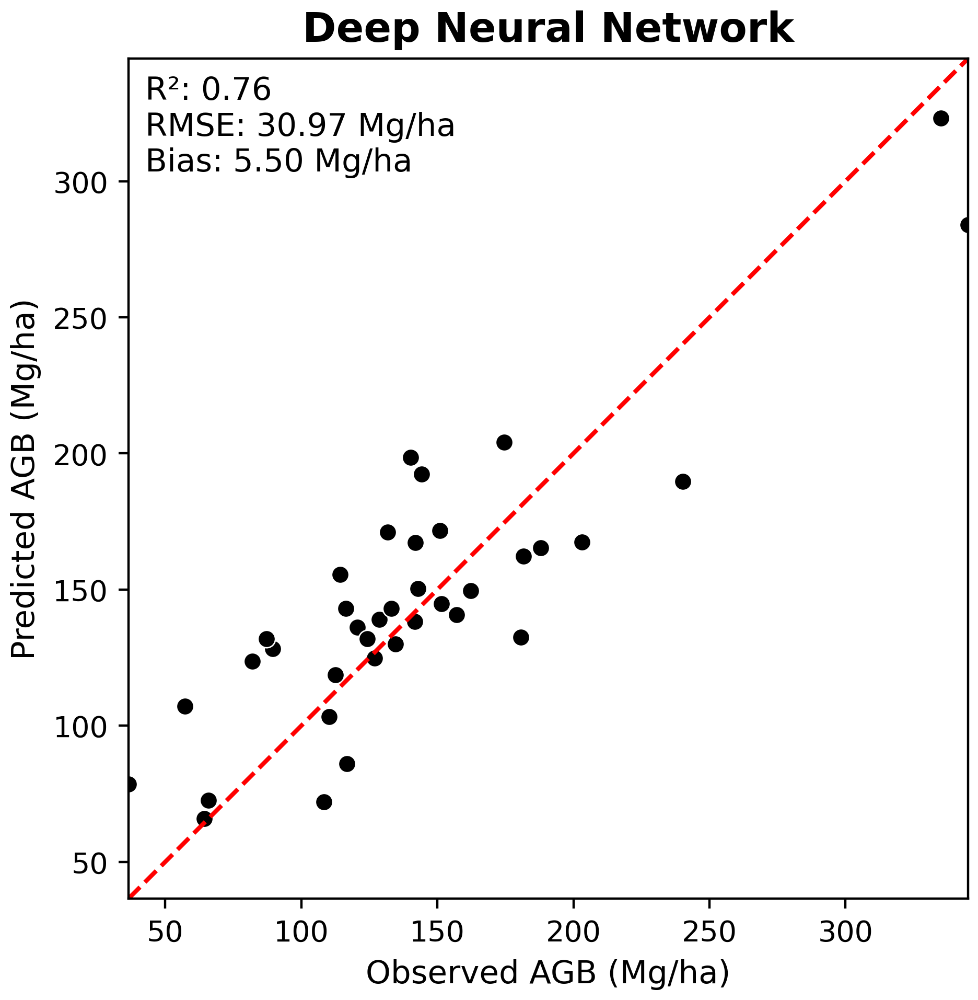

This section details how to interpret the results from the final test run and how to use the trained model effectively.

---

## Evaluating Deep Learning Predictions

Evaluation goes beyond just logging the final loss. It requires inspecting the raw outputs and ensuring they make sense in the context of the problem.

Prediction vs. Target: The core of evaluation is comparing the model's output (raw logits or predicted values) against the ground truth. This is handled within the on_test_epoch_end hook, where raw predictions are aggregated.

Post-processing: For classification, raw logits must be converted to class indices (e.g., using np.argmax(all_pred, axis=1)) before calculating metrics like accuracy or confusion matrices.

## Key Evaluation Metrics

The choice of metric depends entirely on the task type, as implemented in your on_test_epoch_end hook:

### Classification Metrics

Instance Accuracy: The proportion of correctly classified individual samples (points or objects).

Class Accuracy (Mean Class Accuracy): The average accuracy across all possible classes. This is vital for imbalanced datasets, as it prevents the model from being judged solely by its performance on the most frequent class.

$$\text{Class Acc} = \frac{1}{N_{c}} \sum_{c=1}^{N_{c}} \frac{\text{True Positives}_c}{\text{Total Samples}_c}$$

Confusion Matrix: A table that visualizes the performance of the classification model, where each row represents the instances in an actual class, and each column represents the instances in a predicted class.

### Regression Metrics

Root Mean Squared Error (RMSE): Measures the average magnitude of the errors. Since the errors are squared before being averaged, RMSE gives a relatively high weight to large errors.


$$\text{RMSE} = \sqrt{\frac{1}{N} \sum_{i=1}^{N} (y_i - \hat{y}_i)^2}$$

R-squared ($R^2$): Represents the proportion of the variance for a dependent variable that's explained by the independent variable(s) in a regression model. $R^2$ ranges from $0$ to $1$, with $1$ being a perfect fit.

---

### Prediction results

#### Wandb logged results

<iframe src="https://api.wandb.ai/links/ubc-yuwei-cao/q2oxsdbc" style="border:none;height:1024px;width:100%"></iframe>

#### Examples of calculating evaluation metrics from predictions
> The generated predictions also uploaded to github:
> 
> [Classification](./src/pretrained_ckpt/peta_cls_dgcnn_bs8_lre3/checkpoints/predictions.csv)
> 
> [Regression](./src/pretrained_ckpt/peta_reg_dgcnn_bs8_lre3/checkpoints/predictions.csv)

##### Tree species classification performance

- Load libraries and prediction

```{python}

import pandas as pd
import seaborn as sns
import numpy as np
import matplotlib.pyplot as plt
from sklearn.metrics import (
    accuracy_score,
    balanced_accuracy_score,
    cohen_kappa_score,
    f1_score,
    classification_report,
    confusion_matrix,
    mean_squared_error, 
    r2_score
)
import pyvista as pv
from pathlib import Path
import random

from src.plot_regression import plot_regression
```

## Weights and Biases logged results

Weights and Biases (wandb) is an online deep learning tool that can track experiments, perform hyperparameter tuning and visualize results. It is an effective method for refining and comparing models with different configurations.

<iframe src="https://api.wandb.ai/links/ubc-yuwei-cao/q2oxsdbc" style="border:none;height:1024px;width:100%"></iframe>

### Examples of calculating evaluation metrics from predictions
> The generated predictions also uploaded to github:
> 
> [Classification](./src/pretrained_ckpt/peta_cls_dgcnn_bs8_lre3/checkpoints/predictions.csv)
> 
> [Regression](./src/pretrained_ckpt/peta_reg_dgcnn_bs8_lre3/checkpoints/predictions.csv)

---

## Tree Species Classification Assessment

- Load predictions

```{python}
CLASS_MAP = {
    0: "conif",
    1: "decid",
    2: "mixed"
}

# Load predictions
test_df = pd.read_csv("src/pretrained_ckpt/peta_cls_dgcnn_bs8_lre3/checkpoints/predictions.csv")

y_true = test_df["dom_sp_type"]
y_pred = test_df["pred_dom_sp_type"]

```

- Overall performance
```{python}
#| label: tbl-cls-metrics
#| tbl-cap: "Tree species classification performance on the test dataset."
#| tbl-colwidths: [30, 20]
# ---- Summary metrics ----
summary_data = {
    "Metric": [
        "Overall Accuracy",
        "Balanced Accuracy",
        "Cohen's Kappa",
        "Macro F1-score",
        "Weighted F1-score"
    ],
    "Value": [
        accuracy_score(y_true, y_pred),
        balanced_accuracy_score(y_true, y_pred),
        cohen_kappa_score(y_true, y_pred),
        f1_score(y_true, y_pred, average="macro"),
        f1_score(y_true, y_pred, average="weighted")
    ]
}

summary_df = pd.DataFrame(summary_data)
summary_df["Value"] = summary_df["Value"].map(lambda x: f"{x:.3f}")

summary_df
```

- Per-class metrics table
```{python}
#| label: tbl-cls-perclass
#| tbl-cap: "Per-class precision, recall, and F1-score for stand-type classification."
report = classification_report(
    y_true,
    y_pred,
    target_names=[CLASS_MAP[i] for i in sorted(CLASS_MAP)],
    output_dict=True
)

per_class_df = (
    pd.DataFrame(report)
    .T
    .loc[list(CLASS_MAP.values())]
    .reset_index()
    .rename(columns={
        "index": "Class",
        "precision": "Precision",
        "recall": "Recall",
        "f1-score": "F1-score",
        "support": "Support"
    })
)

for col in ["Precision", "Recall", "F1-score"]:
    per_class_df[col] = per_class_df[col].map(lambda x: f"{x:.3f}")
per_class_df
```

- Confusion matrix

```{python}
#| label: fig-cls-confmat
#| fig-cap: "Normalized confusion matrix (recall per class) for tree species stand-type classification."
#| fig-width: 6
#| fig-height: 5
# Print confusion matrix
conf_matrix = confusion_matrix(y_true, y_pred)

plt.figure()
sns.heatmap(conf_matrix, annot=True, fmt='d', cmap='Blues',
            xticklabels=CLASS_MAP.values(),
            yticklabels=CLASS_MAP.values())
plt.xlabel('Predicted Label')
plt.ylabel('Observed Label')
plt.tight_layout()
plt.show()
```
---

## Examples of Plotting Figures

Visualizing the results is often more informative than numerical logs alone.

Qualitative Visualization: For point cloud applications, visualize the point cloud data colored by the model's predicted label versus the true label to identify spatial regions where the model struggles.

### Tree species classification

```{python}
#| code-fold: true
# helper functions
def visualize_z_grid(correct_df, wrong_df, pc_dir, save_path=None):
    import pyvista as pv
    import numpy as np

    CLASS_MAP = {0: "conif", 1: "decid", 2: "mixed"}

    plotter = pv.Plotter(shape=(2,4), window_size=(1800,1360))
    plotter.link_views()
    plotter.enable_eye_dome_lighting()

    rows = [("CORRECT", correct_df), ("WRONG", wrong_df)]

    for row_idx, (_, row_df) in enumerate(rows):
        for col_idx, (_, r) in enumerate(row_df.iterrows()):
            plotter.subplot(row_idx, col_idx)

            pid = r.plot_id
            if pid is None:
                continue  # empty subplot

            gt = CLASS_MAP[int(r.dom_sp_type)]
            pred = CLASS_MAP[int(r.pred_dom_sp_type)]

            pts = np.load(pc_dir / f"{pid}.npy")[:, :3]
            cloud = pv.PolyData(pts)
            cloud["Z"] = pts[:, 2]

            plotter.add_points(
                cloud,
                scalars="Z",
                cmap="viridis",
                point_size=3,
                render_points_as_spheres=True
            )

            plotter.add_text(
                f"{pid}\nGT:{gt} | Pred:{pred}",
                position=(0.02,0.9),
                viewport=True,
                font_size=11,
                color="black",
                shadow=False
            )

    if save_path:
        plotter.show(screenshot=save_path)
    else:
        plotter.show()


def sample_grid(df, n_per_row=3, seed=42):
    df = df.copy()
    df["correct"] = df.dom_sp_type == df.pred_dom_sp_type

    correct = df[df.correct].sample(
        min(n_per_row, len(df[df.correct])),
        random_state=seed
    )
    wrong = df[~df.correct].sample(
        min(n_per_row, len(df[~df.correct])),
        random_state=seed
    )

    return correct, wrong

```

```{python}

# Folder with point clouds
pc_dir = Path("data/petawawa/plot_point_clouds")  # contains prf003.npy, etc

test_df["correct"] = test_df.dom_sp_type == test_df.pred_dom_sp_type

print("Correct:", test_df.correct.sum())
print("Incorrect:", (~test_df.correct).sum())

correct_df, wrong_df = sample_grid(test_df, n_per_row=4)

visualize_z_grid(correct_df, wrong_df, pc_dir, save_path="images/04_eval/cls_output.png")

```

### BIOMASS

---

## Forest Biomass Regression Assessment


**Function to convert z-scored prdicted biomass to tonnes per hectare (Mg/ha)**

```{python}

def convert_from_z_score(z_vals, sd, mean):
    """
    Converts z-score back to original value using mean and sd

    X = Z * standard_deviation + mean

    :param z_vals: z-score values to be converted
    :param sd: standard deviation of original data
    :param mean: mean of original data
    :return: input values converted to back to original units
    """

    z_score_val = z_vals * sd + mean

    return z_score_val

```

**Summarize regression results**

```{python}

# Set filepaths for labels and predictions
LABELS_FPATH = r'data/petawawa/labels.csv'
OBS_PRED_FPATH = r'src/pretrained_ckpt/peta_reg_dgcnn_bs8_lre3/checkpoints/predictions.csv'

# Read predictions and make plot ID uppercase
test_df = (pd.read_csv(OBS_PRED_FPATH)
               .assign(plot_id=lambda df: df['plot_id'].str.upper()))

# Read labels
labels_df = (pd.read_csv(LABELS_FPATH)
             .assign(plot_id=lambda df: df['plot_id'].str.upper())
             .rename(columns={'total_agb_mg_ha': 'agb_mg_ha_obs'}))

# Drop Z-scored AGB labels from dataframes
test_df.pop('total_agb_z')
labels_df.pop('total_agb_z')

# Join with labels DF
test_df = test_df.merge(labels_df, on='plot_id', how='left')

# Set mean and standard deviation for Z-score conversion
mean_agb = test_df['agb_mg_ha_obs'].mean()
sd_agb = test_df['agb_mg_ha_obs'].std()

# Convert predicted Z-scores back to original AGB values (tonnes per hectare)
test_df['agb_mg_ha_pred'] = convert_from_z_score(z_vals=test_df['total_agb_z_pred'],
                                            sd=sd_agb,
                                            mean=mean_agb)

print(test_df.head())

# Plot regression results
plot_regression(obs=test_df['agb_mg_ha_obs'], 
                pred=test_df['agb_mg_ha_pred'],
                title='Deep Neural Network',
                fig_out_fpath='images/dnn_regression_plot.png',
                hide=True)

```

<div style="display: flex; justify-content: center; gap: 20px;">
  
  
</div>

```{python}

```

```{python}

```

```{python}

```

---


---

## Hyperparameter tuning

Compare results of different HPs using WANDB Sweep

<iframe src="https://api.wandb.ai/links/ubc-yuwei-cao/5tuktkzj" style="border:none;height:1024px;width:100%"></iframe>

> Findings?
---
## Selecting model

<iframe src="https://api.wandb.ai/links/ubc-yuwei-cao/q2oxsdbc" style="border:none;height:1024px;width:100%"></iframe>

## Compare results to Random Forest using LiDAR Metrics

For comparison, we can compare the DGCNN results with those obtained by training a random forest classifier and regressor.

[View the RF results here](random_forest.qmd)

