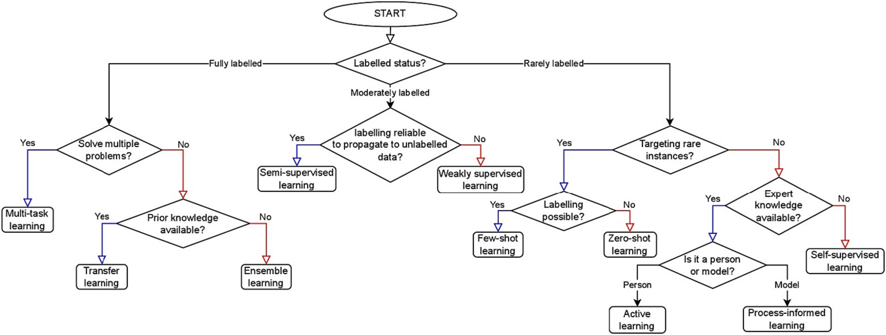
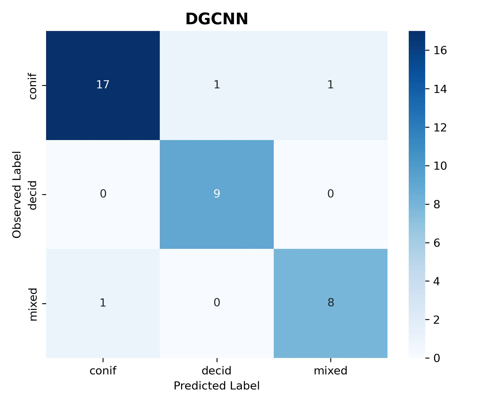
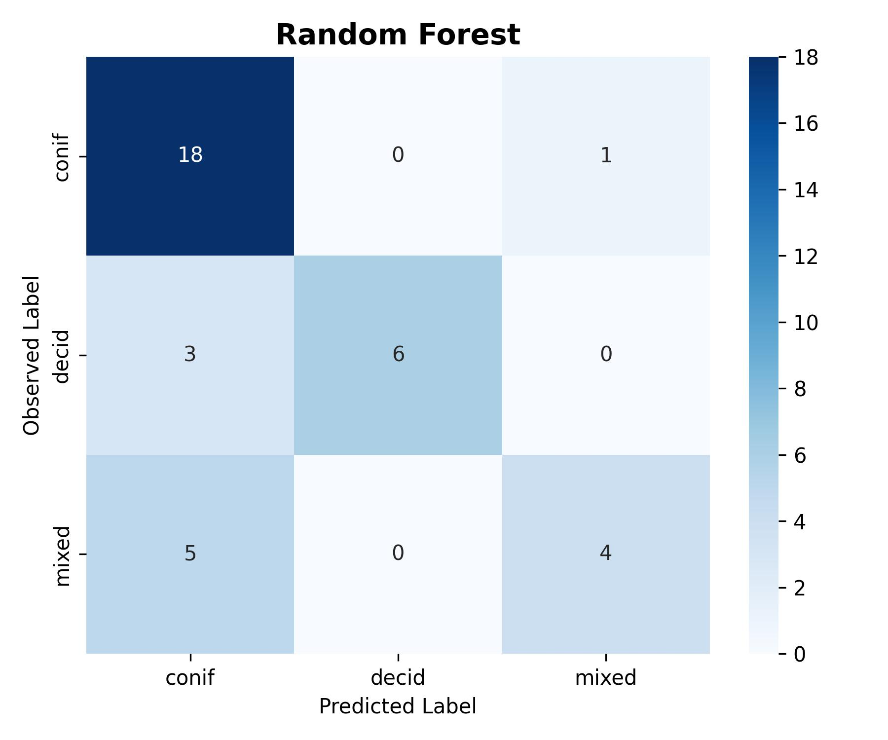
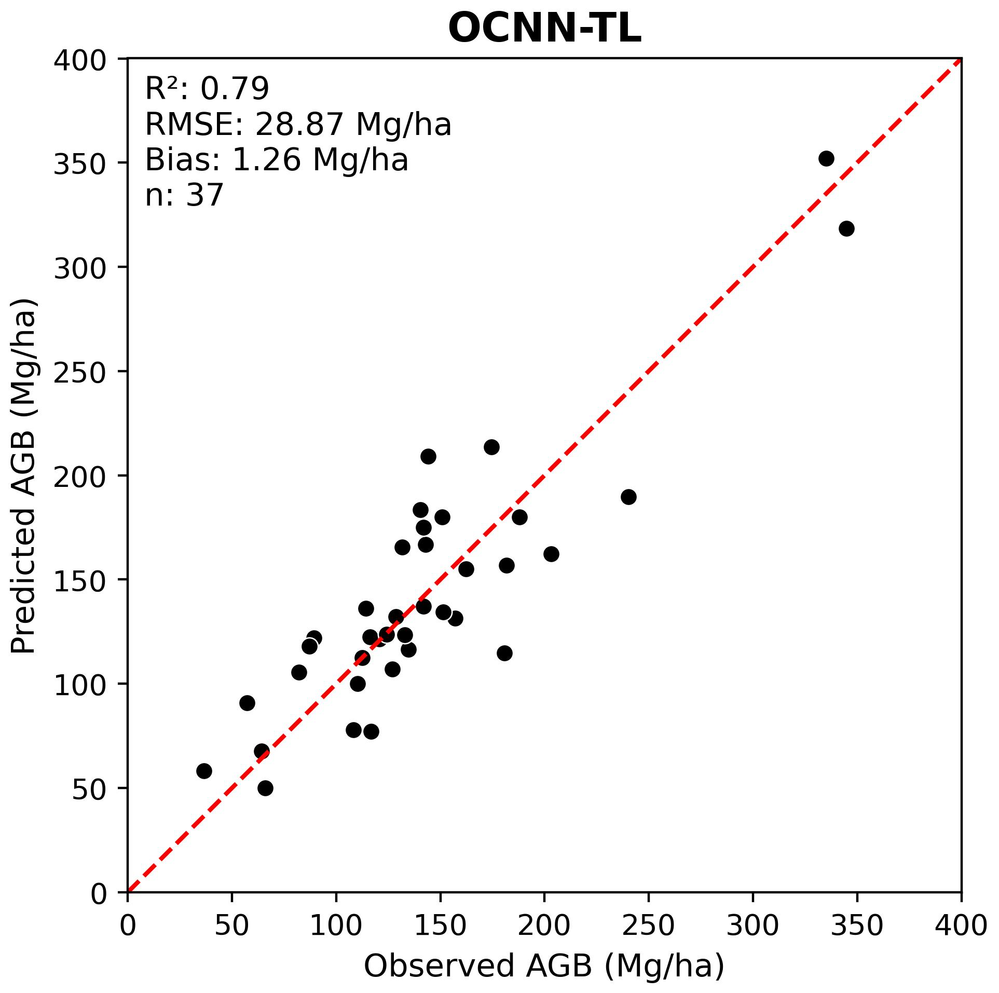
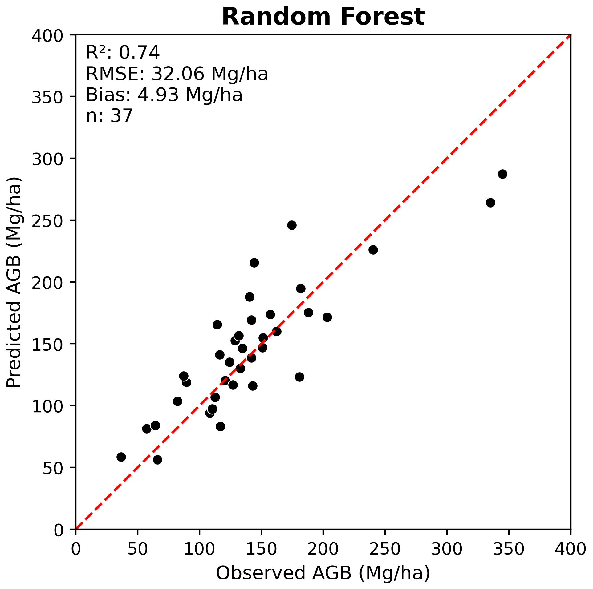

## Overview
This section describes how to evaluate trained deep learning models using an independent test dataset. It focuses on interpreting results from the final test run performed with the optimal network configuration after convergence. The evaluation procedures are demonstrated through our two case studies: tree species classification and biomass regression.

## Evaluating Deep Learning Predictions

Evaluation goes beyond just logging the final loss. It requires inspecting the raw outputs and ensuring they make sense in the context of the problem.

Prediction vs. Target: The core of evaluation is comparing the model's output (raw logits or predicted values) against the ground truth. This is handled within the `on_test_epoch_end` hook, where raw predictions are aggregated.

Post-processing: For classification, raw logits must be converted to class indices (e.g., using `np.argmax(all_pred, axis=1)`) before calculating metrics like accuracy or confusion matrices.

## Key Evaluation Metrics

The choice of metric depends entirely on the task type, as implemented in your `on_test_epoch_end` hook:

### Classification metrics

Instance Accuracy: The proportion of correctly classified individual samples (points or objects).

Class Accuracy (Mean Class Accuracy): The average accuracy across all possible classes. This is vital for imbalanced datasets, as it prevents the model from being judged solely by its performance on the most frequent class.

$$\text{Class Acc} = \frac{1}{N_{c}} \sum_{c=1}^{N_{c}} \frac{\text{True Positives}_c}{\text{Total Samples}_c}$$

Confusion Matrix: A table that visualizes the performance of the classification model, where each row represents the instances in an actual class, and each column represents the instances in a predicted class.

### Regression metrics

Root Mean Squared Error (RMSE): Measures the average magnitude of the errors. Since the errors are squared before being averaged, RMSE gives a relatively high weight to large errors.

$$\text{RMSE} = \sqrt{\frac{1}{N} \sum_{i=1}^{N} (y_i - \hat{y}_i)^2}$$

R-squared ($R^2$): Represents the proportion of the variance for a dependent variable that's explained by the independent variable(s) in a regression model. $R^2$ ranges from $0$ to $1$, with $1$ being a perfect fit.


## Prediction Results and Visualization

Visualizing the results is often more informative than numerical logs alone.

Qualitative Visualization: For point cloud applications, visualize the point cloud data colored by the model's predicted label versus the true label to identify spatial regions where the model struggles.

> The generated predictions are also uploaded to GitHub:
> 
> [Classification](./src/pretrained_ckpt/peta_cls_dgcnn_bs16_lre4/checkpoints/predictions.csv)
> 
> [Regression](./src/pretrained_ckpt/peta_reg_dgcnn_bs8_lre3/checkpoints/predictions.csv)

## Tree Species Classification

First we need to load in our libraries and our predictions that we generated at the end of the train section.

### Load libraries
Metrics can be calculated from libraries such as scikit-learn. `sklearn.metrics` provides common predefined functions that we can use to evaluate our predictions from our examples.

```{python}
import pandas as pd
import seaborn as sns
import numpy as np
import matplotlib.pyplot as plt
from sklearn.metrics import (
    accuracy_score,
    balanced_accuracy_score,
    cohen_kappa_score,
    f1_score,
    classification_report,
    confusion_matrix,
    mean_squared_error, 
    r2_score
)
import pyvista as pv
from pathlib import Path
import random
import pyvista as pv

from src.utils.regression_utils import plot_regression, convert_from_z_score

```
### Load predictions
We then can load in our predictions of our test dataset which we load in as a dataframe with true and predicted observations.

```{python}
CLASS_MAP = {
    0: "conif",
    1: "decid",
    2: "mixed"
}

## Load Predictions
test_df = pd.read_csv(r"src/pretrained_ckpt/peta_cls_dgcnn_bs16_lre4/checkpoints/predictions.csv")

y_true = test_df["dom_sp_type"]
y_pred = test_df["pred_dom_sp_type"]

```

### Calculate overall classification metrics
For classification, we often calculate multiple accuracy metrics such as **overall accuracy, Cohen’s kappa, and F1-score**. Providing multiple metrics allows a more comprehensive assessment of model performance, as each metric captures different aspects of classification quality, particularly in the presence of class imbalance or unequal error costs.

```{python}
#| code-fold: true
# ---- Summary metrics ----
summary_data = {
    "Metric": [
        "Overall Accuracy",
        "Balanced Accuracy",
        "Cohen's Kappa",
        "Macro F1-score",
        "Weighted F1-score"
    ],
    "Value": [
        accuracy_score(y_true, y_pred),
        balanced_accuracy_score(y_true, y_pred),
        cohen_kappa_score(y_true, y_pred),
        f1_score(y_true, y_pred, average="macro"),
        f1_score(y_true, y_pred, average="weighted")
    ]
}

# ---- per-species metrics ----
report = classification_report(
    y_true,
    y_pred,
    target_names=[CLASS_MAP[i] for i in sorted(CLASS_MAP)],
    output_dict=True
)

per_class_df = (
    pd.DataFrame(report)
    .T
    .loc[list(CLASS_MAP.values())]
    .reset_index()
    .rename(columns={
        "index": "Class",
        "precision": "Precision",
        "recall": "Recall",
        "f1-score": "F1-score",
        "support": "Support"
    })
)
```
```{python}
#| label: tbl-cls-metrics
#| tbl-cap: "Tree species classification performance on the test dataset."
#| tbl-colwidths: [30, 20]

summary_df = pd.DataFrame(summary_data)
summary_df["Value"] = summary_df["Value"].map(lambda x: f"{x:.3f}")

summary_df
```
### Calculate class specific metrics
Per-class metrics such as **precision and recall** provide insight into how well individual classes are identified, highlighting class-specific errors that may be obscured by aggregate accuracy measures. **Confusion matrices** further support this analysis by explicitly showing the distribution of correct and incorrect predictions across classes, enabling a detailed interpretation of misclassification patterns.


```{python}
#| label: tbl-cls-perclass
#| tbl-cap: "Per-class precision, recall, and F1-score for tree species classification."

for col in ["Precision", "Recall", "F1-score"]:
    per_class_df[col] = per_class_df[col].map(lambda x: f"{x:.3f}")
per_class_df
```


```{python}
#| label: fig-cls-confmat
#| fig-cap: "Confusion matrix for tree species classification."
#| fig-width: 6
#| fig-height: 5
# Print confusion matrix
conf_matrix = confusion_matrix(y_true, y_pred)

fig, ax = plt.subplots(figsize=(6,5), layout='tight')

sns.heatmap(ax=ax, data=conf_matrix, annot=True, fmt='d', cmap='Blues',
            xticklabels=CLASS_MAP.values(),
            yticklabels=CLASS_MAP.values())

ax.set_xlabel('Predicted Label')
ax.set_ylabel('Observed Label')
ax.set_title('DGCNN', fontsize=14, fontweight='bold')

# Export figure
fig.savefig("images/dnn_cls_confusion_matrix.jpg", dpi=300)

plt.show()
```

### Visualize difficult cases

It is often beneficial to visualize individual examples to better understand model predictions. The figure below shows point cloud samples from the testing set, including correctly classified cases (top row) and misclassified cases (bottom row). Such visualizations help identify where errors occur and, when combined with domain knowledge, provide insight into potential causes of misclassification

```{python}
#| code-fold: true
# helper functions
def visualize_z_grid(correct_df, wrong_df, pc_dir, save_path=None):
    plotter = pv.Plotter(shape=(2,3), window_size=(1800,1360))
    plotter.link_views()
    plotter.enable_eye_dome_lighting()

    rows = [("CORRECT", correct_df), ("WRONG", wrong_df)]

    for row_idx, (_, row_df) in enumerate(rows):
        for col_idx, (_, r) in enumerate(row_df.iterrows()):
            plotter.subplot(row_idx, col_idx)

            pid = r.plot_id
            if pid is None:
                continue  # empty subplot

            obs = CLASS_MAP[int(r.dom_sp_type)]
            pred = CLASS_MAP[int(r.pred_dom_sp_type)]

            pts = np.load(pc_dir / f"{pid}.npy")[:, :3]
            cloud = pv.PolyData(pts)
            cloud["Z"] = pts[:, 2]

            plotter.add_points(
                cloud,
                scalars="Z",
                cmap="viridis",
                point_size=3,
                render_points_as_spheres=True
            )

            plotter.add_text(
                f"{pid}\nobs:{obs} | Pred:{pred}",
                position=(0.02,0.9),
                viewport=True,
                font_size=11,
                color="black",
                shadow=False
            )

    if save_path:
        plotter.show(screenshot=save_path)
    else:
        plotter.show()


def sample_grid(df, n_per_row=3, seed=42):
    df = df.copy()
    df["correct"] = df.dom_sp_type == df.pred_dom_sp_type

    correct = df[df.correct].sample(
        min(n_per_row, len(df[df.correct])),
        random_state=seed
    )
    wrong = df[~df.correct].sample(
        min(n_per_row, len(df[~df.correct])),
        random_state=seed
    )

    return correct, wrong

```

```{python}
# Folder with point clouds
pc_dir = Path("data/petawawa/plot_point_clouds")  # contains prf003.npy, etc

test_df["correct"] = test_df.dom_sp_type == test_df.pred_dom_sp_type

print("Correct:", test_df.correct.sum())
print("Incorrect:", (~test_df.correct).sum())

correct_df, wrong_df = sample_grid(test_df, n_per_row=3)

visualize_z_grid(correct_df, wrong_df, pc_dir, save_path="images/04_eval/cls_output.png")

```

## Forest Aboveground Biomass Regression

Forest aboveground biomass (AGB) regression is a more complex modeling task compared to classifying dominant tree species.

We begin by evaluating the DGCNN model trained with hyperparameters that achieved the best validation performance. 

**The code below includes a function for loading regression predictions and converting them from Z-score to the original scale.**

```{python}
# Define a funmction to read 
def load_reg_pred(obs_pred_fpath, labels_df, mean_agb, sd_agb):
    
    # Read predictions and make plot ID uppercase
    df = (pd.read_csv(obs_pred_fpath)
                .assign(plot_id=lambda df: df['plot_id'].str.upper()))

    # Drop Z-scored AGB labels from dataframes
    df.pop('total_agb_z')

    # Convert predicted Z-scores back to original AGB values (tonnes per hectare)
    df['agb_mg_ha_pred'] = convert_from_z_score(z_vals=df['total_agb_z_pred'],
                                                sd=sd_agb,
                                                mean=mean_agb)
    
    df = df.merge(labels_df, on='plot_id', how='left')

    return df

```

**Load observed and predicted AGB values.**

Previously, we generated predictions using the trained model on the test dataset, which are stored in the `predictions.csv` file within the model checkpoint directory (`src/pretrained_ckpt/...`).

We also need to load the observed AGB values from `labels.csv`.

**Below we generate an observed vs. predicted scatterplot including regression metrics for DGCNN.** 

We can see that the model fit was quite poor.

```{python}
LABELS_FPATH = r'data/petawawa/labels.csv'

dgcnn_pred_fpath = r'src/pretrained_ckpt/peta_reg_dgcnn_bs8_lre3/checkpoints/predictions.csv'

# Read labels
labels_df = (pd.read_csv(LABELS_FPATH)
             .assign(plot_id=lambda df: df['plot_id'].str.upper())
             .rename(columns={'total_agb_mg_ha': 'agb_mg_ha_obs'}))

# Set mean and standard deviation for Z-score conversion
mean_agb = labels_df['agb_mg_ha_obs'].mean()
sd_agb = labels_df['agb_mg_ha_obs'].std()

# Load DGCNN predictions
dgcnn_obs_pred_df = load_reg_pred(dgcnn_pred_fpath, labels_df, mean_agb, sd_agb)

# Plot regression results
plot_regression(obs=dgcnn_obs_pred_df['agb_mg_ha_obs'], 
                pred=dgcnn_obs_pred_df['agb_mg_ha_pred'],
                ax_lims=(0, 400),
                title='DGCNN',
                fig_out_fpath='images/dgcnn_regression_plot.jpg',
                hide=False)


```

### Improving DNN performance

Deep neural networks (DNNs) often have poor model fit when trained out-of-the-box on small datasets. Recall that most prominent DNNs are typically trained using millions of samples.

In situations like the Petawawa dataset, with only n = 249 samples, there are a few steps that can be taken to achieve improved performance.

**Trying a different DNN architecture**

First, we can try a different DNN architecture that may be better suited to forest AGB regression. Some research has indicated that 3-D CNNs perform better for AGB estimation. For example, [Oehmcke et al. (2024)](https://doi.org/10.1016/j.rse.2023.113968) found that the Minkowski Engine sparse 3-D CNN outperformed point-based DNNs such as PointNet and KPConv for AGB regression.

Following this logic, we will evaluate the effectiveness of a similar Octree-CNN (OCNN) model that was implemented by [Seely et al. (2023)](https://doi.org/10.1016/j.srs.2023.100110).

**Below we evaluate the performance of OCNN on the PRF dataset.**

```{python}
# Load OCNN predictions
ocnn_pred_fpath = r'src/pretrained_ckpt/peta_reg_ocnn_bs16_lre3_ckpt_no_ckpt/checkpoints/predictions.csv'

ocnn_obs_pred_df = load_reg_pred(ocnn_pred_fpath, labels_df, mean_agb, sd_agb)

plot_regression(obs=ocnn_obs_pred_df['agb_mg_ha_obs'], 
                pred=ocnn_obs_pred_df['agb_mg_ha_pred'],
                ax_lims=(0, 400),
                title='OCNN',
                fig_out_fpath='images/ocnn_regression_plot.jpg',
                hide=False)

```

We can see that OCNN achieved a better fit compared to DGCNN, reducing RMSE and bias and improving $R^2$.

**Transfer learning**

We can take this a step further and apply [transfer learning (TL)](https://d2l.ai/chapter_computer-vision/fine-tuning.html) to train OCNN. 

Conventionally, DNN model weights are randomly initialized, which means the model begins training with no prior knowledge. TL involves initializing the model weights using a pre-trained OCNN model that was trained on a similar, larger dataset. 

In this case, we will use a version of OCNN that was pretrained on the New Brunswick forest inventory dataset from [Seely et al. (2023)](https://doi.org/10.1016/j.srs.2023.100110). This pretrained model checkpoint is stored at `src/pretrained_ckpt/ocnn_nbk_idXM6D.ckpt`.

**Below we evaluate the transfer learning OCNN (OCNN-TL) performance on the PRF dataset.**

We can see that transfer learning further improved the model fit.

```{python}
# Different model checkpoints

ocnn_tl_pred_fpath = r'src/pretrained_ckpt/peta_reg_ocnn_bs16_lre4_ckpt_ocnn_nbk_idXM6D/checkpoints/predictions.csv'

ocnn_tl_obs_pred_df = load_reg_pred(ocnn_tl_pred_fpath, labels_df, mean_agb, sd_agb)

plot_regression(obs=ocnn_tl_obs_pred_df['agb_mg_ha_obs'], 
                pred=ocnn_tl_obs_pred_df['agb_mg_ha_pred'],
                ax_lims=(0, 400),
                title='OCNN-TL',
                fig_out_fpath='images/ocnn_tl_regression_plot.jpg',
                hide=False)
```

---

Building on the poor DGCNN performance, we explored two methods of improving DNN model performance for AGB estimation:

1) Using a different DNN architecture (OCNN)
2) Applying transfer learning (OCNN-TL)

**Other strategies to boost DNN performance**

Due to the high degree of flexibility in DNN architectures and training strategies, there are many other potential avenues for improving model performance that can be explored. These include, but are not limited to:

- Hyperparameter tuning
- Data augmentation
- Ensemble modelling

**[Safonova et al. 2023](https://doi.org/10.1016/j.jag.2023.103569)** provides additional strategies for improving DNN performance for remote sensing applications in scenarios with small datasets which are shown in the figure below.

{#fig-small-data-flowchart fig-align="center" width=100%}


# Compare results to Random Forest using LiDAR Metrics

While it is useful to compare the performance of different deep neural networks, it is also important to benchmark DNN results against conventional machine learning approaches for EFI that rely on LiDAR metrics. The most common approach is to use Random Forest (RF) models trained using plot-level LiDAR height metrics as predictors.

[View the RF training workflow and results here](random_forest.qmd)

**Below we compare the best DNN results to RF results for both tree species classification and AGB regression.**

Overall, we can see that the DNN models implemented in this tutorial provided a modest improvement compared to RF models trained using LiDAR metrics. It is possible that this improvement could have been further increased with additional DNN hyperparameter tuning and training strategies.

It is important to note the computational cost of training DNNs and the complexity of the code and overall workflow compared to RF. In some cases, the improvement in performance may not justify the added complexity of DNNs compared to RF for EFI applications.

### Comparison for tree species classification

<div style="display: flex; justify-content: center; gap: 20px;">
  
  
</div>

### Comparison for AGB regression

<div style="display: flex; justify-content: center; gap: 20px;">
  
  
</div>

## Other deep neural networks

<iframe src="https://api.wandb.ai/links/ubc-yuwei-cao/q2oxsdbc" style="border:none;height:600px;width:100%" loading="lazy"></iframe>


