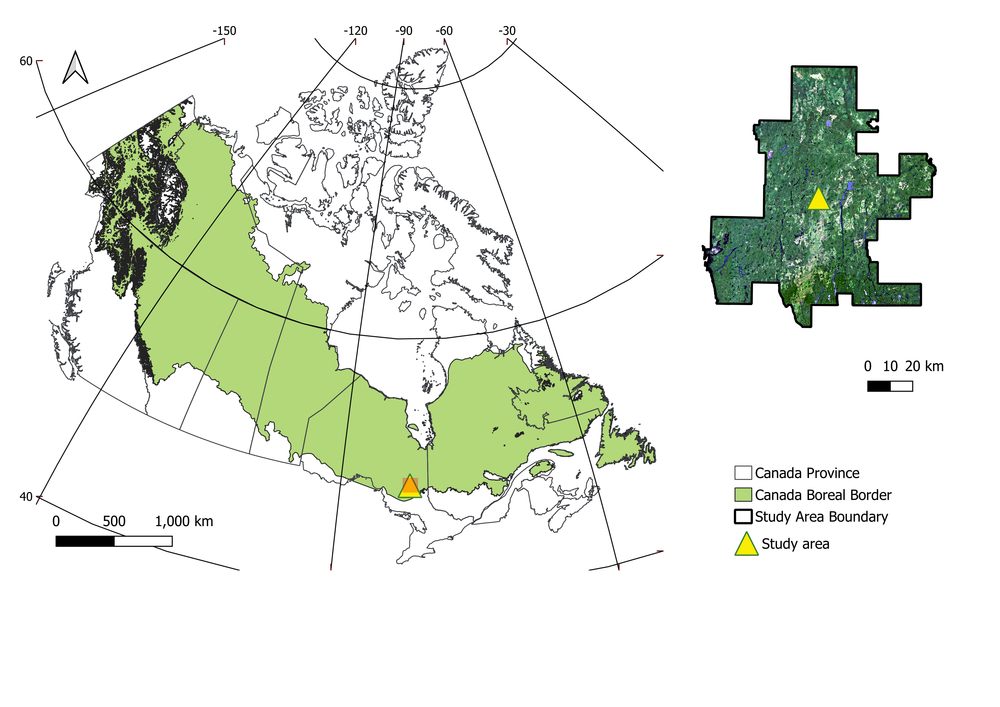
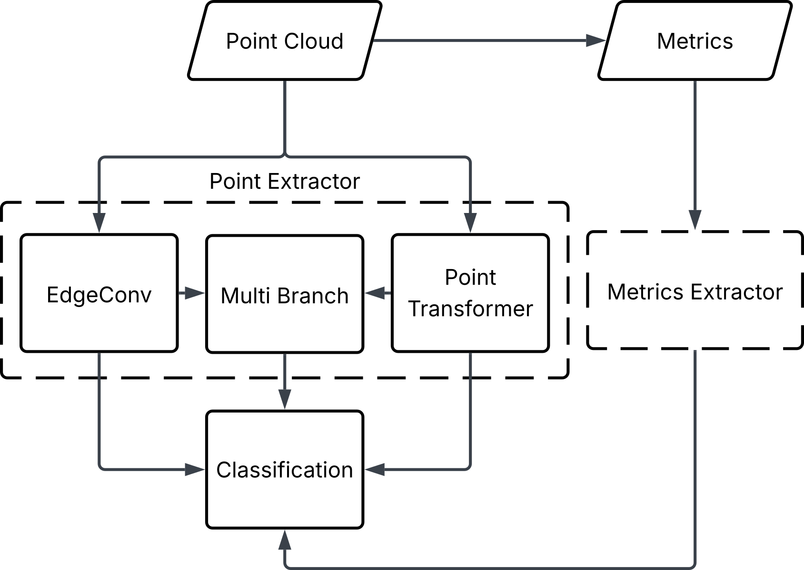

## How is Deep Learning Going to Change EFI Workflows

## Biomass Component Regression

## Tree Species Composition

*Based on the publication <a href=https://doi.org/10.1016/j.isprsjprs.2025.11.026 target=”_blank”>M3FNet: Multi-modal multi-temporal multi-scale data fusion network for tree species composition mapping</a> by Cao et al (2025).*

### Why Tree Species Composition Mapping?
Accurate information on tree species composition (TSC) is critical for forest inventories, serving as a foundational element for forest management. By identifying TSC and its spatial patterns, forest managers can implement sustainable management practices, such as targeted silvicultural intervention, monitoring forest health, and analysing the resilience of forests. 

### Study Area
The Romeo Malette Forest, situated in northern Ontario within the Timmins District, is part of the boreal forest of Canada. It encompasses approximately 6,300 km2, of which 5,824 km2 is forested, extending between 47.8°N and 48.8°N and from 81.0°W to 82.4°W. The region experiences a continental climate, with mean annual precipitation ranging from 770 to 975 mm and mean annual minimum temperatures between 1.0 °C and − 5.0 °C from 1990 to 2010; over the same period, mean annual maximum temperatures varied from 15 °C to 8 °C. Elevations range from 240 to 280 m, and the terrain is characterised by minimal exposed bedrock and extensive, poorly drained flat areas.

{#fig-study-area fig-align="center" width=60%}

### Dataset and Dataset Generation
A multi-step preprocessing workflow was implemented comprising S2 imagery processing, FRI data processing, superpixel generation, and SPL-plot pairing.

<video
  src="images/05_examples_TSC/data_processing.mp4"
  autoplay
  loop
  muted
  playsinline
  style="
    width: 900px;
    height: 500px;
    object-fit: cover;
    object-position: center;
    display: block;
    margin: auto;
  "
></video>

**Superpixel generation involved:**

- Selecting polygons from the “Cleaned FRI” overlapping each $128 \times 128$-pixel tile (red-bounded region)
- Grouping all pixels fully contained within a given polygon into a single superpixel and assigning its identifier (“POLYID”) from the corresponding overlapped polygon
- Marking pixels intersecting polygon boundaries or outside any polygon as “no data”

   
### DL Model
Our proposed network architecture employs a multi-stream design to effectively process and fuse information from multispectral satellite imagery and 3D point cloud data. The model comprises two parallel streams—one dedicated to processing spectral information (Superpixel Stream) and another dedicated to processing structural information (Point Cloud Stream)—and a Fusion Stream to integrate the learnt features.

{#fig-fusion-model fig-align="center" width=70%}

### Result

spatial distribution of the prediction of two leading species—Black Spruce (SB) and Jack Pine (PJ)—along with the combined proportion of all remaining species, as well as the estimation errors compared to the photo-interpreted FRI data. Overall, SB dominates most of the study area, and high RMSE values frequently appear where SB is the top-ranked species or where the remainder category is prevalent.

Table. Comparison of the TSC estimation results using the coefficient of determination (R²) and root mean squared error (RMSE) in different modes: superpixel-only, point cloud-only, and three fusion modes.

| Models                                   | R²    | RMSE |
|------------------------------------------|-------|------|
| Superpixel mode                         | 0.627 | 0.142 |
| Point cloud mode                       | 0.560 | 0.151 |
| Fusion mode                            | 0.657 | 0.132 |
| Single-season Mamba-Fusion mode        | 0.631 | 0.127 |
| All-seasons Mamba-Fusion mode (M3F-Net)| 0.676 | 0.120 |

{#fig-mapping-result fig-align="center" width=80%}

### Key Take-Home Messages
- A superpixel-based spatial alignment strategy to reconcile differences in resolution and modalities between point cloud data and multispectral imagery
- Multi-seasonal S2 imagery to leverage seasonal variations in vegetation phenology to enhance species discrimination
- A multi-stream neural network architecture (M3F-Net) featuring a Mamba-Fusion module for effective integration of 2D and 3D features

---

## Individual Tree Species
*Based on the publication <a href=https://doi.org/10.1016/j.jag.2025.104877 target=”_blank”>Individual tree species prediction using airborne laser scanning data and derived point-cloud metrics within a dual-stream deep learning approach</a> by Murray et al (2025).*

### Why Tree Species Mapping Matters
Knowing which tree species are present, and where they are located, is essential for modern forest inventories. Species information supports decisions related to timber supply, carbon estimation, habitat assessment, and forest management. Traditional inventories often rely on manual interpretation and report species information at the stand level, which limits detail and scalability. 

Deep learning methods offer powerful tools for mapping tree species, but they typically require large, well-labelled datasets for training. Field-based datasets are expensive and time-consuming to collect and typically do not cover the entire forested area. As a result, they often do not provide enough labelled examples to fully support deep learning approaches on their own. This creates a major challenge for applying deep learning to tree species classification at operational scales.

Advances in ALS data, combined with automated data generation methods, provide an opportunity to overcome this limitation by producing large, labelled datasets across extensive forested areas.

### Data Used
This study used ALS data collected over the Romeo Malette Forest (RMF) in Ontario. Existing forest inventory maps and field plot data were also used to provide the tree species information needed for model training.

<video
  src="images/treespecies/pointcloud.mp4"
  autoplay
  loop
  muted
  playsinline
  style="
    width: 400px;
    height: 400px;
    object-fit: cover;
    object-position: center;
    display: block;
    margin: auto;
  "
></video>

### Automated Tree-Level Dataset Creation
An automated workflow was used to detect and segment individual trees directly from the ALS data. Tree species labels were then assigned using existing field measurements and supplemented with inventory information from pure stands, without manual tree delineation or hand-labelling. This approach produced a large dataset of individual tree point clouds, enabling the use of deep learning while avoiding a major bottleneck common in many tree-level studies.

### Combining Two Types of ALS Information
The core idea of this work was to combine two complementary sources of information. First, the raw 3D point clouds capture the detailed shape and structure of individual trees. Second, simple summary metrics describe overall tree characteristics such as height distribution, crown size, and return intensity. Each data type provides different but useful information for distinguishing tree species.

### Deep Learning Approach
A dual-stream deep learning model was developed. One part of the model learns directly from the raw 3D point clouds, while the second part learns from the summary metrics. The outputs from both streams are combined to make a final tree species prediction. This design allows the model to use both detailed structural patterns and broader summary information in a single framework.

{#fig-dual-stream fig-align="center" width=60%}

### Results
Combining point clouds with summary metrics improve tree species classification compared to using point clouds alone. The dual-stream approach produces more accurate predictions and more reliable confidence estimates across species. The largest gains were observed when both types of ALS information were used together, highlighting the value of this fusion in tree-level classification.

### Why This Matters for Forest Inventories
This approach reduces the need for manual interpretation and enables tree-level species mapping over large forested areas. By using data that are already commonly collected for forest inventories, the method is well suited for operational use. It demonstrates how deep learning can be used for enhanced forest inventories by adding detailed species information in a scalable and automated way.

### Key Take-Home Messages
-	ALS can support individual tree species mapping at large scales using deep learning
-	Automated workflows are critical for making deep learning practical in forestry
-	Combining raw 3D data with simple summary metrics improves prediction performance
-	Dual-stream deep learning provides a simple and effective way to combine different types of ALS based forest information.
