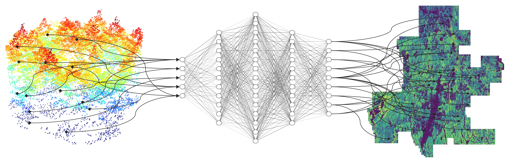
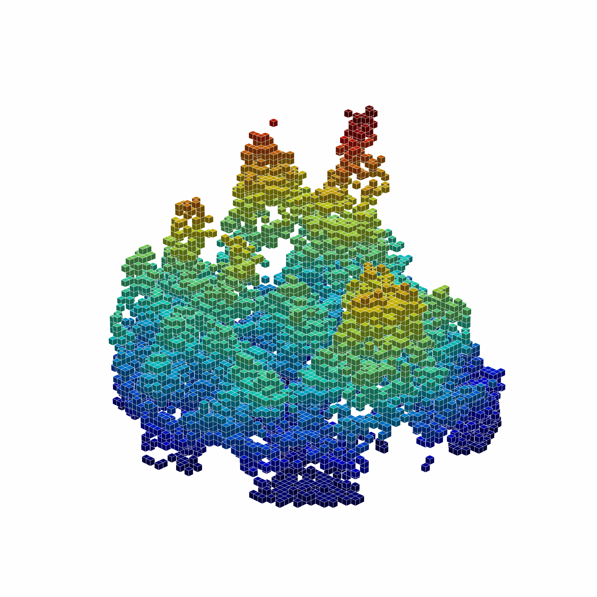
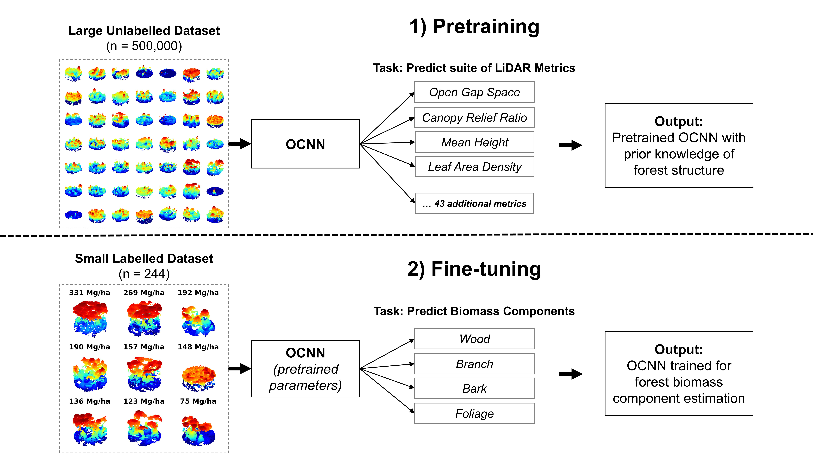
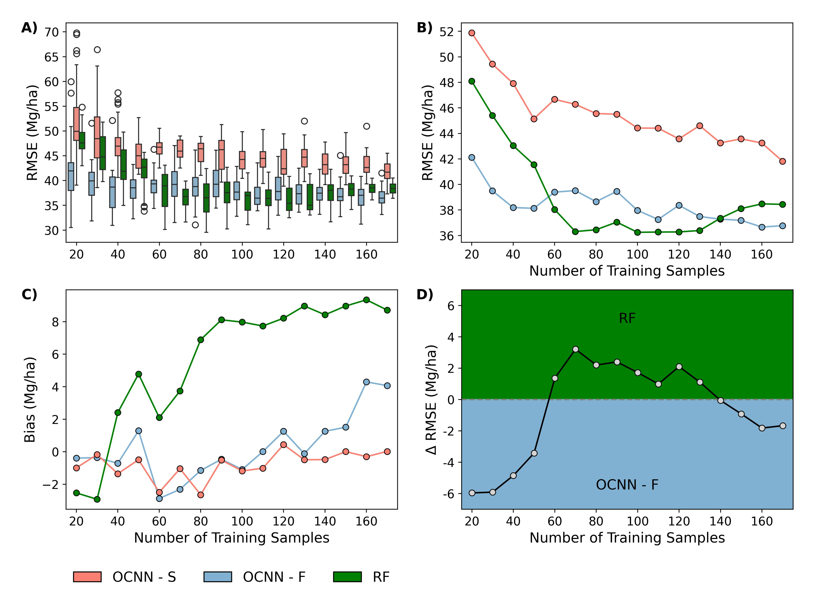
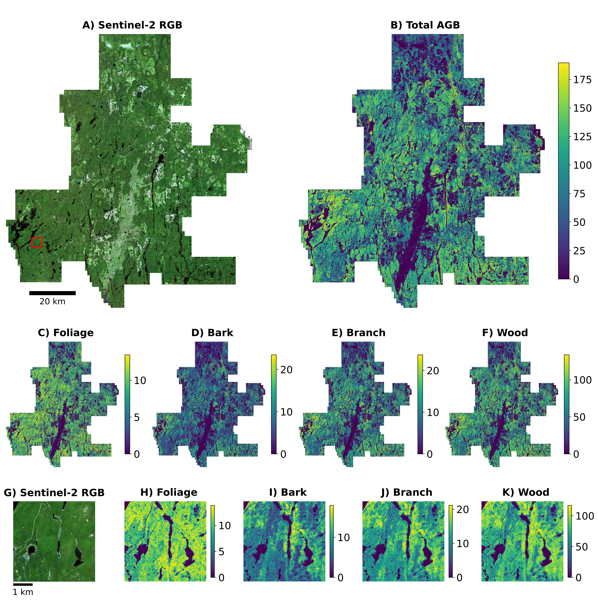
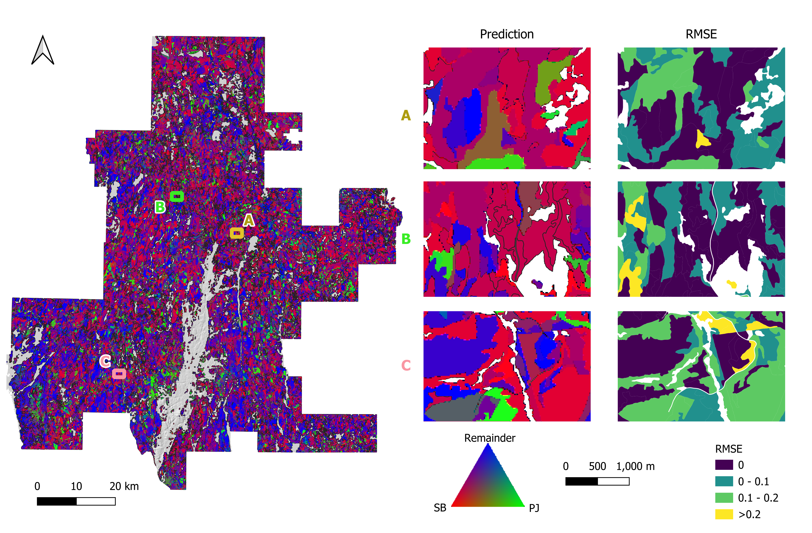
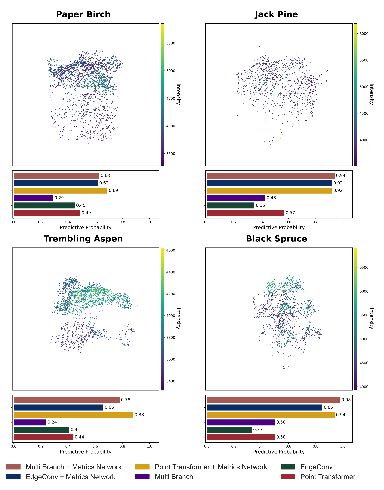

## How is Deep Learning Going to Change EFI Workflows?
Existing research across many EFI modelling objectives (e.g., species classification, individual tree segmentation, biomass regression, etc.) has demonstrated that deep neural networks (DNNs) operating directly on point cloud data often outperform conventional modelling approaches (e.g., random forest) that rely on LiDAR metrics. These performance gains are promising and may signal a shift towards greater use of deep learning workflows when developing EFIs. Below, we summarize three studies by Seely et al. (2026), Cao et al. (2025), and Murray et al. (2025) that exemplify how deep learning can be used to extract more information from ALS point cloud data, resulting in more accurate forest aboveground biomass and species proportion estimates. All three studies were performed in the Romeo Malette Forest (RMF).

## Study Area
The RMF, situated in northern Ontario within the Timmins District, is part of the boreal forest of Canada. It encompasses approximately 6,300 km², of which 5,824 km² is forested, extending between 47.8°N and 48.8°N and from 81.0°W to 82.4°W. The region experiences a continental climate, with mean annual precipitation ranging from 770 to 975 mm and mean annual minimum temperatures between 1.0 °C and −5.0 °C from 1990 to 2010; over the same period, mean annual maximum temperatures varied from 8 °C to 15 °C. Elevations range from 240 to 280 m, and the terrain is characterized by minimal exposed bedrock and extensive, poorly drained flat areas.

{#fig-study-area fig-align="center" width=85%}

---

## 1) Biomass Component Regression
*Based on the publication <a href=https://doi.org/10.1093/forestry/cpag004 target="_blank">Addressing The Small Data Problem in Forestry: Self-Supervised Learning for Aboveground Biomass Estimation</a> by Seely et al. (2026).

### Why Aboveground Biomass Component Regression?
Aboveground biomass (AGB) is a key element of forest inventories and is necessary for a variety of forest-related decision-making processes, including timber harvesting and wildfire fuel assessment. Forest AGB is often divided into its sub-components — wood, branch, bark, and foliage — to fulfill more specific information needs. For example, quantifying branch, bark, and foliage biomass can inform [post-harvest bioenergy applications](https://natural-resources.canada.ca/forest-forestry/forest-industry-trade/forest-bioenergy). 

### Biomass Dataset
The RMF (described above) has 244 fixed-area ground plots that were sampled in 2019. ALS data were collected across the RMF in 2018 with a density of 40 points/m². Total and component biomass were calculated for individual trees using allometric equations, which were aggregated to the plot level for use as response variables.

### Deep Neural Network Architecture
We employed the [Octree-CNN architecture](https://github.com/octree-nn/ocnn-pytorch) (hereafter OCNN) from [Wang et al. (2017)](https://doi.org/10.48550/arXiv.1712.01537), which has been demonstrated to be effective for modelling forest AGB components in previous research ([Seely et al. 2023](https://doi.org/10.1016/j.srs.2023.100110); [2025](https://doi.org/10.1080/01431161.2025.2492412)). OCNN operates on point cloud data by converting it to an octree format and performing 3D convolutions at various depths (i.e., resolutions).

{#fig-ssl-workflow fig-align="center" width=20%}

### Self-Supervised Learning Workflow
Self-supervised learning (SSL) is a DNN modelling framework that can alleviate large dataset requirements and has been widely used in AI applications such as [ChatGPT](https://cdn.openai.com/research-covers/language-unsupervised/language_understanding_paper.pdf). The SSL workflow in this study involved pretraining OCNN on 500,000 unlabelled point clouds and fine-tuning OCNN on the RMF dataset (n = 244 plots). We developed a novel pretraining task for OCNN using ALS metrics as multioutput regression targets to provide the model with prior information about forest structure. We fine-tuned OCNN (hereafter OCNN-F) using the pretrained version of the model as a starting point. We then compared OCNN-F to random forest (RF) and OCNN trained from scratch (i.e., random starting conditions, OCNN-S).

{#fig-ssl-workflow fig-align="center" width=100%}

### Results

#### Model Comparison
Across all response variables (total and component AGB), OCNN-F had the best fit on average (R² = 0.78), followed by RF (R² = 0.75) and OCNN-S (R² = 0.73). OCNN-F generally outperformed OCNN-S and RF, reducing relative RMSE by up to 5%. Both OCNN variants demonstrated lower bias compared to RF.

: Table 1: Performance metrics for total AGB estimation including R², root mean squared error (RMSE), and bias for Octree-CNN trained from scratch (OCNN-S), fine-tuned (OCNN-F), and random forest (RF). Metrics are summarized using the median value from five-fold cross-validation (n = 25 runs per model).

|   Model   |   R²   | RMSE (Mg/ha) | Bias (Mg/ha) |
|:---------:|:------:|:------------:|:------------:|
|  OCNN-F   |  0.82  |    36.13     |    7.40      |
|  OCNN-S   |  0.77  |    41.14     |    3.00      |
|    RF     |  0.80  |    37.97     |    9.14      |

#### Effect of Dataset Size
When OCNN-F, OCNN-S, and RF were trained using increasingly fewer sample plots, the SSL approach provided larger improvements. For example, in situations with fewer than 60 training samples, OCNN-F outperformed RF and OCNN-S by 2–4% in terms of relative RMSE.

{#fig-ssl-agb-map fig-align="center" width=100%}

#### Mapped Biomass Product
We applied OCNN-F across the entire RMF for inference. The results are shown in the maps below.

{#fig-ssl-agb-map fig-align="center" width=85%}

### Key Take-Home Messages
- SSL has potential to substantially increase DNN performance for EFI, especially in scenarios with limited data
- SSL can also reduce computational demands by speeding up model training time
- Pretrained SSL models can be fine-tuned on new out-of-distribution datasets, allowing for broader use cases (e.g., species classification)

---

## 2) Tree Species Composition
*Based on the publication <a href=https://doi.org/10.1016/j.isprsjprs.2025.11.026 target="_blank">M3FNet: Multi-modal multi-temporal multi-scale data fusion network for tree species composition mapping</a> by Cao et al. (2025).

### Why Tree Species Composition Mapping?
Accurate information on tree species composition (TSC) is critical for forest inventories, serving as a foundational element for forest management. By identifying TSC and its spatial patterns, forest managers can implement sustainable management practices, such as targeted silvicultural intervention, monitoring forest health, and analysing the resilience of forests.  

### Dataset and Dataset Generation
A multi-step preprocessing workflow was implemented comprising S2 imagery processing, FRI data processing, superpixel generation, and SPL-plot pairing.

{#fig-data-processing fig-align="center" width=90%}

**Superpixel generation involved:**

- Selecting polygons from the “Cleaned FRI” overlapping each $128 \times 128$-pixel tile (red-bounded region)
- Grouping all pixels fully contained within a given polygon into a single superpixel and assigning its identifier (“POLYID”) from the corresponding overlapped polygon
- Marking pixels intersecting polygon boundaries or outside any polygon as “no data”

### Deep Neural Network Architecture
Our proposed network architecture employs a multi-stream design to effectively process and fuse information from multispectral satellite imagery and 3D point cloud data. The model comprises two parallel streams—one dedicated to processing spectral information (Superpixel Stream) and another dedicated to processing structural information (Point Cloud Stream)—and a Fusion Stream to integrate the learned features.

{#fig-fusion-model fig-align="center" width=85%}

### Results

: Table 2. Comparison of the TSC estimation results using the coefficient of determination (R²) and root mean squared error (RMSE) in different modes: superpixel-only, point cloud-only, and three fusion modes.

| Model                                  | R²    | RMSE  |
|----------------------------------------|-------|-------|
| Superpixel mode                        | 0.627 | 0.142 |
| Point cloud mode                       | 0.560 | 0.151 |
| Fusion mode                            | 0.657 | 0.132 |
| Single-season Mamba-Fusion mode        | 0.631 | 0.127 |
| All-seasons Mamba-Fusion mode (M3F-Net)| 0.676 | 0.120 |

Spatial distribution of the prediction of two leading species—Black Spruce (SB) and Jack Pine (PJ)—along with the combined proportion of all remaining species, as well as the estimation errors compared to the photo-interpreted FRI data. Overall, SB dominates most of the study area, and high RMSE values frequently appear where SB is the top-ranked species or where the remainder category is prevalent.

{#fig-mapping-result fig-align="center" width=85%}

### Key Take-Home Messages
- A superpixel-based spatial alignment strategy to reconcile differences in resolution and modalities between point cloud data and multispectral imagery
- Multi-seasonal S2 imagery to leverage seasonal variations in vegetation phenology to enhance species discrimination
- A multi-stream neural network architecture (M3F-Net) featuring a Mamba-Fusion module for effective integration of 2D and 3D features

---

## 3) Individual Tree Species
*Based on the publication <a href=https://doi.org/10.1016/j.jag.2025.104877 target="_blank">Individual tree species prediction using airborne laser scanning data and derived point-cloud metrics within a dual-stream deep learning approach</a> by Murray et al. (2025).

### Why Tree Species Mapping Matters
Knowing which tree species are present, and where they are located, is essential for modern forest inventories. Species information supports decisions related to timber supply, carbon estimation, habitat assessment, and forest management. Traditional inventories often rely on manual interpretation and report species information at the stand level, which limits detail and scalability. 

Deep learning methods offer powerful tools for mapping tree species, but they typically require large, well-labelled datasets for training. Field-based datasets are expensive and time-consuming to collect and typically do not cover the entire forested area. As a result, they often do not provide enough labelled examples to fully support deep learning approaches on their own. This creates a major challenge for applying deep learning to tree species classification at operational scales.

Advances in ALS data, combined with automated data generation methods, provide an opportunity to overcome this limitation by producing large, labelled datasets across extensive forested areas.

### Data Used
This study used ALS data collected over the Romeo Malette Forest (RMF) in Ontario. Existing forest inventory maps and field plot data were also used to provide the tree species information needed for model training.

{#fig-point-cloud-plot fig-align="center" width=60%}

### Automated Tree-Level Dataset Creation
An automated workflow was used to detect and segment individual trees directly from the ALS data. Tree species labels were then assigned using existing field measurements and supplemented with inventory information from pure stands, without manual tree delineation or hand-labelling. This approach produced a large dataset of individual tree point clouds, enabling the use of deep learning while avoiding a major bottleneck common in many tree-level studies.

### Combining Two Types of ALS Information
The core idea of this work was to combine two complementary sources of information. First, the raw 3D point clouds capture the detailed shape and structure of individual trees. Second, simple summary metrics describe overall tree characteristics such as height distribution, crown size, and return intensity. Each data type provides different but useful information for distinguishing tree species.

### Deep Learning Approach
A dual-stream deep learning model was developed. One part of the model learns directly from the raw 3D point clouds, while the second part learns from the summary metrics. The outputs from both streams are combined to make a final tree species prediction. This design allows the model to use both detailed structural patterns and broader summary information in a single framework.

{#fig-dual-stream fig-align="center" width=85%}

### Results
Combining point clouds with summary metrics improves tree species classification compared to using point clouds alone. The dual-stream approach produces more accurate predictions and more reliable confidence estimates across species. The largest gains were observed when both types of ALS information were used together, highlighting the value of this fusion in tree-level classification.

: Table 3: Evaluation metrics of the various model configurations

| Model                                  | Overall Accuracy | F1-Score | ROC AUC |
|----------------------------------------|------------------|----------|---------|
| EdgeConv                               | 0.55             | 0.54     | 0.74    |
| Point Transformer                      | 0.61             | 0.62     | 0.80    |
| Multi-Branch                           | 0.58             | 0.59     | 0.76    |
| EdgeConv + Metrics Network             | 0.69             | 0.70     | 0.88    |
| Point Transformer + Metrics Network    | 0.69             | 0.70     | 0.87    |
| Multi-Branch + Metrics Network         | 0.69             | 0.69     | 0.86    |

{#fig-predictive-probability fig-align="center" width=85%}

### Why This Matters for Forest Inventories
This approach reduces the need for manual interpretation and enables tree-level species mapping over large forested areas. By using data that are already commonly collected for forest inventories, the method is well suited for operational use. It demonstrates how deep learning can be used for enhanced forest inventories by adding detailed species information in a scalable and automated way.

### Key Take-Home Messages
- ALS can support individual tree species mapping at large scales using deep learning
- Automated workflows are critical for making deep learning practical in forestry
- Combining raw 3D data with simple summary metrics improves prediction performance
- Dual-stream deep learning provides a simple and effective way to combine different types of ALS-based forest information.
