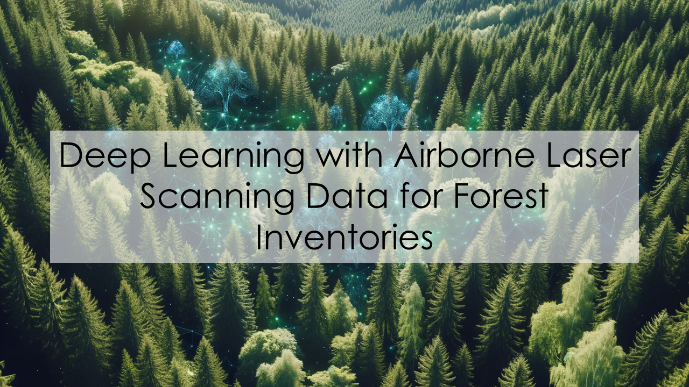

---

## Instructors and Authors

::: {.instructors-table}

|  |  |
|-|-----|
| {.avatar} | **Brent Murray** - Integrated Remote Sensing Studio, University of British Columbia |
| {.avatar} | **Harry Seely** - Integrated Remote Sensing Studio, University of British Columbia |
| {.avatar} | **Yuwei Cao** - Integrated Remote Sensing Studio, University of British Columbia |
| {.avatar} | **Ahmed Ragab** - CanmetENERGY, Natural Resources Canada; Department of Mathematics and Industrial Engineering, Polytechnique Montreal |
| {.avatar} | **Nicholas Coops** - Integrated Remote Sensing Studio, University of British Columbia |

:::

---

## Overview
This is an **introductory workshop for deep learning techniques for Enhanced Forest Inventories (EFIs)**. It will cover a basic end-to-end deep learning workflow for EFI applications covering an **introduction into deep learning**, to **data preparation**, and finally a **demo of model training, evaluation, and deployment**.

---

## What we hope you will learn

- What deep learning is and how it can be used for EFIs.
- How to prepare and read in data for use in deep learning.
- Basics of using the PyTorch Lightning deep learning library.
- Training a deep learning model for species classification and biomass prediction tasks.
- Testing and evaluating deep learning models.

---

## How this tutorial is setup
This workshop will be more of a intoductory tutorial on how to implement deep learning into EFI workflows. With that in mind we encourage you to follow along on the website, take notes and ask questions along the way.

::: callout-note
This website will remain open after the workshop for participants to review the content or share it with others. Feel free to clone this <a href="https://github.com/Brent-Murray/DeepLearningEFI" tatarget="_blank">GitHub Repo</a> as it serves as a launching point for EFI deep learning projects.
:::

---

## Don't get lost in the code
There is code provided for this workshop, but you don't need to be an expert programmer or run any code during this session.

- Focus on the **theory, concepts, and workflows** we are explaining.
- Use the code later as a reference to reinforce what you learned.
- If something isn’t clear, **ask questions in the chat** (or after the workshop)

::: callout-note
We’ve precomputed datasets, training outputs, and evaluations so you can follow along without coding live.
:::

---

## How to follow along
To make the most out of this workshop:

-  Follow along with the broad concepts and ideas being presented. 
- All the code is provided in the <a href="https://github.com/Brent-Murray/DeepLearningEFI/tree/main/src" target="_blank">src folder</a>.
- Additionally all of the data and outputs are provided so you can enjoy the workshop without having to worry about coding at the same time.

::: callout-note
Often coding workshops move at a quick pace and it becomes easy to fall behind. Because deep neural networks often require long training times, all datasets, training outputs, and model evaluations have been precomputed and are provided as part of this tutorial. We highly encourage you to try out the code after the workshop.
:::

---

## Be curious and ask questions

We will be monitoring in the chat throughout the workshop and encourage you to ask questions as they come up and we will do our best to answer them in a timely manner.

::: callout-note
If you have questions after the workshop or encounter any issues you can submit an issue via <a href="https://github.com/Brent-Murray/DeepLearningEFI/issues/new" target="_blank">GitHub</a>.
:::
